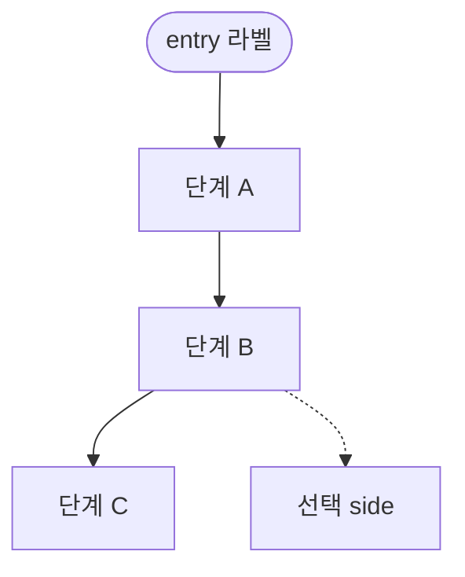
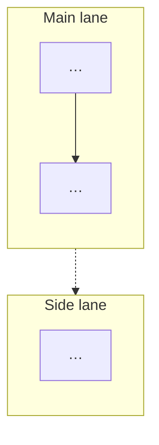

# monet5379 Mermaid

## 정본 (읽기 순)

1. [`docs/templates/mermaid-diagram.md`](../../docs/templates/mermaid-diagram.md) — content + visual
2. [`docs/site-content-rules.md`](../../docs/site-content-rules.md) §Mermaid — 배치·init strip
3. [`assets/js/mermaid-theme.js`](../../assets/js/mermaid-theme.js) — 색 토큰 (글에 hex 금지)

UI 스킬(`monet5379-site-ui`)과 분리: **본문 md + Mermaid 소스만**. SCSS/JS 수정은 테마 파일만.

## 먼저: Tier 판단

기본은 **Tier A (live Mermaid)** — 한 절의 흐름·분기·겹침. 이 스킬이 다루는 범위다.

**입구 지도 · end-to-end 종합 · 레인/존 경계**면 Tier B(editorial PNG)이므로 Mermaid를 쓰지 않는다. 정본·재export: [`docs/export/diagrams/README.md`](../../docs/export/diagrams/README.md). 판단 기준: [`mermaid-diagram.md`](../../docs/templates/mermaid-diagram.md) §Tier.

## Content (무엇을 그릴지)

- 한 블록 = 한 이야기: entry → main 분기
- `flowchart TD` 또는 `flowchart LR`
- subgraph = 레인·축 (3개 이하)
- 블록 위 `**제목**` · 아래 callout 1–2문장
- `≠` / NOTE: prose에 경계가 있으면 도식 안에 넣지 않음

## Visual (어떻게 보일지)

frontend-design **원칙만** (랜딩 UI 절차는 적용하지 않음):

| 원칙 | 적용 |
|------|------|
| Ground in subject | 그 절의 **한 분기·한 경계**만 |
| Structure is information | stadium=entry, dashed=optional, subgraph=lane |
| Avoid template defaults | init·노란 Mermaid default·AI 팔레트 금지 |
| Bold in one place | entry stadium **하나** 또는 main subgraph 하나 |
| Self-critique | light/dark · 노드 수 · 라벨 중복 |

## 작성 패턴

subgraph:

## Must not

- `%%{init:…}%%`, `style`/`classDef` with hex colors
- 구현 파일명 나열, Plan 임시 라벨
- sibling mermaid-kit · `.mmd` 정본

## After edit

- `bundle exec jekyll serve` → Mermaid note 1개 → light/dark 토글
