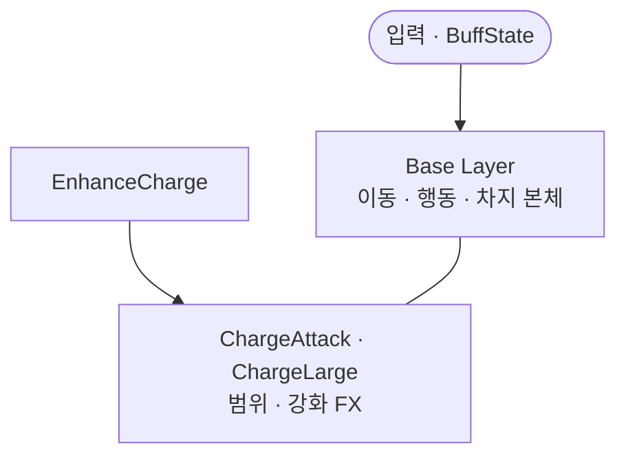
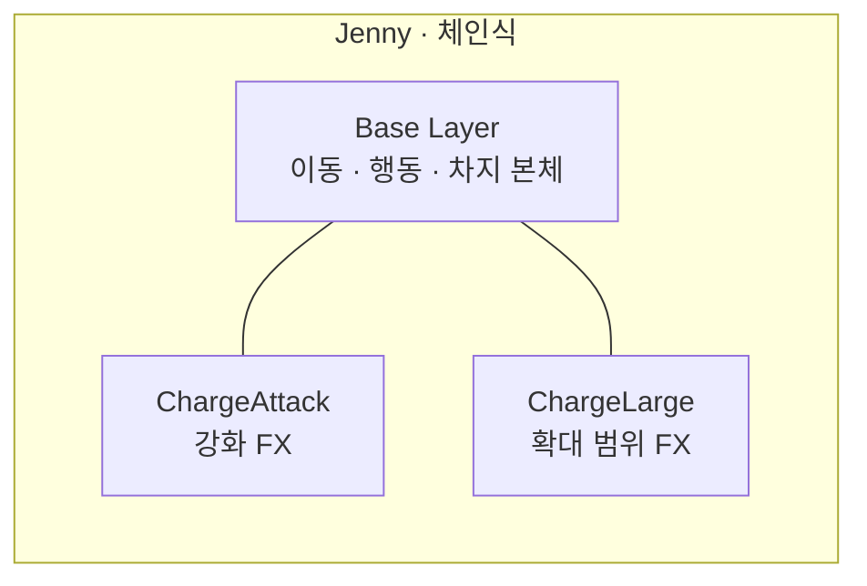

제니(Jenny)는 사슬낫을 자유롭게 사용하는 캐릭터입니다. 제니의 충전 공격을 예시로 애니메이터의 다중 레이어를 알아보려합니다. 제니의 차지(충전) 공격은 공격 키를 누르고 있으면 사용합니다. 몸의 움직임을 재생하는 Base Layer, 사슬을 표현하는 FX는 ChargeAttack · ChargeLarge 오버레이로 분리했습니다. 이 노트에서는 분리의 이유를 정리합니다.

*Jenny — 차지(충전) 공격. 몸의 움직임은 Base Layer, 사슬 FX는 ChargeAttack · ChargeLarge 오버레이.*

## 맥락

차지 공격은 **범위가 늘어나는 업그레이드**를 탈 수 있습니다. 본체 스프라이트의 차지 **행동**과, 늘어난 범위를 보여 주는 **FX**는 에셋·타이밍·단계 수가 다릅니다. 둘을 Base Layer 한 그물에 넣으면 제작·QA에서는 이렇게 갈라집니다.

- **강화 단계마다 Base `ChargeAttack` 변형을 복제** — Idle·Run·Jump 진입선까지 같이 늘어남
- **범위 링·체인 FX와 본체 클립이 한 상태 machine에서 경쟁** — 이동 축과 강화 축 의미가 섞임
- **런에서 버프·기어로 강화가 켜졌다 꺼질 때** — FX만 토글하기 어렵고 그래프 전체를 다시 훑음

게이트·쿨·차지 가능 여부는 [Command 밖에 둔 이유]({{ "/notes/blade-command-gate/" | relative_url }})에, 어떤 Enhance가 붙는지는 [코어·기어·리스크와 특성]({{ "/notes/blade-build-attach/" | relative_url }})에 있습니다. 이 글은 그 결정 **다음**, **강화 FX를 어느 레이어에** 그릴지입니다.

## 이 글에서 쓰는 말

| 말 | 역할 | 코드에서는 (참고) |
|----|------|-------------------|
| **Base Layer** | 이동·행동·차지 **본체** 클립 | Base Layer · `ChargeAttack` 상태 |
| **FX 오버레이** | Base 위에 겹치는 **범위·강화** 연출 | `ChargeAttack` · `ChargeLarge` 레이어 |
| **강화 단계** | 버프·빌드가 넘기는 FX 티어 | `EnhanceCharge` (Animator 파라미터) |
| **행동 vs FX** | 본체 자세 vs 범위 표현 | Base `PlayAnimation` vs 오버레이 BlendTree |

## 한 컨트롤러 안의 두 층

**행동은 Base, 강화 FX는 오버레이**

Base Layer 안에서 Idle·Run·Jump·Landing·WallSliding은 물리·입력 파라미터로 **Transition**을 잇고, 차지 **행동**은 `ChargeAttack` 상태로 **이름 재생**합니다. Jenny(체인식)는 그 위에 **ChargeAttack** · **ChargeLarge** 레이어를 두고, `EnhanceCharge` 단계에 따라 범위 FX 클립을 BlendTree로 고릅니다. BuffState(예: Bloodshed · Convene)가 런 중 `EnhanceCharge` 값을 넘기면 **본체 그래프는 그대로** FX 채널만 바뀝니다.

**Jenny · Base와 FX 오버레이**

*Jenny(체인식) — ChargeAttack 레이어. Empty · Charge · ChargeEnd로 강화 FX를 나누고, ChargeLarge도 같은 패턴입니다.*

| | Base Layer | FX 오버레이 (`ChargeAttack` · `ChargeLarge`) |
|--|------------|-----------------------------------------------|
| 소유 | 이동·행동·차지 **본체** | **범위·강화** 연출 |
| 진입 | 물리 Transition · `PlayAnimation` | `EnhanceCharge` · 레이어 BlendTree |
| Base에 합치면 | 강화마다 **본체 상태 변형**이 늘어남 | — |
| [드래곤]({{ "/notes/dragon-animator-move-exit/" | relative_url }}) 대비 | 한 레이어 안 이동 \| Exit | **레이어**로 본체와 FX 분리 |

## 왜 오버레이 레이어인가

**강화 FX는 Base `ChargeAttack`의 변형 클립이 아니라, 별 채널 문제입니다.** 범위가 커질수록 본체 자세와 다른 스프라이트·링·체인 FX가 필요합니다. Base 그물에 단계별 변형을 넣으면 이동 Transition과 **강화 단계 Transition**이 한 state machine에서 경쟁합니다.

**레이어를 나누면 Base와 FX의 소유가 갈립니다.** Base는 **행동**만 늘리고, Enhance 티어별 FX는 ChargeAttack · ChargeLarge 쪽 클립·BlendTree로 빼 둡니다. [코어·기어·리스크와 특성]({{ "/notes/blade-build-attach/" | relative_url }})에서 강화가 붙을 때 BuffState가 Animator 파라미터만 바꾸면 FX 레이어만 단계에 맞게 재생됩니다.

**ChargeAttack과 ChargeLarge는 같은 기법, FX 스케일만 다릅니다.** ChargeAttack은 강화 구간, ChargeLarge는 **확대된 범위** 연출용입니다. 둘 다 Base 밖에 두고, 본체 `ChargeAttack` **행동** 상태와 이름만 같습니다 — Base는 자세, 레이어는 FX.

## 출시에서 남긴 것

- **Base Layer = 이동·행동·차지 본체** — Transition · `PlayAnimation`
- **강화·범위 FX = 오버레이 레이어** — ChargeAttack · ChargeLarge (필요한 형태만)
- **Enhance → Animator** — BuffState 등이 `EnhanceCharge`로 FX 티어 전달
- **드래곤과 대비** — 한 레이어 두 구역 vs **레이어로 본체·FX 분리**

## 기각한 대안

**강화 FX를 Base `ChargeAttack` 상태 변형으로** — 기각. 단계마다 본체 상태·진입선이 늘고, FX 클립 교체가 이동 그물 QA에 섞입니다.

**강화 단계를 Base Transition으로** — 기각. `EnhanceCharge` 티어가 이동·공격 Transition과 **한 축**에서 경쟁합니다.

**레이어 대신 Base Blend Tree만** — 기각(FX 축). 이동 Blend와 `EnhanceCharge` 단계를 한 트리에 넣으면 **축 의미**가 섞입니다.

**FX만 별도 프리팹 스폰, Animator 레이어 없음** — 기각(차지 범위). 본체 차지 타이밍·방향과 FX 싱크를 매 공격마다 코드로 맞추는 비용이 큽니다.

**모든 캐릭터 Charge* 오버레이 통일** — 기각. 범위 강화 FX가 **필요한 형태**(예: Jenny 체인식)만 레이어를 추가합니다.

## 정리

**차지 본체(Base)** 와 **범위·강화 FX(오버레이)** 는 Animator에서 소유가 다릅니다. 업그레이드 단계별 FX를 ChargeAttack · ChargeLarge 레이어로 빼 두면 Base 이동·행동 그물과 Enhance 콘텐츠 추가 비용이 서로 간섭하지 않습니다.

[Command 밖에 둔 이유]({{ "/notes/blade-command-gate/" | relative_url }}) · [무기 히트마크]({{ "/notes/blade-weapon-hitmark/" | relative_url }}) · [코어·기어·리스크와 특성]({{ "/notes/blade-build-attach/" | relative_url }}) · [드래곤 — 이동 그래프와 Exit]({{ "/notes/dragon-animator-move-exit/" | relative_url }}) · [드래곤 — 몸과 무기 레이어]({{ "/notes/dragon-animator-weapon-layer/" | relative_url }}). [그림자를 Shadow 레이어로 둔 이유]({{ "/notes/blade-animator-shadow-layer/" | relative_url }}) · 무기별 컨트롤러 분기 · Blend Tree 내부·레이어 마스크·클립 제작 세부는 이 글에서 다루지 않습니다.
