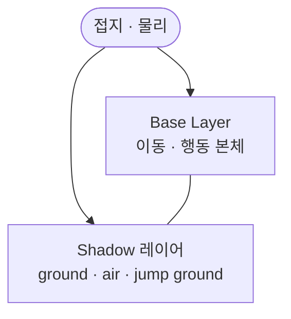

본체는 Base Layer, 그림자 클립은 Shadow 레이어로 분리했습니다. ground · air · jump ground 전환을 Base 그물에 넣지 않은 이유를 정리합니다.

## 맥락

플레이어 프리팹에는 본체와 별도로 발밑 **Shadow** 자식이 있습니다. 그림자는 Idle·Run 자세를 한 장씩 따라 그리지 않고, 땅에 붙어 있는지·공중인지·착지 순간에 크기와 표시가 바뀝니다. 본체는 Idle·Run·Jump·Landing을 이어 가는데, 그 그물에 그림자 클립을 넣으면 제작·QA에서는 이렇게 갈라집니다.

*Kil — 본체 스프라이트와 별도 Shadow 자식. 지상 `ground`일 때 발밑 타원.*

- **본체 상태마다 그림자 키를 복제** — Idle과 Run이 같은 지상 그림자인데도 클립이 두 벌
- **접지 전환이 이동 Transition과 한 state machine에서 경쟁** — 달리는 축과 그림자 phase가 섞임
- **캐릭터를 숨길 때 그림자만 끄기 어려움** — 본체 그래프를 건드리지 않고는 발밑만 비울 구멍이 없음

게이트·쿨은 [Command 밖에 둔 이유]({{ "/notes/blade-command-gate/" | relative_url }})에, 차지 강화 FX는 [연출 오버레이 레이어]({{ "/notes/blade-animator-overlay-layer/" | relative_url }})에 있습니다. 이 글은 그 결정 **다음**, **그림자를 어느 레이어에** 그릴지입니다.

## 이 글에서 쓰는 말

| 말 | 역할 | 코드에서는 (참고) |
|----|------|-------------------|
| **Base Layer** | 이동·행동 **본체** 클립 | Base Layer |
| **Shadow 레이어** | 발밑 그림자 채널 | `Shadow` 레이어 |
| **접지** | 땅에 붙어 있는지 | `IsGrounded` |
| **Disable** | 그림자만 끄기 | `Disable` 트리거 |

## 한 컨트롤러 안의 그림자 채널

**본체는 Base, 그림자는 Shadow**

접지 신호는 Base와 Shadow가 **같이** 읽습니다. 속도 같은 다른 물리 파라미터도 같은 풀에 들어가지만, Shadow 전환이 읽는 것은 접지와 Disable입니다. 레이어 인덱스를 코드가 켜고 끄지 않습니다.

*`animator_player_jenny_chainsickle` — Layers: Base · Shadow · ChargeAttack · ChargeLarge. Shadow — Entry → ground · air · jump ground, Any State → Disable. Charge*는 [연출 오버레이 레이어]({{ "/notes/blade-animator-overlay-layer/" | relative_url }}).*

Entry의 기본은 `ground`(지상, 크기 1)입니다. 접지가 풀리면 `air`(크기 0)로 가고, 다시 접지되면 `jump ground`에서 크기가 되살아난 뒤 `ground`로 돌아옵니다. 착지 직후 다시 떨어지면 `jump ground`에서 `air`로 돌아갑니다. Any State에서 `Disable`이 오면 그림자 스프라이트를 비웁니다. 캐릭터 렌더러를 끌 때 이 트리거가 붙습니다.

Jenny(체인식) 컨트롤러는 Layers에 Base · Shadow · ChargeAttack · ChargeLarge가 겹칩니다. ChargeAttack · ChargeLarge는 [연출 오버레이 레이어]({{ "/notes/blade-animator-overlay-layer/" | relative_url }})의 FX 채널이고, Shadow는 그 옆의 **발밑** 채널입니다. 맨손 Jenny처럼 Charge* 레이어가 없는 플레이어 컨트롤러에도 Shadow는 있습니다. 그림자 클립은 플레이어가 공유합니다.

| | Base Layer | Shadow 레이어 |
|--|------------|---------------|
| 소유 | 이동·행동 **본체** | **발밑 그림자** |
| 상태 | Idle · Jump · Landing · 행동 | `ground` · `air` · `jump ground` · `Disable` |
| 손잡이 | 접지 · 속도 · 이름 재생 | 접지 · `Disable` |
| [드래곤]({{ "/notes/dragon-animator-move-exit/" | relative_url }}) 대비 | 한 레이어 안 이동 \| Exit | **레이어**로 본체와 그림자 분리 |

## 왜 Shadow 레이어인가

**그림자 클립이 본체를 재생하지 않습니다.** 클립은 자식 Shadow의 크기·스프라이트를 바꿉니다. Idle과 Run은 같은 `ground`이고, Jump는 `air`로 숨기며, 착지는 `jump ground`에서 크기를 되돌립니다. 본체 상태 수와 그림자 phase 수가 다릅니다.

**Base에 넣으면 진입선이 폭발합니다.** 모든 본체 클립에 그림자 키를 심거나, Idle·Run·Jump마다 그림자 변형 상태를 복제해야 합니다. 지상 그림자는 하나인데 이동 그물이 같이 늘어납니다.

**Disable은 본체와 다른 끄는 축입니다.** 렌더러를 끌 때 Any State에서 그림자만 비웁니다. Base 이동·행동 그물을 건드리지 않습니다.

무기·행동 Base는 캐릭터마다 늘지만, 그림자 채널은 `ground` · `air` · `jump ground` · `Disable` **클립을 플레이어가 공유**합니다.

## 출시에서 남긴 것

- **Base Layer = 이동·행동 본체** — Idle · Jump · Landing · 행동
- **Shadow 레이어 = 발밑 그림자** — `ground` · `air` · `jump ground` · `Disable` (플레이어 공통)
- **접지는 Base와 같은 파라미터** — Shadow 전용 레이어 코드 없음
- **Disable = 렌더러를 끌 때 그림자만** — Any State

## 기각한 대안

**그림자 phase를 Base Transition으로** — 기각. 이동 그물과 그림자 크기 전환이 한 state machine에서 경쟁합니다.

**본체 클립마다 그림자 키를 같이 찍기** — 기각. Idle과 Run이 같은 `ground`인데 클립마다 복제됩니다.

**그림자만 별 Animator, 레이어 없음** — 기각. 접지 신호를 두 컨트롤러에 나눠 넣어야 하고, 본체 타이밍과 싱크 비용이 커집니다.

**Shadow를 Charge* 레이어와 합침** — 기각. 차지 범위 FX와 발밑 그림자는 축이 다릅니다. Charge*는 [필요한 형태만]({{ "/notes/blade-animator-overlay-layer/" | relative_url }}) 두고, Shadow는 플레이어 공통입니다.

## 정리

발밑 그림자는 본체 자세의 변형이 아니라 **접지 phase** 문제입니다. Shadow 레이어로 빼 두면 Base 이동·행동 그물과 그림자 클립이 서로 엮이지 않습니다.

[연출 오버레이 레이어]({{ "/notes/blade-animator-overlay-layer/" | relative_url }}) · [Command 밖에 둔 이유]({{ "/notes/blade-command-gate/" | relative_url }}) · [드래곤 — 이동 그래프와 Exit]({{ "/notes/dragon-animator-move-exit/" | relative_url }}) · [드래곤 — 몸과 무기 레이어]({{ "/notes/dragon-animator-weapon-layer/" | relative_url }}). 차지 강화·범위 FX · 무기 히트마크 · Blend Tree 내부는 이 글에서 다루지 않습니다.
