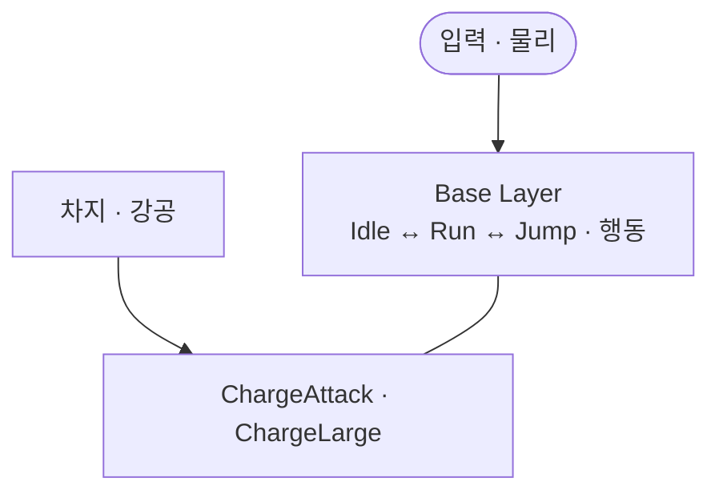
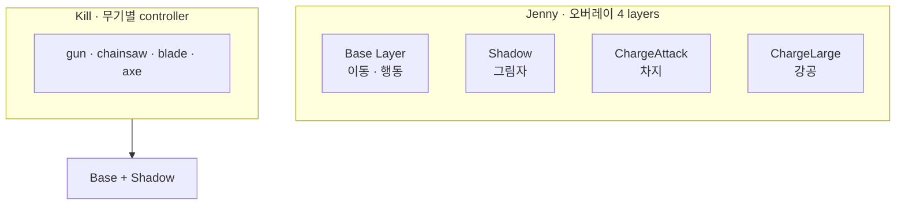

이동·행동은 Base Layer에서 이어지고, 동시에 겹쳐야 하는 연출만 ChargeAttack · ChargeLarge 같은 오버레이 레이어로 분리했습니다. 한 레이어에 Transition으로 넣지 않은 이유를 정리합니다.

[블레이드 어썰트]({{ "/projects/blade-assault/" | relative_url }}) 액션 파이프라인 **연출 Why**입니다. [Command 밖에 둔 이유]({{ "/notes/blade-command-gate/" | relative_url }})가 게이트, [무기 히트마크]({{ "/notes/blade-weapon-hitmark/" | relative_url }})가 타격 정의를 고릅니다. 이 글은 **그래프를 어떻게 자를지**만 다룹니다. [드래곤 — 이동 그래프와 Exit]({{ "/notes/dragon-animator-move-exit/" | relative_url }})은 **한 레이어 안**에서 이동과 Exit 액션을 나눈 사례이고, 블레이드는 **레이어를 쌓아** 겹침 연출을 분리한 사례입니다.

## 맥락

플레이어 연출에는 두 종류의 요구가 한 화면에서 겹칩니다. Run → Jump → Landing처럼 **직전 자세가 다음 전제**인 흐름이 있고, 차지·강공처럼 Base와 **같은 프레임에 공존**해야 하는 연출이 있습니다. 둘을 같은 Layer·Transition 모델에 넣으면 플레이·QA에서는 이렇게 갈라집니다.

- **차지 중 이동·점프가 끊김** — 겹침 연출을 상태 **전환**으로 모델링함
- **강공 후 Landing·WallSliding이 어긋남** — Base 그물 우선순위와 차지 단계가 경쟁함
- **차지 변형을 추가할 때마다 그래프 전체를 재훑음** — Idle·Run·Jump **×** 차지 단계 진입선이 늘어남

게이트·쿨·차지 가능 여부는 [Command 밖에 둔 이유]({{ "/notes/blade-command-gate/" | relative_url }})에 있습니다. 이 글은 그 결정 **다음**, 연출 그래프를 **어느 레이어에** 그릴지입니다.

## 이 글에서 쓰는 말

| 말 | 역할 | 코드에서는 (참고) |
|----|------|-------------------|
| **연속 맥락** | Transition으로 잇는 Base 이동·행동 | Base Layer |
| **겹침 맥락** | Base와 동시 재생, Base 상태를 대체하지 않음 | 오버레이 레이어 |
| **오버레이 레이어** | Base 위에 쌓는 추가 Animator Layer | `ChargeAttack` · `ChargeLarge` |
| **보조 레이어** | Base와 짝을 이루는 연출 보조 | `Shadow` |
| **무기별 컨트롤러** | Kill처럼 변신마다 **파일**을 바꾸는 경로(오버레이 Why 아님) | `animator_player_kill_*` |

## 한 컨트롤러 안의 두 층

**연속은 Base, 겹침은 오버레이**

Base Layer 안에서 Idle·Run·Jump·Landing·WallSliding은 `SpeedX` · `SpeedY` · `IsGrounded` 같은 물리·입력 파라미터로 **Transition**을 잇습니다. 차지·강공은 Base 상태를 **바꾸지 않고** 오버레이 레이어에서 **동시에** 재생합니다. Unity Animator Layer는 가중치·마스크로 Base를 유지한 채 위에 클립을 겹칩니다.

**Jenny · Base와 오버레이**

일부 무기 형태(예: Jenny 체인식)는 **ChargeAttack** · **ChargeLarge**를 추가합니다. Shadow는 Base와 **짝**을 이루는 보조 연출이고, 차지·강공 오버레이가 이 글의 중심입니다. 주인공 Kill은 gun · chainsaw · blade · axe마다 `animator_player_kill_*` **컨트롤러 파일**이 따로 있고, 각각 Base Layer + Shadow 두 겹입니다. 변신(`Transform` 상태)은 프리팹·그래프 쪽에서 무기 그래프로 바꾸며, 런타임 `runtimeAnimatorController` 교체 경로는 두지 않았습니다.

| | Base Layer | 오버레이 레이어 |
|--|------------|-----------------|
| 소유 | 이동·행동 **연속성** | **동시** 겹침 연출 |
| 진입 | 물리·입력 Transition, 행동은 `PlayAnimation` | 레이어 상태·트리거 |
| Base에 합치면 | 겹침이 **전환**으로 읽힘 | — |
| [드래곤]({{ "/notes/dragon-animator-move-exit/" | relative_url }}) 대비 | 한 레이어 안 이동 \| Exit | **레이어 수**로 겹침 분리 |

## 왜 오버레이 레이어인가

**겹침은 Transition이 아니라 동시 재생 문제입니다.** [드래곤]({{ "/notes/dragon-animator-move-exit/" | relative_url }})의 Exit 액션은 한 번 재생하고 Idle로 **돌아오는** 연출입니다. 차지·강공은 Base를 **유지한 채** 위에 올립니다. Base 그물에 차지 Transition을 추가하면 “직전 자세가 전제”인 이동 규칙과 “단계가 쌓이는” 차지 규칙이 **한 상태 machine**에서 경쟁합니다.

**레이어 경계가 콘텐츠 소유를 고정합니다.** Base Transition은 **이동 규칙**만 늘립니다. 차지·강공 변형은 오버레이·클립 쪽으로 옮깁니다. 공격·스킬·대시를 Idle에서 화살표로 잇지 않고 **이름으로 재생**하는 선택([드래곤]({{ "/notes/dragon-animator-move-exit/" | relative_url }})과 같은 “그래프 비용 줄이기”)과 맞물리되, **동시 재생**이 필요할 때만 레이어가 추가됩니다.

**Shadow와 ChargeAttack · ChargeLarge는 같은 기법, 다른 역할입니다.** Shadow는 그림자 등 **보조** 연출 동기화입니다. Charge*는 **게임플레이가 겹치는** 차지·강공입니다. 둘 다 Base 밖 채널이지만, 오버레이 Why의 중심은 후자입니다.

**Kill 무기 분기와 역할이 다릅니다.** gun · chainsaw · blade · axe는 **컨트롤러 파일**을 바꿉니다. Jenny 차지·강공은 **같은 Base** 위에 레이어를 겹치는 문제입니다. 무기 파일 분리와 오버레이는 **같은 글의 두 번째 주제로 섞지 않습니다**.

## 출시에서 남긴 것

- **Base Layer = 연속 맥락** — Transition·물리 파라미터
- **겹침 연출 = 오버레이 레이어** — ChargeAttack · ChargeLarge (필요한 형태만)
- **Shadow = 보조 오버레이** — Base와 짝
- **무기 세트 = 레이어가 아닌 컨트롤러 파일** — Kill 변신
- **드래곤과 대비** — 한 레이어 두 구역 vs **레이어로 겹침 분리**

## 기각한 대안

**겹침 연출도 Base Layer Transition으로** — 기각. 동시 재생이 아니라 **상태 교체**가 되어 이동·차지가 경쟁합니다.

**차지 중 Base 상태를 통째로 바꾸기** — 기각. Run·Jump·WallSliding을 끊으면 손맛·물리 QA가 깨집니다.

**레이어 대신 Blend Tree만** — 기각(차지·강공 축). 이동 Blend와 차지 단계를 한 트리에 넣으면 **축 의미**가 섞입니다.

**모든 캐릭터 4-layer 통일** — 기각. 오버레이는 차지·강공 겹침이 **필요한 형태**만. Kill은 Base + Shadow와 무기 파일.

**런타임 controller 스왑으로 레이어 회피** — Kill 변신 전용. Jenny 오버레이 문제와 무관합니다.

## 정리

**연속 맥락(Base)** 과 **겹침 맥락(오버레이)** 은 Animator에서 소유가 다릅니다. 동시에 돌아가야 하는 차지·강공은 ChargeAttack · ChargeLarge 레이어로 빼면, Base 이동 그물과 콘텐츠 추가 비용이 서로를 흔들지 않습니다.

[Command 밖에 둔 이유]({{ "/notes/blade-command-gate/" | relative_url }}) · [무기 히트마크]({{ "/notes/blade-weapon-hitmark/" | relative_url }}) · [드래곤 — 이동 그래프와 Exit]({{ "/notes/dragon-animator-move-exit/" | relative_url }}). Blend Tree 내부·레이어 마스크·클립 제작·Shadow 세부는 이 글에서 다루지 않습니다.
