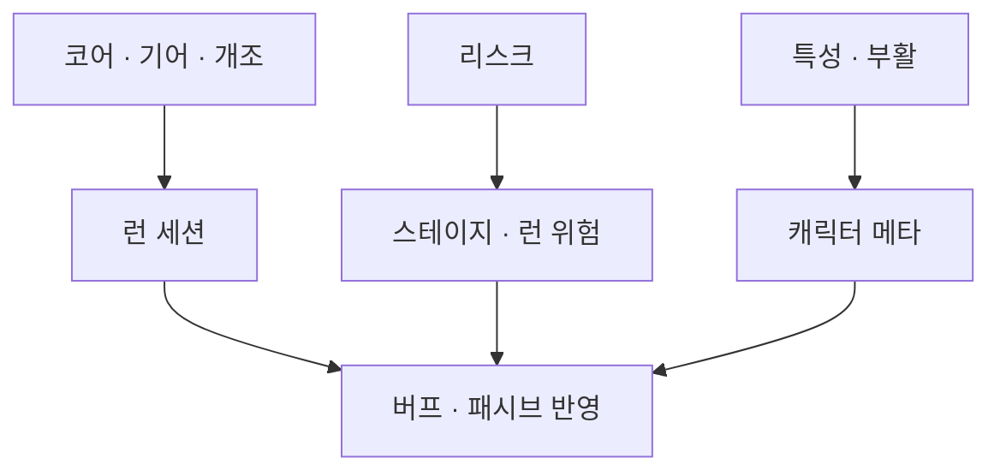

효과가 버프·패시브로 같아 보여도, 런 장착·스테이지 위험·캐릭터 메타를 같은 Add API에 넣지 않고 세션을 가른 이유를 정리합니다.

[블레이드 어썰트]({{ "/projects/blade-assault/" | relative_url }}) **어디에 붙이는가** 시리즈 2편입니다. 읽기 지도는 [시스템은 어디에 붙는가]({{ "/notes/blade-systems-read/" | relative_url }})입니다. 한 프레임 행동의 게이트는 1편 쪽이고, 이 글은 **런·스테이지·캐릭터에 무엇을 붙이는가**만 봅니다. 버프·패시브 본체 How는 [드래곤 버프]({{ "/notes/dragon-combat-buff-bridge/" | relative_url }}) · [패시브]({{ "/notes/dragon-combat-passive-bridge/" | relative_url }})로 이어집니다.

## 맥락

코어를 끼면 공격력이 오르고, 기어를 줍면 효과가 붙고, 위험을 고르면 패널티와 보상이 함께 옵니다. 화면에서는 모두 “버프가 붙었다”로 보일 수 있습니다. 그래서 유혹이 생깁니다. 효과를 한 목록·한 Add API에 넣고, 출처만 태그로 구분하면 되지 않을까요.

그 길을 택하지 않았습니다. **누가 소유하는 목록인가**, **언제 지워지는가**, **사망·스테이지 종료 뒤 무엇이 남는가**가 갈리면, 넣는 세션도 갈랐습니다. 전투 반영은 버프·패시브 표면으로 모으되, 세션 계약을 섞지 않습니다.

## 세션이 다른 축

| 축 | 무엇을 소유하나 | 전투에 어떻게 닿나 | 같은 Add로 특성과 섞나 |
|----|-----------------|--------------------|-------------------------|
| **코어** | 런 세션 보유·재생 | 버프/패시브 · (필요 시) Hyper 실행 | 아니오 |
| **기어** | 런 획득·상시/액티브 | 버프/패시브 또는 Active · 일부는 코어 레벨 신호만 | 아니오 |
| **무기 개조** | 후보·구매·라인 성장 세션 | 무기 버프/패시브 | 아니오 — 히트마크 슬롯 소유를 빼앗지 않음 |
| **리스크** | 이번 스테이지·런 위험 덱 | 버프/패시브 · (스킬형) 아이콘 | 아니오 — 특성과 API를 공유하지 않음 |
| **특성** | 캐릭터 프리셋·해금 | 버프/패시브 | 리스크와 목록·API 분리 |
| **부활** | 특성 프리셋이 여는 충전 | 스테이지 안 재개 / 실패 시 진행 정리 | 코어·기어·리스크 하강과 한 묶음 아님 |

**세션 ≠ 버프 표면**

코어는 피해 식·무기 히트마크를 두지 않습니다. 기어 일부는 코어 레벨만 올리고 코어 내부를 복제하지 않습니다. 개조는 반영을 무기 버프/패시브로 모으고, 타격 슬롯 정의의 소유자를 가로채지 않습니다 — [무기 히트마크]({{ "/notes/blade-weapon-hitmark/" | relative_url }}).

리스크는 “이번 런의 위험”이고 특성은 “이 캐릭터의 정체성·해금”입니다. 효과가 같아 보여도 목록과 사망 뒤 남는 축이 다릅니다. 부활 잔여가 있으면 스테이지 안 재개하고, 없으면 진행이 인게임 구간을 지운 뒤 결과로 갑니다. 위험 하강이나 코어/기어 정리와 한 줄로 묶지 않습니다.

## 왜 세션을 가르는가

**QA 질문이 갈립니다.** “스테이지를 나가니 남는다/사라진다”, “캐릭터를 바꾸니 남는다”, “부활 후 위험 덱이 같이 리셋된다”는 세션 계약 문제입니다. 버프 삽입만 보면 출처가 지워집니다.

**콘텐츠를 넣을 곳이 먼저 정해집니다.** 새 효과가 런 장착인지, 무기 라인인지, 이번 스테이지 위험인지, 캐릭터 프리셋인지를 묻고, 답이 갈리면 API도 갈립니다. 한 Add에 태그만 달면 나중에 “지울 때 누구 몫인가”가 한곳에 쌓입니다.

**손맛 축과 빌드 축을 나눕니다.** 얼리 액세스 피드백을 빌드 쪽과 게이트·무기 쪽으로 가른 것과 같은 습관입니다. 빌드 밸런스를 고친다고 `Command` Execute를 열 필요가 없습니다.

## 기각한 대안

**효과를 한 인벤·한 Add API에 몰고 출처 태그만 두기** — 화면은 단순해 보이지만, 스테이지 종료·부활·캐릭터 교체 때 무엇을 지울지 규칙이 태그 분기 숲이 됩니다.

**리스크를 특성 목록에 합치기** — 메타 해금과 런 위험이 같은 슬롯에서 싸우고, “캐릭터 특성인데 스테이지마다 바뀐다”는 설명이 어려워집니다.

**개조가 히트마크 카탈로그를 직접 덮어쓰기** — 무기 슬롯 소유와 세션 성장이 한곳에 붙어, 개조 QA가 타격 정의 QA와 섞입니다.

## 정리

런 장착(코어·기어·개조), 스테이지 위험(리스크), 캐릭터 메타(특성·부활)는 **버프로 같아 보여도 세션이 다릅니다.** 같은 Add API에 넣지 않은 덕분에, 지우는 시점과 회귀 범위를 먼저 물을 수 있습니다.

고정 표 데이터는 [Excel→JSON]({{ "/notes/excel-json-fixed-data/" | relative_url }})에, 버프·패시브 동작은 [드래곤 전투]({{ "/notes/dragon-combat-cluster-read/" | relative_url }}) 시리즈에, 읽기 지도는 [시스템은 어디에 붙는가]({{ "/notes/blade-systems-read/" | relative_url }})에 둡니다.
