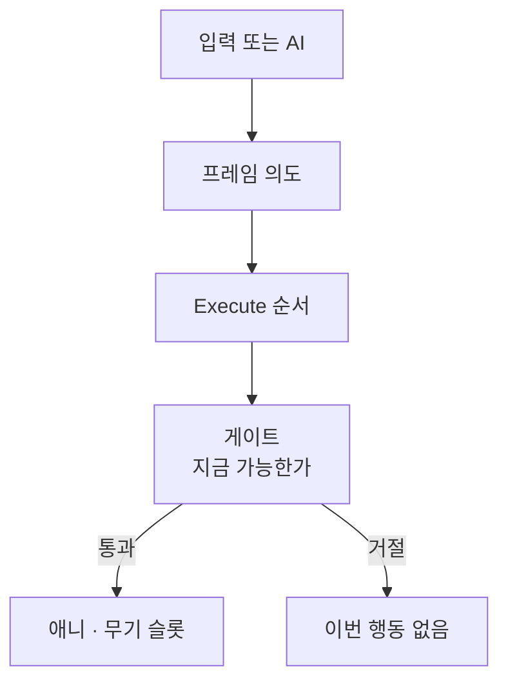

한 프레임 의도와 가능 여부를 갈라, Player와 AI가 같은 Execute 순서를 타게 하면서도 게이트 본체를 Command에 넣지 않은 이유를 정리합니다.

[블레이드 어썰트]({{ "/projects/blade-assault/" | relative_url }}) 액션 파이프라인의 **어디에 붙이는가** 시리즈 1편입니다. 읽기 지도는 [시스템은 어디에 붙는가]({{ "/notes/blade-systems-read/" | relative_url }})입니다. 게이트를 통과한 뒤 타격 정의를 고르는 길은 [무기 히트마크]({{ "/notes/blade-weapon-hitmark/" | relative_url }})가, 적용 이후 숫자·HP는 [드래곤 타격 흐름]({{ "/notes/dragon-combat-hit-flow/" | relative_url }})이 담당합니다.

## 맥락

플레이·QA에서 자주 보이는 증상은 “버튼을 눌렀는데 스킬이 안 나감”, “대시 중에 공격·차지가 겹친다”, “장전 중인데 사격이 나간다”처럼 **의도**와 **지금 할 수 있는가**가 섞인 자리에서 갈라집니다.

한곳에 몰아넣으면 단순해 보입니다. 입력 처리 함수가 쿨·탄약·대시 횟수·피해까지 한꺼번에 보면 호출 경로가 짧습니다. 그 길을 택하지 않았습니다. **이 프레임에 무엇을 시도하는가**와 **지금 통과해도 되는가**를 갈랐습니다. 통과 뒤에야 애니와 무기 슬롯이 열립니다.

## 이 글에서 쓰는 말

| 말 | 역할 |
|----|------|
| **의도** | 이 프레임에 대시·스킬·차지·공격 등을 시도한다는 표시 |
| **명령** | 의도를 모아 Execute 순서로 게이트를 부르는 실행 척추 (`Command`) |
| **게이트** | 대시·스킬·차지·탄약 등이 **지금 할 수 있는가**에 답하는 층 |
| **Execute 순서** | 같은 프레임에서 무엇을 먼저 해석할지 고정한 순서 |

## 의도 · 게이트 · Execute

**수집과 실행을 같은 순간에 끝내지 않습니다.** 플레이어는 프레임 앞쪽에서 입력 버스에서 의도를 받고, 뒤쪽에서 Execute로 게이트를 부른 뒤 의도를 비웁니다. 몬스터·서먼은 AI가 같은 의도 칸을 채운 뒤 같은 Execute를 탑니다. 보스가 패턴 한 걸음을 낼 때도 전용 피해 트리를 그리기보다 이 버스를 밀게 둡니다.

**의도 ≠ 게이트 ≠ 피해**

명령은 키 바인드·대시 횟수 본체·피해 식을 두지 않습니다. 어빌리티 / 스킬 / 차지 / 탄약이 게이트에 답하고, 통과 뒤에 무기 히트마크와 전투 파이프라인이 이어집니다.

같은 프레임에 대시가 서면 공격·차지를 막습니다. 장전이 진행 중이면 사격을 막습니다. “리로드가 성공해서”가 아니라 **지금 발사하면 안 되는 상태**로 읽습니다. 손맛 QA는 대부분 이 경계에서 갈라집니다.

## 왜 Command 밖에 두는가

**회귀 범위가 갈립니다.** 새 대시 규칙·탄약 FSM·스킬 취소는 게이트 쪽에 두고, Execute 순서와 의도 필드만 명령이 지킵니다. 쿨을 Command에 복사하면 Player와 AI·보스 경로마다 같은 식을 복제하기 쉽습니다.

**Player와 AI가 같은 척추를 탑니다.** 디바이스 입력이든 행동 트리든, 채우는 쪽만 다르고 Execute·게이트 질문은 같습니다. 몬스터용으로 짧은 피해 함수를 따로 두면 “플레이어만 막히고 적은 통과” 같은 불일치가 납니다.

**콘텐츠를 늘릴 때 질문이 고정됩니다.** 새 행동이 들어오면 “의도 칸인가, 게이트인가, 무기 슬롯인가”를 먼저 묻습니다. 답이 갈리면 넣는 곳이 갈립니다 — [프로젝트]({{ "/projects/blade-assault/" | relative_url }})에서 말한 소유 경계와 같습니다.

## 기각한 대안

**입력 함수에 쿨·횟수·피해를 몰아넣기** — 호출은 짧지만 Player·AI·보스마다 복제되고, “안 나감” QA가 한 함수에 섞입니다.

**게이트를 Command 메서드 안으로 흡수하기** — Execute 순서와 가능 여부 본체가 한 타입에 붙어, 탄약·대시만 고쳐도 Command 전체를 건드리게 됩니다.

**AI만 별도 공격 API** — 손맛 규칙을 플레이어에만 두고 적은 우회하면, 밸런스·면역·취소 규칙이 두 갈래가 됩니다.

## 정리

명령은 **프레임 의도와 Execute 순서**만 소유하고, 대시·스킬·차지·탄약의 **지금 가능한가**는 게이트에 둡니다. Player와 AI가 같은 버스를 타게 하면서도 피해 식과 횟수 본체를 Command에 넣지 않은 이유입니다.

게이트 통과 후 타격 정의는 [무기 히트마크]({{ "/notes/blade-weapon-hitmark/" | relative_url }})에, 시전·적용 이후 숫자·HP·버프·패시브는 [드래곤 스킬 시전]({{ "/notes/dragon-skill-cast/" | relative_url }}) · [타격 흐름]({{ "/notes/dragon-combat-hit-flow/" | relative_url }}) · [전투 들어가며]({{ "/notes/dragon-combat-cluster-read/" | relative_url }})에 둡니다. 읽기 지도는 [시스템은 어디에 붙는가]({{ "/notes/blade-systems-read/" | relative_url }})입니다.
