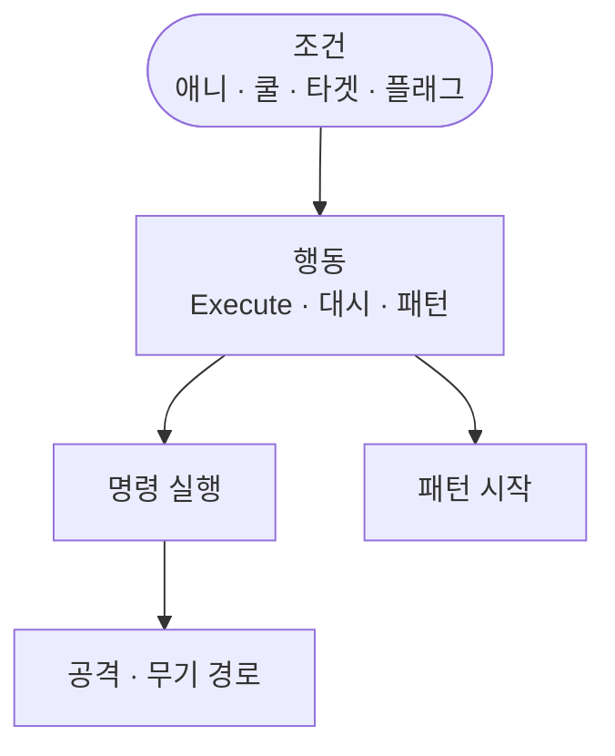

트리가 돈 뒤에도 태스크는 피해를 계산하지 않습니다. Chase·Attack·Pattern·Dash 가족이 조회하고 호출하는 표면만 정리합니다.

적 AI 시리즈 2편입니다. [1편]({{ "/notes/blade-monster-bt-run/" | relative_url }})에서 행동 트리가 도는 것을 전제로 합니다. 이 글은 **태스크 가족이 무엇을 부르는지**입니다. 의도 위임·같은 Execute 척추는 [드래곤 — 적은 어떻게 움직이는가]({{ "/notes/dragon-monster-move/" | relative_url }})와 [명령·게이트]({{ "/notes/blade-command-gate/" | relative_url }})에 맡깁니다. 행동 트리 에셋 그래프·태스크 파일 전수는 다루지 않습니다.

## 맥락

1편의 「언제 도는가」와 이 글의 「무엇을 부르는가」를 섞으면 QA가 어긋납니다.

- **새 몬스터마다 전투 코드를 늘린다** — 태스크 가족·프리팹 조립으로 늘리는 축
- **AI에 피해 식을 넣고 싶어짐** — 타격은 전투·무기 층
- **패턴 phase를 AI 노트에 찾고 있음** — 트리는 시작·플래그만

출시본은 유틸리티 AI 전면이 아니라 **NodeCanvas 행동 트리 + 태스크 가족**입니다. 기획·컨텐츠가 그래프와 태스크를 조립하고, 런타임은 캐릭터 API 호출 표면만 지킵니다.

## 이 글에서 쓰는 말

| 말 | 역할 | 코드에서는 (참고) |
|----|------|-------------------|
| **조건 태스크** | 애니·쿨·타겟·플래그 조회 | Condition |
| **행동 태스크** | 명령 채움 · 대시 · 패턴 시작 등 | Action |
| **태스크 가족** | 역할로 묶은 호출 표면 (파일 전수 아님) | Actions / Conditions |
| **의도** | 무엇을 시도할지 — 피해·쿨 본체 없음 | CommandInfo · API 호출 |

## 한 틱에서 무엇이 도는가

**조건 조회 → 행동 호출 → 명령 · 어빌리티 · 패턴 시작**

1. **조건** — 애니 재생 중인지, 공격·대시가 가능한지, 타겟이 살아 있는지, 패턴 대기·쿨 플래그는 어떤지 봅니다.
2. **행동** — 명령을 채운 뒤 실행하거나, 대시·점멸·플래시·패턴 시작 API를 호출합니다.
3. **아래 층** — 공격은 기존 공격·무기 경로로 가고, 패턴 **이후 step**은 보스 패턴 시스템이 소유합니다. 게이트·Execute 순서는 [명령·게이트]({{ "/notes/blade-command-gate/" | relative_url }})입니다.

## 태스크 가족이 의미하는 것

| 가족 | 하는 일 | 넘기지 않음 |
|------|---------|-------------|
| Chase · Kiting · Patrol | 추적·거리 두기·순찰 의도 | 이동 물리 적분 본체 |
| Target | 타겟 선정·생존·지면 등 | Detect 거리 수식 전수 |
| Attack | 가능·쿨·애니 조회 · 명령 실행 | 피해 식 · Hitmark 정의 |
| Animation | 재생 중 여부 | Animator 컨트롤러 내부 |
| Pattern | 시작 · 대기 · 쿨 플래그 | phase · gacha · step 본체 |
| Dash · Blink · Flash | 명령 채움 후 실행 | 대시 게이트 본체 |
| ForceVelocity · Boss ready | 속도 강제 · 전투 준비 게이트 | 스테이지 스폰 스케줄 |

개별 클래스 목록은 공개 노트에 두지 않습니다. 포트폴리오에서는 **가족 단위 경계**만 고정하면 됩니다.

## 패턴·전투와의 경계

| 상황 | 트리가 하는 것 | 다른 곳 |
|------|----------------|---------|
| 보스 패턴 시작 | 시작 API · 플래그 | phase/step 오케스트레이션 |
| 공격 | 명령 실행 호출 | 무기 히트마크 · 전투 파이프 |
| 대시·점멸 | 의도 채움 · 실행 | Ability·게이트 규칙 |
| 피해 | 하지 않음 | [무기 히트마크]({{ "/notes/blade-weapon-hitmark/" | relative_url }}) · 드래곤 타격 흐름 |

플레이어와 몬스터가 **같은 명령 실행 순서**를 탄다는 설계는 [명령·게이트]({{ "/notes/blade-command-gate/" | relative_url }})가 정본입니다. 이 글은 트리가 그 입구를 **어떻게 두드리는지**만 봅니다.

## 출시에서 남긴 것

- **태스크 가족으로만 문서화** — 파일 전수 나열을 계약으로 두지 않음
- **AI는 데미지를 계산하지 않음** — 전투·무기 손잡이 유지
- **패턴 시작만 AI** — step 본체를 트리에 흡수하지 않음

## 기각·보류

- 행동 태스크 안에 피해 식·쿨 본체를 넣기 — **기각**. 명령·전투와 손잡이가 두 갈래가 됨.
- 새 적마다 전용 전투 파이프를 그리기 — **기각(출시)**. 보스를 늘릴 때 기존 명령을 밀게 둠.

## 정리

행동 트리가 「부르는」 것은 **조건 조회와 의도 호출**이지, 피해·패턴 step·게이트 본체가 아닙니다. 의도만 넘기는 층은 [드래곤 — 적은 어떻게 움직이는가]({{ "/notes/dragon-monster-move/" | relative_url }})에, BA Execute·게이트는 [명령·게이트]({{ "/notes/blade-command-gate/" | relative_url }})에, 타격 슬롯은 [무기 히트마크]({{ "/notes/blade-weapon-hitmark/" | relative_url }})에 둡니다.
