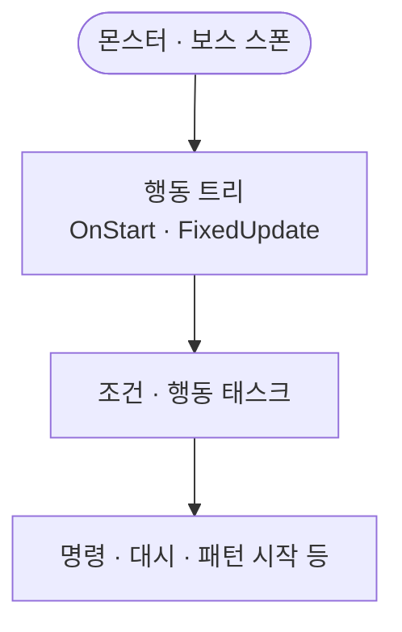

몬스터·보스의 뇌는 비어 있는 AIBrain이 아니라 행동 트리입니다. 스폰 뒤 트리가 언제 도는지, 플레이어 입력과 어디가 갈리는지만 이 글에서 봅니다.

[블레이드 어썰트]({{ "/projects/blade-assault/" | relative_url }}) 적 AI 시리즈 1편입니다. 이 글은 **행동 트리(Behavior Tree, BT)가 언제 도는지**만 봅니다. 태스크가 무엇을 호출하는지는 [2편]({{ "/notes/blade-monster-bt-call/" | relative_url }})입니다. 의도 위임·같은 실행 척추는 [드래곤 — 적은 어떻게 움직이는가]({{ "/notes/dragon-monster-move/" | relative_url }})와 [명령·게이트]({{ "/notes/blade-command-gate/" | relative_url }})에서 이어집니다.

## 맥락

플레이·QA에서 자주 갈라지는 체감:

- **코드에 AIBrain이 있다**고 뇌를 찾음 — 클래스는 비어 있음
- **플레이어와 몬스터 AI가 같은가** — 입력과 트리는 갈라짐
- **스폰 직후**부터 순찰·공격한다고 가정 — 트리가 돌기 전과 혼동

드래곤 쪽 적 AI는 프리팹 FSM(뇌·상태·행동·조건)입니다. 블레이드 어썰트는 **NodeCanvas 행동 트리**와 태스크 가족이 그 자리입니다. 문제의식(의도만 아래 층에 넘긴다)은 통하고, 손잡이만 다릅니다.

## 이 글에서 쓰는 말

| 말 | 역할 | 코드에서는 (참고) |
|----|------|-------------------|
| **행동 트리** | 몬스터·보스의 의사결정 런타임 | `BehaviourTreeOwner` |
| **태스크** | 그래프 리프 — 조건 조회 · 의도 호출 | Action / Condition |
| **플레이어 입력** | 플레이어가 의도를 채우는 쪽 | Command / Input |
| **AIBrain** | 이름만 있는 빈 껍데기 — 뇌 아님 | `AIBrain` (stub) |

## 언제 도는가

**스폰 → 트리 OnStart / FixedUpdate → 조건·행동 태스크 → (의도만) 캐릭터 API**

1. **스폰** — 몬스터·보스가 필드에 섭니다. 캐릭터 생명주기·풀은 [시스템은 어디에 붙는가]({{ "/notes/blade-systems-read/" | relative_url }})의 액션·스테이지 칸과 맞닿고, 이 글은 **이미 선 적**의 트리만 봅니다.
2. **트리 틱** — 행동 트리가 OnStart와 FixedUpdate로 돕니다. 여기서부터 QA의 “AI가 움직인다” 기준입니다.
3. **태스크** — 조건이 애니·쿨·타겟·패턴 플래그를 보고, 행동이 명령을 채우거나 대시·패턴 시작을 호출합니다. 호출 표면 목록은 [2편]({{ "/notes/blade-monster-bt-call/" | relative_url }})입니다.

플레이어는 **입력 → 명령**으로 같은 실행 순서를 탑니다. 몬스터는 **트리가 의도를 채운다**는 점만 다릅니다. “몬스터만 다른 공격 파이프”가 아닙니다.

## 플레이어와의 경계

| 질문 | 이 글 | 다른 노트 |
|------|-------|-----------|
| 트리가 언제 도나 | ✓ | — |
| 태스크가 무엇을 부르나 | — | [2편]({{ "/notes/blade-monster-bt-call/" | relative_url }}) |
| 게이트·Execute 순서 | — | [명령·게이트]({{ "/notes/blade-command-gate/" | relative_url }}) |
| 의도만 넘기는 층 | — | [드래곤 3편]({{ "/notes/dragon-monster-move/" | relative_url }}) |

보스 패턴의 phase·step 본체는 적 AI 시리즈에 두지 않습니다. 트리는 패턴 **시작·플래그**만 건드리고, 오케스트레이션은 별도 시스템입니다.

## 출시에서 남긴 것

- **뇌 = 행동 트리** — 빈 `AIBrain`에 로직을 쌓지 않음
- **Player ≠ BT** — 입력과 태스크 세트를 갈랐음
- **몬스터 FixedUpdate 틱** — 트리 모드를 캐릭터 이동 틱과 섞어 서술하지 않음

## 기각·보류

- `AIBrain`에 FSM·트리를 다시 얹기 — **기각**. 이름이 남는 함정만 키움.
- 플레이어 입력과 BT 태스크를 한 그래프에 합치기 — **기각**. 회귀 축이 한곳에 뭉침.

## 정리

적의 「뇌」는 스폰과 함께 있는 **행동 트리**이지, 비어 있는 AIBrain이 아닙니다. 스폰 뒤 트리가 돌고, 플레이어는 입력으로 같은 명령 길을 탑니다. 의도 위임 How는 [드래곤 — 적은 어떻게 움직이는가]({{ "/notes/dragon-monster-move/" | relative_url }})에, BA 게이트·Execute는 [명령·게이트]({{ "/notes/blade-command-gate/" | relative_url }})에 둡니다.
