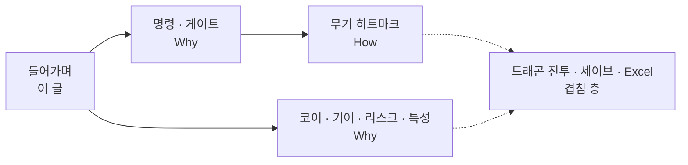

런 빌드·액션 파이프라인·스테이지·메타가 어떻게 갈라지는지, 시리즈로 들어가기 전에 한 장으로 정리합니다.

[블레이드 어썰트]({{ "/projects/blade-assault/" | relative_url }}) 시스템 **들어가며**입니다. 아래 BA 노트([명령·게이트]({{ "/notes/blade-command-gate/" | relative_url }}) · [무기 히트마크]({{ "/notes/blade-weapon-hitmark/" | relative_url }}) · [코어·기어·리스크와 특성]({{ "/notes/blade-build-attach/" | relative_url }}))의 입구로 쓰면 됩니다. 능력치·버프·패시브·타격 적용·세이브·고정 데이터처럼 드래곤과 겹치는 층은 드래곤·개인 노트가 정본이고, 이 글은 **BA 손잡이**만 지도로 둡니다.

## 맥락

콘텐츠를 늘릴 때 “어디에 넣지?”가 한곳에 섞이면, 손맛 버그와 빌드 밸런스와 스테이지 진행이 같은 파일에서 싸우기 쉽습니다. 새 효과가 들어오면 **런 장착인지, 입력 게이트인지, 무기 슬롯인지, 이번 스테이지 위험인지, 캐릭터 메타인지**를 먼저 물었습니다. 답이 갈리면 넣는 곳이 갈리게 두었습니다.

드래곤 전투의 역할 분담 문제의식은 통하지만, 변신 무기·탄약·차지·리스크 덱 때문에 파이프라인 모양이 다릅니다. 겹치는 How는 [전투 들어가며]({{ "/notes/dragon-combat-cluster-read/" | relative_url }}) 쪽으로 이어가면 됩니다.

## 네 칸

| 칸 | 질문 | 이 칸이 결정하는 것 | 넘기지 않음 | 노트 |
|----|------|---------------------|-------------|------|
| **런 빌드** | 한 런 동안 들고 가는 장착 | 코어 · 기어 · 개조 · 리스크 | 피해 식 · 명령 본체 | [어디에 붙이는가 2편]({{ "/notes/blade-build-attach/" | relative_url }}) |
| **액션 파이프라인** | 이 프레임에 무엇을 시도·적용하는가 | 의도 · 게이트 · 무기 히트마크 | 스테이지 열림/닫힘 | [1편 게이트]({{ "/notes/blade-command-gate/" | relative_url }}) · [히트마크]({{ "/notes/blade-weapon-hitmark/" | relative_url }}) |
| **스테이지 루프** | 방·보상을 언제 닫는가 | 스테이지 · 방/웨이브 · 미션 · 진행 | 한 프레임 타격 식 | (이 지도만 — 전용 노트 없음) |
| **메타** | 캐릭터에 무엇이 남는가 | 특성 · 부활 | 리스크 덱과 같은 Add | [2편]({{ "/notes/blade-build-attach/" | relative_url }}) |

한 런 동안 들고 가는 장착 → 이 프레임에 무엇을 시도·적용하는가 → 방·보상을 언제 닫는가를 한 축으로 둡니다. 방은 **언제 싸우는가**이고, 액션 파이프라인은 **한 프레임에 무엇을 시도하는가**입니다. 보스는 패턴이 전용 피해 트리를 그리기보다 명령을 밀게 두어, 보스를 늘릴 때 전투를 다시 그리지 않게 했습니다 — 세부 노트는 두지 않고 프로젝트 요약에 맡깁니다.

## 권장 읽기 순서

1. **이 글** — 네 칸·읽기 순서
2. **[명령·게이트]({{ "/notes/blade-command-gate/" | relative_url }})** — 의도 vs 가능 여부
3. **[무기 히트마크]({{ "/notes/blade-weapon-hitmark/" | relative_url }})** — 슬롯 → 전투로 넘기기
4. **[코어·기어·리스크와 특성]({{ "/notes/blade-build-attach/" | relative_url }})** — 런·위험·메타 세션
5. (겹침) [타격·버프·패시브]({{ "/notes/dragon-combat-cluster-read/" | relative_url }}) · [Excel→JSON]({{ "/notes/excel-json-fixed-data/" | relative_url }}) · [세이브 경계]({{ "/notes/save-layout-boundaries/" | relative_url }})

## 정리

블레이드 어썰트 공개 기술 글의 BA 전용 축은 **붙는 곳(게이트·빌드 세션)** 과 **무기 슬롯 How**입니다. 숫자·HP·버프 연쇄·고정 데이터·세이브 레인은 드래곤·개인 노트를 정본으로 두고, 이 들어가며에서 손잡이만 고르면 됩니다.

프로젝트 요약·성과·스토어는 [블레이드 어썰트]({{ "/projects/blade-assault/" | relative_url }})에 있습니다.
