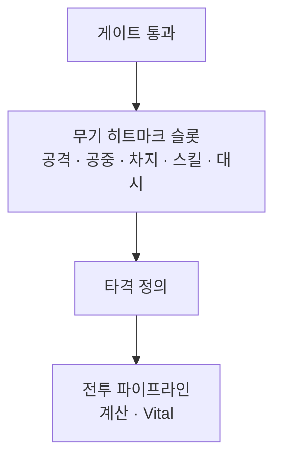

게이트 통과 후 공격·공중·차지·스킬·대시 타격을 무기 히트마크 슬롯에서 고르고, 피해·Vital은 전투 파이프라인으로 넘기는 경로를 정리합니다.

[블레이드 어썰트]({{ "/projects/blade-assault/" | relative_url }}) 액션 파이프라인의 **무기 쪽 How**입니다. 게이트·Execute는 [Command 밖에 둔 이유]({{ "/notes/blade-command-gate/" | relative_url }})가, 읽기 지도는 [시스템은 어디에 붙는가]({{ "/notes/blade-systems-read/" | relative_url }})가 담당합니다. 이 글은 슬롯 선택까지이고, 맞힌 뒤 숫자·HP는 [드래곤 타격 흐름]({{ "/notes/dragon-combat-hit-flow/" | relative_url }})으로 이어집니다.

## 이 글에서 쓰는 말

| 말 | 역할 |
|----|------|
| **게이트** | 지금 대시·스킬·차지·공격 등을 해도 되는가 |
| **히트마크 슬롯** | 무기마다 공격·공중·차지·스킬·대시 타격 정의를 모아 둔 칸 |
| **타격 정의** | 한 방의 수치·타입 묶음 (`Hitmark`) |
| **전투 파이프라인** | 정의 로드 → 계산 → Vital 반영 |

## 맥락

변신 무기·차지·스킬 타격이 늘면, “이 모션의 데미지 식”을 무기 클래스나 대시 어빌리티 안에 두기 쉽습니다. 그러면 같은 한 방의 의미가 무기마다 복제되고, 근접과 투사체가 숫자를 서로 다르게 갖기 쉽습니다.

블레이드 어썰트에서는 **가능 여부(게이트)** 와 **어떤 타격 정의인가(무기 슬롯)** 와 **숫자·HP(전투)** 를 갈랐습니다. 게이트를 통과한 뒤에야 슬롯이 열리고, 슬롯이 고른 정의만 전투 파이프라인으로 넘어갑니다.

## 경로

**게이트 통과 → 무기 슬롯 선택 → 전투 파이프라인**

1. `Command` Execute가 게이트에 묻습니다. 거절이면 애니·슬롯이 열리지 않습니다.
2. 통과하면 현재 무기의 히트마크 슬롯에서 이번 행동 종류에 맞는 타격 정의를 고릅니다.
3. 정의가 확정된 뒤 대상 확정·계산·Vital은 전투 층입니다. 대시·스킬 어빌리티가 데미지 식을 소유하지 않습니다.

스킬·차지의 **시전·홀드 게이트**와 **공격으로 이어지는 슬롯**은 다릅니다. 게이트는 “지금 쓸 수 있는가”, 슬롯은 “쓰면 어떤 한 방인가”입니다.

무기 개조(Enhance)는 세션에서 버프/패시브를 갈아 끼우되, 히트마크 슬롯 정의의 소유자를 빼앗지 않습니다 — [코어·기어·리스크와 특성]({{ "/notes/blade-build-attach/" | relative_url }}).

## 기각한 대안

**무기마다 피해 식을 복제하기** — 밸런스 패치마다 슬롯 수만큼 같은 식을 고치게 됩니다. 한 방의 의미는 정의 ID 쪽에 둡니다.

**어빌리티·스킬이 데미지를 직접 넣기** — 이동·시전 게이트와 숫자 소유가 한곳에 붙어, “취소는 됐는데 피해는 나감” 같은 QA가 섞입니다.

**게이트 없이 슬롯만 두기** — 탄약·대시 중 사격이 슬롯 선택 전에 막히지 않습니다. 손맛 규칙은 게이트에 둡니다.

## 정리

무기 히트마크 슬롯은 **게이트를 통과한 행동의 타격 정의**만 고릅니다. 피해·Vital·버프·패시브 연쇄는 전투 파이프라인이고, 드래곤에서 같은 층을 풀어 둔 글은 [타격 흐름]({{ "/notes/dragon-combat-hit-flow/" | relative_url }}) · [투사체 transport]({{ "/notes/dragon-combat-projectile/" | relative_url }}) · [전투 들어가며]({{ "/notes/dragon-combat-cluster-read/" | relative_url }})입니다.
