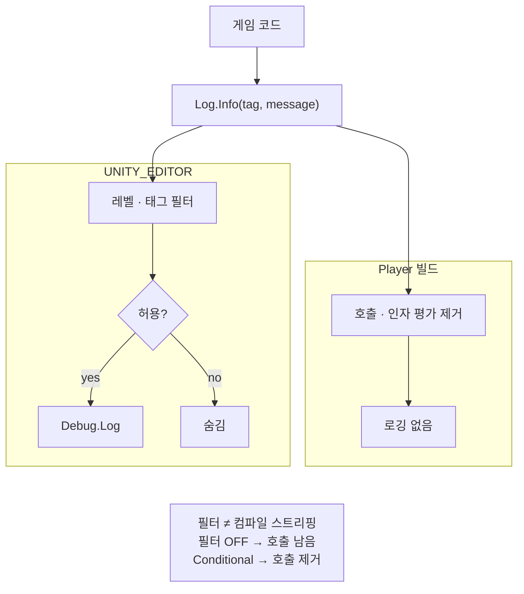

에디터 레벨·태그 필터와 플레이어 빌드에서 호출·인자 평가를 없애는 `[Conditional]`은 다른 문제라는 점을, Dragon is Dead Log API 기준으로 정리합니다.

[Dragon is Dead]({{ "/projects/dragon-is-dead/" | relative_url }}) 성능 작업에서 적용한 내용입니다. 계기는 Player 빌드 Profiler에 로그 경로(문자열·할당)가 남아, 필터 off = 비용 없음 가정이 깨진 것이었습니다. 같은 불변조건을 타이틀 밖으로 빼 둔 구현은 [Conditional Log]({{ "/projects/conditional-log/" | relative_url }})입니다.

## 맥락

프로젝트 `Log` API의 역할을 나눕니다.

| API | 용도 | 플레이어 빌드 |
|-----|------|----------------|
| `Log.Progress` / `Info` / `Warning` / `Error` 등 | 개발 가시성(레벨·태그 필터) | `[Conditional("UNITY_EDITOR")]`로 **호출문·인자 평가 제거** |
| `Debug.Log*` / 리포팅 | 릴리스에 남길 메시지 | `Log` 밖 **별도 경로** |

에디터 필터는 콘솔 가시성만 바꿉니다. 호출에 `Combat`, `Stage` 같은 도메인 태그를 붙이고, 에디터에서 레벨·태그를 켜고 끕니다. 꺼도 출력만 막을 뿐 호출부의 `$""`는 그대로 평가됩니다. 바이너리 비용은 Conditional이 담당합니다.

## 문제

레벨·태그를 꺼도 플레이어 빌드 Profiler에 로그 경로 비용이 남는 경우가 있습니다. C#은 호출 **전에** 인자를 평가하기 때문입니다. 메서드 안 early return이나 `#if`는 출력만 막고, 호출문은 바이너리에 남습니다. `Update`마다 `CalcDamage()`·`$""`·`string.Format`이 도는 이유입니다. “콘솔에 안 찍힌다”는 “비용이 없다”가 아닙니다.

에디터 UX와 릴리스 경로를 한 클래스에 섞으면, 이 호출이 빌드에 남는지를 호출부마다 짐작해야 합니다.

**핵심:** 컴파일 제거(`[Conditional]`)와 에디터 필터(레벨·태그)는 다른 문제입니다. 전자는 바이너리 비용, 후자는 개발 중 가시성입니다.

잘못된 패턴 예:

```csharp
// 태그·레벨을 꺼도 CalcDamage·보간 문자열이 매 프레임 평가됨
Log.Info("Combat", $"dmg={CalcDamage()}");
```

`[Conditional("UNITY_EDITOR")]`가 붙은 API는 플레이어 빌드에서 위 호출문 자체가 사라집니다.

## 해결

**필터 ≠ Conditional**



<div class="callout" markdown="1">

- **에디터 필터**: 레벨·태그로 콘솔 가시성만 바꿈. 꺼도 호출·인자 평가는 남음
- **Conditional**: 플레이어 빌드에서 호출문·인자 평가 제거

</div>

출력 API에 `[Conditional("UNITY_EDITOR")]`를 두고, 레벨·태그 필터는 `Write` 안의 early return에만 둡니다. 속성은 호출부가 보는 메서드에 붙습니다.

```csharp
using System.Diagnostics;
using UnityEngine;

public static class Log
{
    public static bool LevelInfo = true;

    [Conditional("UNITY_EDITOR")]
    public static void Info(string tag, string message)
    {
        Write(tag, message);
    }

    static void Write(string tag, string message)
    {
        if (!LevelInfo) return;
        if (!IsTagEnabled(tag)) return; // 에디터 가시성만. 호출부는 이미 실행됨
        Debug.Log($"[{tag}] {message}");
    }

    static bool IsTagEnabled(string tag) => true; // 에디터에서 태그 on/off
}
```

래퍼가 `Log`만 감싸고 자신은 Conditional이 없으면, 호출부의 `$""`는 플레이어 빌드에 남습니다.

```csharp
using System.Diagnostics;

public static class GameLog
{
    [Conditional("UNITY_EDITOR")]
    public static void Info(string tag, string message)
    {
        Log.Info(tag, message);
    }
}
```

### 컴파일 제거 vs 런타임 차단

| 구분 | 시점 | 호출문 | 호출부 인자 평가 |
|------|------|--------|------------------|
| early return / 레벨 off / `#if`만 | 런타임 | 바이너리에 **남음** | **실행됨** |
| `[Conditional("UNITY_EDITOR")]` (플레이어 빌드) | **컴파일** | **제거됨** | **제거됨** |
| 에디터 (레벨·태그 off) | — | 남음 | **실행됨** (`$""`·`params` 포함) |

에디터에서도 핫 패스에 `$""` + `Log.*`를 두면 필터와 무관하게 비용이 납니다. **호출 자체를 두지 않는 것**이 정답입니다.

## 실무

1. **가변 디버그** → 태그·레벨로 좁히기
2. **릴리스에 남길 메시지** → `Debug.Log*` / 리포팅 — `Log`와 분리
3. **프레임마다 도는 로그** → 기본 off, 필요할 때만 켬
4. **무거운 문자열·계산** → 핫 패스에는 호출 자체를 두지 않기

## 한계

`[Conditional]`은 `UNITY_EDITOR`에만 걸려 있습니다. 에디터(Play 포함)에서는 레벨·태그를 꺼도 호출문은 남고, 호출부 인자(`$""`·계산)는 `Write` early return 전에 평가됩니다. 필터는 콘솔 출력만 막습니다.

에디터 핫 패스 비용을 필터로 없애지 않는 것이 [Conditional Log]({{ "/projects/conditional-log/" | relative_url }})의 **현재 한계**입니다. 두 번째 컴파일 심볼·지연 메시지 API는 이 패키지 범위 밖입니다.

## 기각·보류

런타임 early return / `#if`만으로 플레이어 비용을 제어하는 방식은 기각합니다. 호출부 인자 평가가 남습니다.

`Log` 안에 릴리스 전용 Error·파일 로그를 유지하면 “빌드에 남는가” 경계가 섞입니다. 출력 API는 Conditional로 분리합니다.

Unity Logging 패키지·API 대폭 축소는 빌드 비용 합격선과 무관해 보류합니다.

에디터 Play 프로파일 등으로 `Log.*`를 **통째로** 끄는 두 번째 컴파일 심볼(`[Conditional("…")]` 추가)은 후보로 보류합니다. 심볼은 컴파일 단위라 레벨·태그 필터별 인자 스킵은 되지 않습니다. 필터 off마다 `$""`를 막으려면 `Func<string>` 등 API 변경이 필요하고, 지금 최소 복사 단위와는 결이 달라 함께 보류합니다.

## 확인 포인트

- Player(비에디터) 빌드: 빈번한 `Log.Info` / `Progress` 경로가 Profiler Scripts·GC Alloc에 유의미하게 나타나지 않음
- 에디터: 레벨·태그 off 시 해당 메시지가 콘솔에 안 찍힘 (**인자 평가는 남을 수 있음** — [한계](#한계))
- 릴리스에 남길 메시지: `Debug.Log*` 등 `Log` 래퍼 밖
- `Update` / `FixedUpdate`에 `$""` 또는 무거운 인자 + `Log.*`를 상시 두지 않음

## 정리

필터는 가시성, Conditional은 바이너리 비용입니다. 둘을 한 메커니즘으로 취급하지 않고, 핫 패스에서는 호출 자체를 두지 않습니다.
