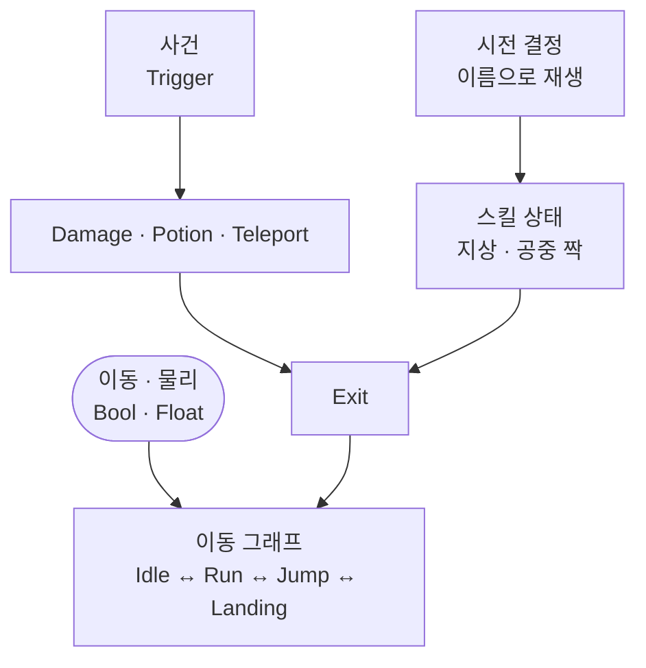

이동의 연속과 공격 뒤 중립 복귀를 한 레이어에서 같이 잡으려고, 플레이어 연출 레이어를 이동 그래프와 Exit 액션 두 구역으로 나눈 이유를 정리합니다.

## 맥락

플레이어 연출은 두 종류의 요구가 한 화면에서 겹칩니다. 달리다 점프하고 착지하는 동안에는 **이전 자세가 다음 자세의 전제**입니다. 반대로 스킬 한 방, 물약, 피격은 **한 번 재생하고 중립으로 돌아와야** 합니다. 둘을 같은 방식으로 잇거나 같은 방식으로 끊으면, 플레이 중에는 이렇게 갈라집니다.

- **스킬을 썼는데 캐릭터가 계속 달림 / 끝났는데 이동이 안 풀림** — 이동 잠금이 상태 진입·종료에 걸려 있음
- **공중에서 쓴 스킬이 지상 모션으로 나감** — 지상·공중 짝 중 어느 상태를 재생했는지의 문제
- **연타가 씹힘** — 다음 입력은 애니메이션이 끝나는 시점에 소비됨

시전 여부·쿨·입력 버퍼 규칙은 [스킬 시전]({{ "/notes/dragon-skill-cast/" | relative_url }})에 있습니다. 이 글은 그 결정이 내려진 **다음**, 연출 그래프를 어떻게 잘랐는지입니다.

## 이 글에서 쓰는 말

| 말 | 역할 | 코드에서는 (참고) |
|----|------|-------------------|
| **연출 레이어** | 전신 연출을 담는 채널 | `Body` (무기 채널이 필요한 캐릭터만 `Weapon1` 추가) |
| **이동 그래프** | 서로 잇는 연속 상태 묶음 | Idle · RunStart · Run · JumpApex · Landing · Crouch |
| **Exit 액션** | 끝나면 Exit로 빠져 Idle로 돌아오는 이산 상태 | 스킬 · Damage · Potion · Teleport · Spawn |
| **파라미터** | 코드가 그래프에 넘기는 손잡이 | Bool · Float(상태) · Trigger(사건) |
| **재생 이름** | 스킬 상태를 직접 고르는 문자열 | `Animator.Play(이름)` |

## 한 레이어 안의 두 구역

**이동은 잇고, 액션은 돌려보낸다**

이동 구역은 파라미터가 바뀌는 동안 상태를 **이어서** 넘기고, Exit 구역은 한 번 재생한 뒤 Exit를 지나 Idle로 **돌아옵니다**. 같은 레이어 안이지만 들어가는 길과 나오는 길이 다릅니다.

*player_character_hunter · Body — Idle을 중심으로 Run · Jump · Crouch · Leap · Landing이 양방향으로 잇힌 이동 그래프*

*같은 레이어 — Any State·Trigger 유틸과 스킬·공중 짝 상태가 끝나면 Exit로 모이는 구역*

| | 이동 그래프 | Exit 액션 |
|--|-------------|-----------|
| 들어가는 길 | 파라미터 조건 Transition | Trigger, 또는 이름으로 재생 |
| 나오는 길 | 다음 이동 상태 | Exit → Idle |
| 손잡이 | Bool·Float — `Grounded` · `Walking` · `Speed` · `ySpeed` | Trigger — `Spawn` · `Damage` · `Teleport` · 스킬 이름 |
| 늘어나는 축 | 이동 규칙 (착지·이단점프·매달림) | 콘텐츠 (스킬·소모품·상태이상) |

## 왜 갈랐는가

**이동은 이어져야 하고, 액션은 끊겨야 합니다.** 지면에 닿았는지, 걷는 중인지, 수직 속도가 얼마인지는 매 프레임 갱신되는 **상태**입니다. 그래서 Bool·Float 조건으로 상태를 잇습니다. 피격·물약·순간이동은 그 순간 한 번 일어나는 **사건**이라 Trigger로 끼워 넣고, 끝나면 그래프를 원래 자리로 되돌립니다.

**스킬 상태에는 들어오는 화살표를 두지 않았습니다.** 시전이 결정되면 코드가 애니메이션 이름으로 상태를 직접 재생합니다. 그래서 스킬을 늘려도 이동 그래프에 Transition이 붙지 않습니다. 스킬은 대개 지상·공중 짝으로 존재하고 합치면 수십 개인데, 이 상태들은 **나가는 길만** 가집니다. 대신 콘텐츠가 늘어나는 비용이 그래프가 아니라 **이름 계약** 쪽으로 옮겨갑니다.

한 번에 끝나지 않는 지속형 스킬만 예외입니다. 지상·공중 진입 후 `{스킬 이름}Progress` 상태로 이어지고, `Complete`에서 Exit로 빠집니다. 유지 구간은 같은 이름의 Bool 파라미터로 잡습니다.

*RagingChainblade — 지상·공중 짝이 Progress로 모이고 Complete에서 Exit로 나가는 예*

**Exit는 되돌아오는 자리이자 게임플레이가 풀리는 자리입니다.** 상태에 들어갈 때 클립 길이를 기준으로 이동·좌우 반전을 잠그고, 나갈 때 잠금을 풀고 스킬 쪽에 종료를 알리고 대기 중인 입력을 소비합니다. “스킬이 끝났는데 안 움직인다”, “연타가 씹힌다”가 대부분 이 지점입니다. 액션을 이동 그래프에 직접 이어 붙이면 이 해제 시점이 상태마다 흩어집니다.

## 이름이 계약인 곳

코드는 상태를 **문자열로** 확인합니다. `Spawn`·`Damage`·`Potion`·`Teleport` 같은 이름과 스킬 애니메이션 이름, 지속형의 진행·완료 이름이 그대로 판정에 쓰입니다. 클립 이름만 바꾸면 연출이 아니라 이동 잠금과 입력 버퍼가 깨집니다. 그래서 재생하려던 이름과 실제 진입한 상태 이름이 다르면 로그로 남깁니다.

파라미터는 컨트롤러에 **있는 것만** 캐시합니다. 캐릭터마다 이동·전투 파라미터 구성이 조금씩 달라도 같은 연출 코드가 돌고, 없는 파라미터 호출은 그냥 무시됩니다. 적 캐릭터가 같은 코드로 다른 그래프를 쓰는 이유도 같습니다.

## 출시에서 남긴 것

- **이동 = 상태 그물 · 공격·유틸 = Exit 액션** — 한 레이어 안의 두 구역
- **스킬은 Transition 대신 이름 재생** — 콘텐츠 추가 비용이 그래프에 붙지 않음
- **지상·공중은 짝으로** 두고 어느 쪽을 재생할지는 코드가 고름
- **레이어는 필요할 때만** — 기본은 전신 채널 하나, 무기 채널이 필요한 캐릭터만 추가. 재생은 활성 레이어 수만큼 같은 이름으로

## 기각한 대안

**이동까지 Any State에서 풀기** — 기각. 이동은 직전 자세가 전제인데 어디서든 진입할 수 있게 두면 우선순위와 복귀가 상태마다 달라집니다. 피격·소모품처럼 어디서든 끼어들어야 하는 액션의 Any State 진입은 그대로 씁니다.

**스킬마다 Idle에서 들어오고 나가는 Transition을 그리기** — 기각. 지상·공중 짝까지 세면 연결이 수백 개가 되고, 스킬 하나를 추가할 때마다 그래프를 다시 훑어야 합니다.

**잠금·버퍼 해제를 코드 타이머로만 처리** — 기각. 클립 길이·재생 속도가 바뀌면 어긋납니다. 상태 진입 시점의 클립 길이와 종료 시점을 그대로 기준으로 씁니다.

## 정리

한 레이어 안에서도 **연속 맥락**과 **일회 연출**은 소유가 다릅니다. 이동은 파라미터로 잇는 그래프에 두고, 스킬·피격·소모품은 이름이나 Trigger로 진입해 Exit로 돌아오는 액션에 두면, 이동 규칙과 콘텐츠가 서로를 흔들지 않습니다.

시전 결정·쿨·입력 버퍼는 [스킬 시전]({{ "/notes/dragon-skill-cast/" | relative_url }})에, 애니메이션 이벤트에서 넘어가는 피해·버프는 [적용 시점]({{ "/notes/dragon-combat-skill-bridge/" | relative_url }}) · [타격·데미지]({{ "/notes/dragon-combat-hit-flow/" | relative_url }})에 있습니다. 적 쪽 상태 전환은 연출 그래프가 아니라 뇌 FSM이며 [적의 뇌는 언제 명령하는가]({{ "/notes/dragon-monster-brain-command/" | relative_url }})에 두었습니다. 클립 제작·Blend Tree 내부와 레이어 가중치 상세는 이 글에서 다루지 않습니다.
