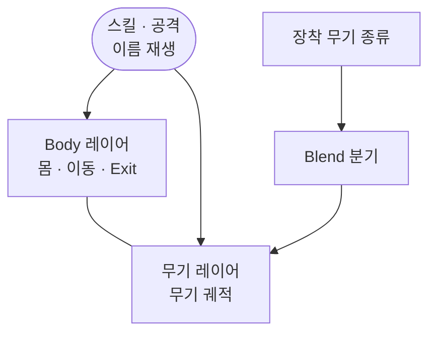

공격·스킬에서 Body 레이어에는 몸 동작만 두고, 장착 무기별 궤적은 무기 레이어에 따로 그린 이유를 정리합니다.

## 맥락

플레이어는 같은 스킬을 써도 몸통·다리 자세와 무기 궤적이 따로 움직입니다. 한손·양손·쌍수로 장착이 바뀌면 몸은 거의 같은 자세인데, 손·팔·무기 스프라이트만 다른 클립이 필요합니다. 이 둘을 Body 그래프 하나에 같이 넣으면 제작·QA에서는 이렇게 갈라집니다.

- **스킬마다 무기 변형 상태가 복제됨** — 한 스킬 옆에 한손·양손·쌍수 클립이 각각 붙음
- **이동 축과 무기 축이 한 그래프에서 섞임** — 이동 Transition과 무기 분기가 같은 자리에서 경쟁
- **무기만 손볼 때 이동·스킬 그물을 다시 훑음** — Idle·Run은 그대로인데 공격 클립만 무기 수만큼 늘어남

시전 결정·이름 재생·Exit 해제는 [이동 그래프와 Exit 액션]({{ "/notes/dragon-animator-move-exit/" | relative_url }})에 있습니다. 이 글은 그다음, **무기 연출을 어느 채널에** 둘지입니다.

## 이 글에서 쓰는 말

| 말 | 역할 | 코드에서는 (참고) |
|----|------|-------------------|
| **Body 레이어** | 몸 동작·이동·Exit 액션을 담는 채널 | `Body` |
| **무기 레이어** | 무기 스프라이트·궤적만 겹쳐 그리는 채널 | `Weapon1` |
| **무기 종류** | 장착에 따라 클립을 고르는 분기 값 | `WeaponType` · Blend Tree `Weapon1Type` |

## 한 컨트롤러 안의 두 채널

**몸은 Body, 무기는 무기 레이어**

스킬·공격은 코드가 애니메이션 이름으로 상태를 재생합니다. 같은 이름을 두 레이어에 맞춰 두어서, Body에서는 몸 동작이 돌고 무기 레이어에서는 그 동작에 맞는 무기 궤적이 겹쳐 돕니다. 장착이 바뀌면 무기 종류 값만 갱신하고, 어떤 무기 클립을 쓸지는 무기 레이어 Blend Tree가 고릅니다. 두 채널의 타이밍과 종료 지점은 컨트롤러에서 나란히 맞춰 둡니다.

*`player_character_berserker` · Weapon1 — Weight 1 · Override. WeaponAttack0~2가 Exit로 모이는 overlay · Body와 같은 이름·Exit 배선으로 동기*

| | Body 레이어 | 무기 레이어 |
|--|-------------|-------------|
| 소유 | 이동 그래프 · Exit 액션 · 몸 동작 | 무기 궤적·스프라이트 |
| 무기 종류 분기 | 무기 레이어를 둔 캐릭터에서는 없음 | Blend Tree — `Weapon1Type` 등 |
| 진입 | 코드가 이름으로 재생 | 같은 이름 · 컨트롤러에 나란히 배치 |
| 이동 Transition | 있음 | 없음 |

## 왜 무기 레이어인가

**몸 동작 수와 무기 클립 수가 다릅니다.** 한 스킬의 몸통·다리 자세는 무기와 무관하게 하나로 두고, 손과 무기 궤적만 한손·양손·쌍수로 갈라집니다. Body에 전부 넣으면 스킬 하나마다 무기 수만큼 상태가 복제되고, 이동 그물과 같은 자리에서 Transition이 폭발합니다.

**무기 종류는 장착에서 값만 갱신합니다.** 인벤토리에서 주무기·보조무기가 바뀌면 무기 종류 값 하나만 씁니다. 어떤 클립을 재생할지는 Blend Tree가 정하므로, 무기를 늘려도 늘어나는 쪽은 코드가 아니라 Animator 에셋입니다. Body는 장착과 무관하게 이동·스킬 그물을 그대로 씁니다.

**무기 레이어는 필요한 캐릭터에만 둡니다.** 무기 변형이 Body 안 Blend Tree로 충분하면 채널을 늘리지 않았습니다. 출시 기준으로 `Body` + `Weapon1`을 함께 쓰는 캐릭터는 Berserker 하나이고, 나머지는 Body 하나에서 무기 종류로 클립을 갈랐습니다. 레이어 순서와 개수가 캐릭터마다 다르므로, 한 캐릭터의 배선을 다른 캐릭터에 그대로 가정하지 않습니다.

## 출시에서 남긴 것

- **Body = 몸·이동·Exit** — [이동 그래프와 Exit 액션]({{ "/notes/dragon-animator-move-exit/" | relative_url }})과 같은 축
- **무기 레이어 = 무기 궤적** — 출시 기준 Berserker만 · 컨트롤러 기본 가중치로 항상 켜 둠
- **무기 종류는 값만, 클립 선택은 에셋** — 장착 때 값 갱신 · 재생 클립은 Blend Tree가 고름
- **채널을 늘리지 않은 캐릭터** — Body 하나에서 무기 종류로 분기

## 기각한 대안

**무기 변형을 Body 상태마다 복제** — 기각. 스킬마다 한손·양손·쌍수 상태가 붙어, 이동 그물과 무기 분기가 한 그래프에서 경쟁합니다.

**모든 캐릭터에 무기 레이어를 두기** — 기각. Body Blend Tree로 충분한 캐릭터까지 채널을 늘리면 두 레이어의 타이밍을 맞추는 비용만 커집니다.

**무기 레이어 가중치를 런타임에 코드로 조절** — 기각. 컨트롤러 기본 가중치로 켜 두었습니다. 대시·난간처럼 파츠 가시성을 손보는 구간에서도 방어구·머리 채널만 가중치로 건드리고, 무기까지 토글하지는 않았습니다.

**스킬마다 무기 전용 재생 API** — 기각. Body와 같은 이름·종료 계약을 그대로 쓰고, 두 채널의 동기는 컨트롤러에 나란히 둔 상태로 맞춥니다.

## 정리

공격·스킬에서 몸 동작과 무기 궤적은 소유가 다릅니다. Body에 몸·이동·Exit를 두고 무기 궤적만 겹쳐 그리면, 장착이 바뀌어도 이동 그물을 다시 그리지 않습니다. 채널을 늘릴지는 캐릭터마다 다르게 정했고, Body Blend Tree로 충분하면 하나로 두었습니다.

[이동 그래프와 Exit 액션]({{ "/notes/dragon-animator-move-exit/" | relative_url }}) · [스킬 시전]({{ "/notes/dragon-skill-cast/" | relative_url }}) · [Blade — Shadow 레이어]({{ "/notes/blade-animator-shadow-layer/" | relative_url }}). 스프라이트 파츠·애니메이션 이벤트, 무기별 스킬 클립 필터, 방어구·머리 채널 가중치, Blend Tree 내부 구성은 이 글에서 다루지 않습니다.
