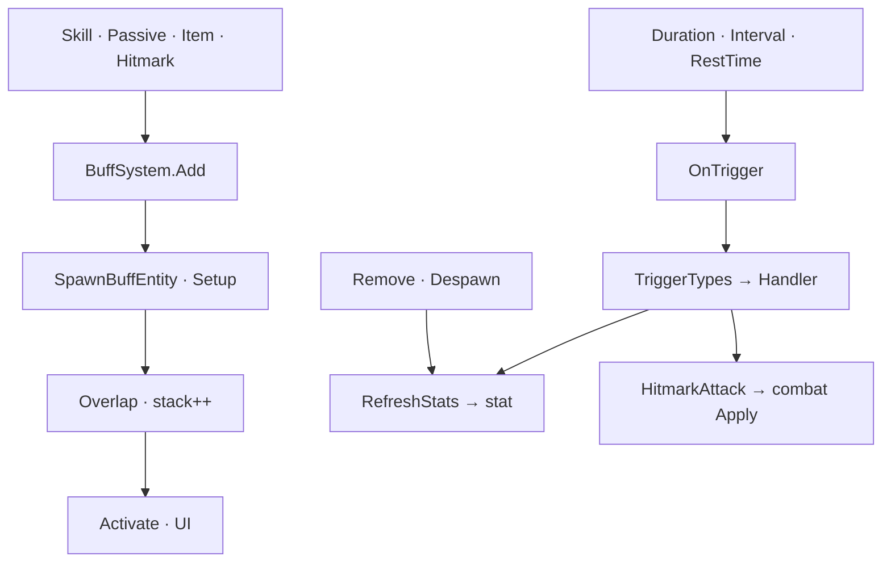

버프는 지속·중첩·주기 틱을 가진 상태이고, 붙을 때·틱마다 스탯·타격·스킬로 연결됩니다. CC(기절 등)가 스킬 입력을 막는 지점까지 정리합니다.

[트리거·연쇄]({{ "/notes/dragon-combat-cluster-read/" | relative_url }}) 시리즈 2편입니다. Buff 층의 Add·Stack·Trigger How와 Buff/Passive **역할 분리**는 [읽기 지도]({{ "/notes/dragon-combat-cluster-read/" | relative_url }})·[3편 passive]({{ "/notes/dragon-combat-passive-bridge/" | relative_url }})와 함께 봅니다. 이 글은 **전투 연동** — Add/Trigger → stat·combat, CC → skill — 에 맞춥니다.

## 맥락

| | Buff | Passive |
|--|------|---------|
| 단위 | BuffEntity · stack · duration | PassiveEntity · Manager queue |
| 비유 | **지금 걸린 상태** (독·공격력 up·기절) | **사건에 반응하는 규칙** |
| AddBuff | **본체** | Effect가 BuffSystem.Add **호출** |

게임 예:

- **공격력 버프** — Add → Stat Modifier → [2편 stat]({{ "/notes/dragon-combat-stat/" | relative_url }})
- **독 DoT** — Trigger tick → Hitmark → [3편 combat]({{ "/notes/dragon-combat-hit-flow/" | relative_url }}) (Projectile 없이 많음)
- **기절** — StateEffect → 스킬 버튼 차단

SkillEntity.Buff · Passive AddBuff Effect · Item 등이 `BuffSystem.Add`로 들어옵니다. Remove 시 Stat **RemoveBySource** 쌍([타격·데미지 2편]({{ "/notes/dragon-combat-stat/" | relative_url }}))을 지킵니다 — 버프 해제 후 스탯 잔존 QA.

## Add · Lifecycle

**Producer → Add → Spawn BuffEntity → Setup · Overlap → Activate**

| 단계 | 요지 |
|------|------|
| Add | `FindBuffClone` — 런타임 SO mutate 금지 |
| Overlap | stack · 같은 버프 겹침 · `CheckRemovingStackSequentially` 중 Add 거부 |
| Duration/Interval | 코루틴 · RestTime(Buff 전용 재발동 간격) |
| Remove | Stat Remove(source=BuffEntity) · Despawn |
| Death | BuffSystem.Clear — [1편]({{ "/notes/dragon-combat-character/" | relative_url }}) 연쇄 |

## Trigger Handler (family)

Handler 전수는 Architecture(스튜디오 내부)에 두고, **연동**만 표로 고릅니다.

| family | Handler 예 | 연결 |
|--------|------------|------|
| Combat | HitmarkAttack · MaxStackHitmarkAttack | [combat Apply]({{ "/notes/dragon-combat-hit-flow/" | relative_url }}) |
| Stat | IncreaseStatFor* · RefreshStats | [stat Modifier]({{ "/notes/dragon-combat-stat/" | relative_url }}) |
| Skill | AddSkillPoint · ReduceCooldown* | [스킬]({{ "/notes/dragon-skill-cast/" | relative_url }}) |
| Item/Gold/Misc | 포션 · 재화 | Item |

DoT tick은 Trigger → Attack → **combat** 회귀 QA가 필요합니다. ExecuteAttack 순서(Passive → Buff → Damage)는 [3편 passive]({{ "/notes/dragon-combat-passive-bridge/" | relative_url }})와 맞춥니다.

## StateEffect (CC)

StateEffect registry · Incompatible maps → **`CharacterHandleSkill` blocking**([1편]({{ "/notes/dragon-combat-character/" | relative_url }})). CC는 Buff 층이 소유하고, skill은 **입력 차단**만 소비합니다 — **이 상태면 스킬 버튼이 막힌다**.

| | Buff RestTime | Passive Rest | Skill Cast Rest |
|--|---------------|--------------|-----------------|
| 역할 | Buff 재발동 간격 | 패시브 규칙 재발동 | 시전 쿨·Rest |
| 혼동 금지 | ✓ | ✓ | ✓ |

## 정리

Buff는 **Add/Stack/Duration + Trigger Handler**로 stat·combat·skill에 연결됩니다. Remove는 Stat 쌍, CC는 skill 입력과 만납니다. 다음 [3편]({{ "/notes/dragon-combat-passive-bridge/" | relative_url }})에서 이벤트 큐·ExecuteAttack을 봅니다. Buff partial·Handler 구현 표는 Architecture(스튜디오 내부)에, Buff SO Scriptable은 [`excel-json-fixed-data`]({{ "/notes/excel-json-fixed-data/" | relative_url }})에, save/load 후 인게임 buff 없음은 의도(세이브 범위 밖)입니다.
