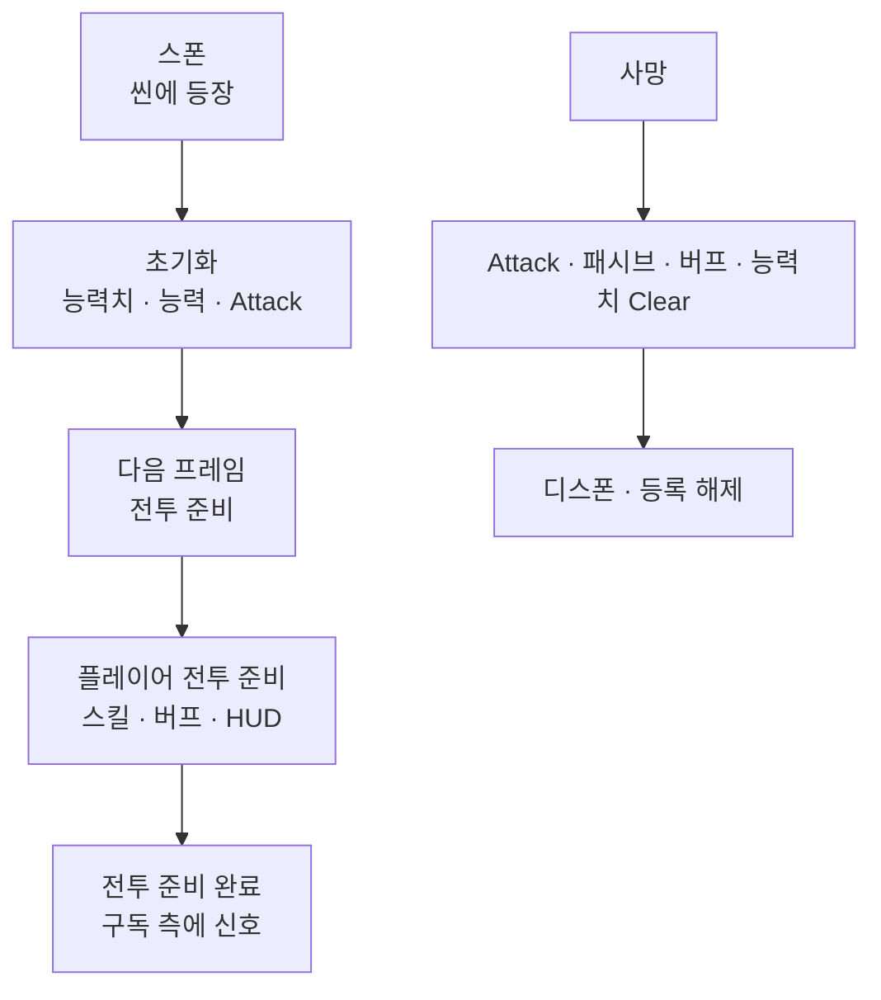

스테이지에 전투 주체가 서는 순서, 전투 준비 전후에 스킬·AI·숫자가 켜지는 시점, 사망 시 하위 시스템을 비우는 생명주기를 정리합니다.

[타격·데미지]({{ "/notes/dragon-combat-cluster-read/" | relative_url }}) 시리즈 1편입니다. Stat·Combat·스킬·버프·패시브는 같은 **Owner**(캐릭터) 아래 붙지만, **누가 씬에 있고 언제 tick이 켜지는지**는 캐릭터 층이 먼저 정합니다. [읽기 지도]({{ "/notes/dragon-combat-cluster-read/" | relative_url }})에서 두 줄기 전체를 보면 됩니다.

## 맥락

플레이·QA에서 자주 보이는 증상은 이렇게 갈라집니다.

- **전투 준비 전** 스킬 입력이 무시되거나 AI가 움직이지 않음
- **죽은 뒤** 버프·능력치·패시브가 남아 다음 전투에 섞임
- **세이브 캐릭터**와 **지금 필드의 몬스터**를 같은 대상으로 QA함

전투 숫자·히트마크·버프를 설명할 때 Owner가 없으면 “누구의 능력치인가”“BattleReady 전에 스킬을 써도 되나”가 공중에 뜹니다. 드래곤 이즈 데드에서는 **캐릭터 베이스**(`TSCharacter`)가 런타임 엔티티이고, **캐릭터 매니저**(`CharacterManager`)가 플레이어·몬스터·동맹을 등록합니다.

| 구분 | Profile / Data | Runtime (필드) |
|------|----------------|----------------|
| 세이브의 스킬·유물·능력치 | ✓ 저장·로드 | 필드 인스턴스가 참조 |
| 선택된 캐릭터 | ✓ | 플레이어 런타임이 소비 |
| 매니저의 “지금 플레이어” | — | ✓ 전투에서 기준 |
| 테이블 캐릭터 데이터 | 테이블 | 초기화 입력 |

**세이브에 있는 캐릭터**와 **지금 맞고 있는 몬스터**는 다른 층입니다. 프로필과 프리팹 인스턴스를 혼동하면 퀘스트·통계·착용 QA가 한꺼번에 어긋납니다.

## 생명주기

**스폰 → 초기화 → 전투 준비 → (tick) → 사망 → 디스폰**

1. **스폰** — 플레이어·몬스터가 씬에 등장. 플레이어 Spawner는 **Stage 프리팹 자식**(GameMain 루트 금지).
2. **초기화** — 기본 능력치·능력·Attack 배선. ([2편]({{ "/notes/dragon-combat-stat/" | relative_url }})) 이 단계까지는 **전투 입력·AI가 아직 열리지 않을 수 있음**.
3. **전투 준비** — 다음 프레임 뒤. Attack·Shield·Feedbacks. 플레이어는 장비·유물·스킬/버프·HUD. **여기서부터** “전투 준비 완료”로 QA.
4. **전투 준비 이벤트** — 플레이어가 준비되면 입력·미니맵·퀘스트 등이 구독. 보스 등은 캠프별 참여 신호가 따로 있습니다.
5. **사망** — Attack/패시브/버프/능력치 Clear, 사망 상태. **죽으면 하위 시스템을 비움** — 잔존 버프·능력치 QA의 기준. 몬스터는 드랍·경험치 일부.
6. **디스폰** — Vital 등록 해제, 매니저에서 플레이어·몬스터 해제.

전투 준비 **전** 스킬·AI를 가정하면 참조가 아직 안 잡혀 **무반응·오류**가 납니다. AI는 Initialize에서 끈 뒤 BattleReady에서 켜는 순서가 있습니다.

## 매니저 · 스폰

| Camp | 런타임 | 전투 참여 신호 |
|------|--------|----------------|
| Player | 플레이어 | ✓ (전투 준비) |
| Monster | 몬스터 | ✓ (스폰) |
| Boss | 보스 | ✓ (전투 준비) |
| Ally | 동맹 | — |

씬 전환 시 몬스터·동맹은 비우고, 지역(Area) 안에서는 플레이어를 유지합니다. 재로드 시에는 플레이어를 다시 만들고 등록을 맞춥니다. 게임 시작 시 매니저도 초기화합니다.

## 컴포넌트 지도

같은 Owner 아래 능력치·Vital·공격·버프·패시브·소환·Physics Controller가 붙습니다. **이 글은 존재·타이밍만** 봅니다. 숫자·타격·연쇄는 형제 노트.

**플레이어만:** 스킬·타겟팅. **몬스터만:** AI·드랍.

| 컴포넌트 | 이 시리즈에서 | 상세 |
|----------|---------------|------|
| 능력치 | 초기화 · 사망 Clear | [2편]({{ "/notes/dragon-combat-stat/" | relative_url }}) |
| Vital · Attack | 초기화 · 사망 | [3편]({{ "/notes/dragon-combat-hit-flow/" | relative_url }}) |
| 버프 · 패시브 | 전투 준비 · 매 프레임 · Clear | [트리거·연쇄]({{ "/notes/dragon-combat-skill-bridge/" | relative_url }}) |
| 스킬 | 플레이어 전투 준비 · 시전 | [스킬 시전]({{ "/notes/dragon-skill-cast/" | relative_url }}) · [Apply 시점]({{ "/notes/dragon-combat-skill-bridge/" | relative_url }}) |

이동·점프·대시·스킬 입력 등은 매 프레임 능력 루프에서 돌며, **전투 권한**과 **UI 팝업으로 입력을 막는 것**은 별개입니다.

## 게임 루프 (요지)

매 프레임 **캐릭터 매니저**가 등록된 캐릭터의 로직·물리 갱신을 돌립니다. 패시브 등은 **전투 준비 게이트** 아래에서만 tick. Pause는 몬스터·동맹 AI/물리 정지(플레이어 스킬 Pause와 별도).

## 정리

캐릭터 층은 **스폰·초기화·전투 준비·사망 Clear·매니저 등록**의 기준입니다. 능력치·공격·스킬·버프·패시브는 같은 Owner 위에서 돌아가며, 다음 [2편]({{ "/notes/dragon-combat-stat/" | relative_url }})에서 숫자가 어디서 쓰이고 읽히는지 이어집니다. 웨이브·스테이지 스폰 스케줄과 AI 의사결정은 스튜디오 내부에 두고, 네 층 Why·출시 요지는 [읽기 지도]({{ "/notes/dragon-combat-cluster-read/" | relative_url }})에 둡니다.
