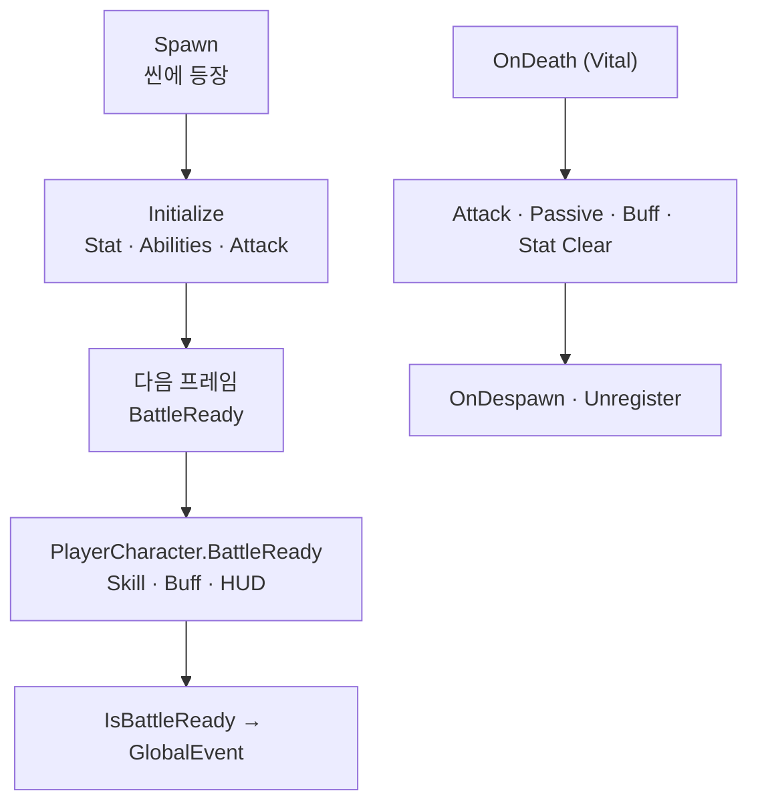

스테이지에 전투 주체가 서는 순서, 전투 준비 전후에 스킬·AI·숫자가 켜지는 시점, 사망 시 하위 시스템을 비우는 생명주기를 정리합니다.

[타격·데미지]({{ "/notes/dragon-combat-cluster-read/" | relative_url }}) 시리즈 1편입니다. Stat·Combat·Skill·Buff·Passive는 같은 **Owner**(캐릭터) 아래 붙지만, **누가 씬에 있고 언제 tick이 켜지는지**는 캐릭터 층이 먼저 정합니다. [읽기 지도]({{ "/notes/dragon-combat-cluster-read/" | relative_url }})에서 두 줄기 전체를 보면 됩니다.

## 맥락

플레이·QA에서 자주 보이는 증상은 이렇게 갈라집니다.

- **전투 준비 전** 스킬 입력이 무시되거나 AI가 움직이지 않음
- **죽은 뒤** 버프·스탯·패시브가 남아 다음 전투에 섞임
- **세이브 캐릭터**와 **지금 필드의 몬스터**를 같은 대상으로 QA함

전투 숫자·Hitmark·버프를 설명할 때 Owner가 없으면 “누구의 Stat인가”“BattleReady 전에 Skill을 써도 되나”가 공중에 뜹니다. 드래곤 이즈 데드에서는 **`TSCharacter`** 가 런타임 엔티티 베이스이고, **`CharacterManager`** 가 Player(0~1)·Monsters·Alliances를 등록합니다.

| 구분 | Profile / Data | Runtime (Character) |
|------|----------------|---------------------|
| `VCharacter` Skill·Relic·Stat | ✓ 저장·로드 | `CharacterInfo` 참조 |
| `GetSelectedCharacter()` | ✓ | `PlayerCharacter`가 소비 |
| `CharacterManager.Player` | — | ✓ 전투에서 “지금 플레이어”의 기준 |
| Json `CharacterData` | 테이블 | Initialize 입력 |

**세이브에 있는 캐릭터**와 **지금 맞고 있는 몬스터**는 다른 층입니다. 프로필과 프리팹 인스턴스를 혼동하면 퀘스트·통계·착용 QA가 한꺼번에 어긋납니다.

## 생명주기

**스폰 → Initialize → BattleReady → (tick) → Death → Despawn**

1. **Spawn** — 플레이어·몬스터가 씬에 등장. (`ResourcesManager.SpawnPlayerCharacter` / `SpawnMonsterCharacter`) 플레이어 Spawner는 **Stage 프리팹 자식**(GameMain 루트 금지).
2. **Initialize** — 기본 스탯·능력·Attack 배선. ([2편]({{ "/notes/dragon-combat-stat/" | relative_url }})) 이 단계까지는 **전투 입력·AI가 아직 열리지 않을 수 있음**.
3. **BattleReady** — 다음 프레임 뒤. Attack·Shield·Feedbacks. 플레이어는 장비·유물·Skill/Buff OnBattleReady·HUD. **여기서부터** “전투 준비 완료”로 QA.
4. **IsBattleReady** — Player + setter일 때 `PLAYER_CHARACTER_BATTLE_READY`. 입력·Minimap·Quest 등 구독.
5. **OnDeath** — Vital. Attack/Passive/Buff/Stat Clear, Condition Dead. **죽으면 하위 시스템을 비움** — 잔존 버프·스탯 QA의 기준. 몬스터는 드랍·EXP partial.
6. **OnDespawn** — Vital Unregister, `UnregisterPlayer` / Monster 해제.

BattleReady **전** Skill·Brain을 가정하면 참조가 아직 안 잡혀 **무반응·오류**가 납니다. Brain은 Initialize에서 Deactivate 후 BattleReady에서 활성화하는 순서가 있습니다.

## CharacterManager · Spawner

| Camp | 타입 | Register | BattleReady 이벤트 (전투 참여 신호) |
|------|------|----------|-------------------------------------|
| Player | `PlayerCharacter` | RegisterPlayer | `PLAYER_CHARACTER_BATTLE_READY` |
| Monster | `MonsterCharacter` | RegisterMonster | `MONSTER_CHARACTER_SPAWNED` |
| Boss | `BossCharacter` | RegisterMonster | `BOSS_CHARACTER_BATTLE_READY` |
| Ally | `AllyCharacter` | RegisterAlliance | — |

씬 전환: `ClearMonsterAndAlliance`, Area 내 전환 시 `DontDestroyPlayerOnLoad`(플레이어 유지), 재로드 시 `DoDestroyPlayerOnLoad` + Unregister. `GameManager` 시작 시 `CharacterManager.Reset`.

## 컴포넌트 지도

같은 Owner 아래 Stat·Vital·Attack·Buff·Passive·Summon·Physics Controller가 붙습니다. **이 글은 존재·타이밍만** 봅니다. 숫자·타격·연쇄는 형제 노트.

**Player only:** SkillSystem, TargetingSystem. **Monster only:** TSAIBrain, TSDropObjectSpawner.

| 컴포넌트 | 이 시리즈에서 | 상세 |
|----------|---------------|------|
| Stat | Initialize · Death Clear | [2편]({{ "/notes/dragon-combat-stat/" | relative_url }}) |
| MyVital · Attack | Initialize · OnDeath | [3편]({{ "/notes/dragon-combat-hit-flow/" | relative_url }}) |
| Buff · Passive | OnBattleReady · LogicUpdate · Clear | [트리거·연쇄]({{ "/notes/dragon-combat-skill-bridge/" | relative_url }}) |
| Skill | Player BattleReady · HandleSkill | [스킬 시전]({{ "/notes/dragon-skill-cast/" | relative_url }}) · [Apply 시점]({{ "/notes/dragon-combat-skill-bridge/" | relative_url }}) |

`CharacterAbility[]`(이동·점프·대시·`CharacterHandleSkill` 등)는 `LogicUpdate`에서 Early/Process/Late로 돌며, `IsAuthorized`와 `IsBlockInput`(UI Popup)은 별개입니다.

## 게임 루프 (요지)

매 프레임 **CharacterManager**가 등록된 캐릭터의 LogicUpdate·PhysicsUpdate를 돌립니다. Passive 등은 **`IsBattleReady` 게이트** 아래에서만 tick. Pause는 몬스터·동맹 Brain/Physics 정지(플레이어 Skill Pause와 별도). (`GameManager.Update` → `CharacterManager.LogicUpdate` → `TSCharacter.LogicUpdate`)

## 정리

캐릭터 층은 **스폰·Initialize·BattleReady·Death Clear·Manager 등록**의 기준입니다. Stat·Combat·Skill·Buff·Passive는 같은 Owner 위에서 돌아가며, 다음 [2편]({{ "/notes/dragon-combat-stat/" | relative_url }})에서 숫자가 어디서 쓰이고 읽히는지 이어집니다. Wave·Stage 스폰 스케줄은 Stage·Wave Architecture에, AI Decision/Action은 Architecture(스튜디오 내부)에, 네 층 Why·출시 요지는 [읽기 지도]({{ "/notes/dragon-combat-cluster-read/" | relative_url }})에 둡니다.
