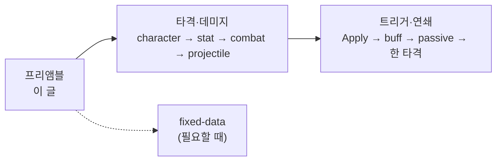

전투 코드를 처음 볼 때 어디부터 읽어야 하는지, 스킬·타격·버프·패시브가 서로 무엇을 넘기지 않는지를 두 줄기로 정리합니다.

[드래곤 이즈 데드]({{ "/projects/dragon-is-dead/" | relative_url }}) 전투 클러스터 **읽기 지도**입니다. 아래 두 시리즈([타격·데미지]({{ "/notes/dragon-combat-character/" | relative_url }}) · [트리거·연쇄]({{ "/notes/dragon-combat-skill-bridge/" | relative_url }}))의 입구로 쓰면 됩니다. 플레이어 스킬 **성장·시전** 체감은 [스킬]({{ "/notes/dragon-skill-growth/" | relative_url }}) 시리즈가, 고정 데이터는 [`excel-json-fixed-data`]({{ "/notes/excel-json-fixed-data/" | relative_url }})가 담당합니다.

## 맥락

전투를 처음 볼 때 “스킬 클래스부터” 들어가면 **누구의 숫자인지**, **전투 준비가 끝났는지**가 빠진 채로 타격만 따라가기 쉽습니다. 반대로 “HP만” 보면 버프·패시브가 **언제** 붙는지가 흐려집니다. 코드를 열지 않아도, QA에서 “전투 준비 전 스킬 무시”“맞았는데 0”“버프 해제 후 스탯 잔존” 같은 증상은 같은 이유로 갈라집니다.

그래서 질문 유형을 **두 줄기**로 나눕니다.

| 줄기 | 질문 (입 밖으로 물을 수 있는 형태) | 시리즈 |
|------|-----------------------------------|--------|
| **1 — 캐릭터·수치·피격** | 필드에 누가 있고, 숫자는 어디서 오며, 맞으면 HP·가드에 어떻게 닿나 | [타격·데미지]({{ "/notes/dragon-combat-character/" | relative_url }}) 4편 |
| **2 — 트리거·연쇄** | 스킬·버프·패시브가 한 타격으로 어떻게 모이고, 맞은 뒤 또 무엇이 연쇄되나 | [트리거·연쇄]({{ "/notes/dragon-combat-skill-bridge/" | relative_url }}) 4편 |

## 이 시리즈에서 쓰는 말

| 말 | 역할 | 코드에서는 (참고) |
|----|------|-------------------|
| **Owner** | 타격·버프·스탯의 주인 캐릭터 | `TSCharacter` |
| **Hitmark** | 한 방의 정의 — 수치·타입 묶음 | Hitmark ID · Scriptable clone |
| **Activate** | 타격 **시작** — 대상을 잡기 전 | `AttackEntity.Activate` |
| **Apply** | 정의를 읽어 계산한 뒤 HP·자원에 **반영** | `AttackEntity.Apply` |
| **transport** | 날아가 맞히기만 — 데미지 식은 없음 | Projectile |

**두 줄기 지도**

## 네 층 경계

런타임 흐름 위에 Skill·Hitmark·Buff·Passive **역할 분리**를 겹쳐 둡니다. 캐릭터·Stat·Projectile은 이 표 **밖** — Owner·숫자·transport입니다.

| 층 | 질문 | 이 층이 결정하는 것 | 넘기지 않음 | 시리즈에서 |
|----|------|---------------------|-------------|------------|
| **Skill** | 언제 쓰는가 | 입력·쿨·Rest·버퍼·슬롯 | 피해 공식·스택·CC | [Apply 시점]({{ "/notes/dragon-combat-skill-bridge/" | relative_url }}) · [스킬 시전]({{ "/notes/dragon-skill-cast/" | relative_url }}) |
| **Hitmark** | 무엇이 맞는가 | 타격 정의 → Apply → Vital | 쿨·패시브 조건식 | [타격·데미지 3편]({{ "/notes/dragon-combat-hit-flow/" | relative_url }}) |
| **Buff** | 지금 어떤 상태인가 | stack·duration·CC·Trigger | 이벤트 규칙 전체 | [트리거·연쇄 2편]({{ "/notes/dragon-combat-buff-bridge/" | relative_url }}) |
| **Passive** | 무슨 일이면 무엇을 하는가 | Trigger→Condition→Effect·큐 | 피해 식·Buff stack 정책 | [트리거·연쇄 3편]({{ "/notes/dragon-combat-passive-bridge/" | relative_url }}) |

같은 Hitmark ID를 스킬·투사체·Buff DoT가 공유합니다. Skill은 Apply **앞**에서 끊고, Passive Effect는 Buff·Hitmark·Skill API에 **위임**합니다.

## 권장 읽기 순서

1. **이 글** — 두 줄기·네 층·용어
2. **[타격·데미지]({{ "/notes/dragon-combat-character/" | relative_url }})** — character → stat → [맞으면 무엇이 일어나는가]({{ "/notes/dragon-combat-hit-flow/" | relative_url }}) → [투사체]({{ "/notes/dragon-combat-projectile/" | relative_url }})
3. (선택) Hitmark/Buff/Passive SO·Stat Json — [`excel-json-fixed-data`]({{ "/notes/excel-json-fixed-data/" | relative_url }})
4. **[트리거·연쇄]({{ "/notes/dragon-combat-skill-bridge/" | relative_url }})** — Apply → buff → passive → [한 타격으로 모이기]({{ "/notes/dragon-combat-one-hit/" | relative_url }})

런타임 흐름만 따라가면 1~4까지로 충분합니다. Json·Scriptable 필드는 필요할 때만 fixed-data를 엽니다.

## 출시에서 지킨 것 (요지)

얼리 액세스(2024.06)부터 정식(2025.06)까지 같은 클러스터 위에서 콘텐츠를 늘렸을 때, 문서·코드에 남긴 **소유 경계**입니다. 완벽한 설계가 아니라 “어디에 넣을지”를 고정한 기록에 가깝습니다.

| 경계 | QA에서 보이는 쪽 |
|------|------------------|
| Skill — 쿨·Rest·버퍼·슬롯. 피해 식은 Hitmark | 스킬 UI와 실제 데미지 숫자가 다른 층 |
| Hitmark — 무효·로드 실패 시 Apply 중단 | 맞았는데 0 · 정의 없음 |
| Passive — 전역 큐·프레임 상한·Rest. Effect는 API 위임 | 한 프레임에 연쇄 폭주 |
| Buff Remove — Stat source 제거 쌍 | 버프 해제 후 스탯 잔존 |
| 데이터 — Facade로만 읽기 | 핫패스 dict 직접 접근 금지 |

**남은 갭:** STR/INT ↔ 물리/마법 공격력 **설계 계약**과 generic `AttackPower` 구현은 아직 어긋날 수 있습니다([2편 stat]({{ "/notes/dragon-combat-stat/" | relative_url }})). Passive·Buff·Damage **이벤트 순서**는 콘텐츠가 늘수록 QA가 필요합니다.

## fixed-data는 언제 여는가

표로 고치는 Stat Json, Scriptable Hitmark/Buff/Passive 정의가 **어디서 clone되어 들어오는지**가 궁금할 때만 [`excel-json-fixed-data`]({{ "/notes/excel-json-fixed-data/" | relative_url }})를 엽니다. 시리즈 1·2는 **런타임 흐름** 위주입니다.

## 정리

전투 클러스터는 **타격·데미지(시리즈 1)** 와 **트리거·연쇄(시리즈 2)** 두 줄기로 읽고, Skill·Hitmark·Buff·Passive 네 층으로 **역할**을 겹쳐 보면 됩니다. Trigger 50+·Handler 22 전수는 Architecture(스튜디오 내부)에, Stage·Wave 스폰 스케줄은 액션·Stage Architecture에, GC·pool hot path는 Optimization·성능 노트에 둡니다.
