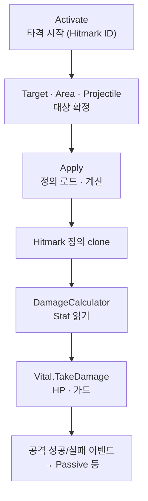

한 번 맞았을 때 타격 정의가 로드되고, 능력치를 읽어 계산한 뒤 HP·가드에 닿는 경로와, 근접·범위·투사체가 대상만 다르게 잡는 방식을 정리합니다.

[타격·데미지]({{ "/notes/dragon-combat-cluster-read/" | relative_url }}) 시리즈 3편입니다. 플레이어에게 **「한 번 맞았다」**는 체감은 하나지만, 구현에서는 **타격을 시작하는 쪽**과 **숫자를 계산해 HP를 깎는 쪽**이 갈라집니다. Owner·Initialize는 [1편]({{ "/notes/dragon-combat-character/" | relative_url }})·[2편]({{ "/notes/dragon-combat-stat/" | relative_url }})이 담당합니다.

## 이 글에서 쓰는 말

| 말 | 역할 | 코드에서는 (참고) |
|----|------|-------------------|
| **Hitmark** | 한 방의 정의 — 수치·타입 묶음 | Scriptable clone · Hitmark ID |
| **Activate** | 타격 **시작** | `AttackEntity.Activate` |
| **Apply** | 정의 로드 → 계산 → Vital **반영** | `AttackEntity.Apply` |
| **Target / Area / Projectile** | **대상을 잡는 방식** — 근접·범위·날아감 | Attack 형태 |
| **DamageCalculator** | Hitmark + [Stat 읽기]({{ "/notes/dragon-combat-stat/" | relative_url }}) | `FindCalculateValue` |
| **Vital** | Life·Guard·TakeDamage·OnDeath | HP·가드 |

## 맥락

“맞았는데 0”“근접과 투사체 숫자가 달라야 하는데 같다/다르다” 같은 QA는 **경로 B(Apply 이후)** 에서 잡힙니다. 타격 정의 → 계산 → Vital 축은 [블레이드 어썰트]({{ "/projects/blade-assault/" | relative_url }})에서도 출시했습니다. BA는 Command·무기 hitmark 슬롯이 앞에 더 두껍고, 이 글은 드래곤의 Activate·Apply 경계입니다. 드래곤 이즈 데드는 **Hitmark ID**로 “한 방의 의미”를 고정하고, Target / Area / Projectile은 **누구에게 Apply할지**만 다르게 둡니다.

- **Target** — 지정·근접 단일(계) 대상
- **Area** — 박스·원·호 범위 검색
- **Projectile** — 날아가 충돌 후 child Attack ([4편]({{ "/notes/dragon-combat-projectile/" | relative_url }}))

## 두 경로

**경로 A — 트리거 진입** (얕게): Skill·Buff·Passive·애니 타이밍 → `Activate`. **타격을 시작**만 하고, 숫자·HP는 아직. 상세는 [트리거·연쇄]({{ "/notes/dragon-combat-skill-bridge/" | relative_url }}).

**경로 B — Apply → Vital** (이 글의 중심): 정의 로드 → Stat 읽기 → HP·가드 반영.

1. **Activate** — Hitmark ID로 Attack 활성화.
2. **형태별 대상 확정** — Target: 지정/근접, Area: 범위 검색, Projectile: transport 후 child Attack([4편]({{ "/notes/dragon-combat-projectile/" | relative_url }})).
3. **Apply** — `FindHitmarkClone`, 유효하지 않으면 **중단**(맞았는데 0).
4. **DamageCalculator** — 정의 항목마다 Stat 소비, 회피·가드 반영.
5. **Vital** — Life·Guard·OnDeath → [1편]({{ "/notes/dragon-combat-character/" | relative_url }}) Clear 연쇄.
6. (선택) GlobalEvent — Passive 반응([트리거·연쇄 3편]({{ "/notes/dragon-combat-passive-bridge/" | relative_url }})).

## 세 형태

| 형태 | 맞히는 방식 | Apply 이후 |
|------|-------------|------------|
| **Target** | 단일(계) 대상 | 동일 파이프라인 |
| **Area** | 박스·원·호 → VitalManager 검색 | 동일 |
| **Projectile** | Spawn · Tick · Collision → child Attack | 동일 ([4편]({{ "/notes/dragon-combat-projectile/" | relative_url }})) |

Projectile은 **피해 식을 갖지 않습니다**. 날아가 맞히기(transport)만 하고, **맞은 뒤 숫자는 이 글과 같은 Hitmark 파이프라인**을 탑니다.

한 Hitmark 정의를 근접 Target과 Projectile 충돌이 **공유**할 수 있습니다. 갈래만 바꿔도 “한 방”의 의미는 ID 한곳에 남습니다.

## Stat · Combat 접점

Apply 직전·직후 DamageCalculator가 **Stat 읽기**([2편]({{ "/notes/dragon-combat-stat/" | relative_url }}))를 호출합니다. Buff Trigger의 stat Handler도 RefreshStats → Modifier지만, **타격 한 번의 숫자**는 이 Apply 경로에서 소비됩니다.

UI 스킬 상세의 예상 피해는 가능하면 **같은 계산 경로**를 재사용합니다. 전투 씬에 적이 없어도 “이 Hitmark면 어떤 식인가”를 맞추기 위함입니다 — UI와 실제 타격 불일치 QA.

## 네 층에서의 위치

[읽기 지도]({{ "/notes/dragon-combat-cluster-read/" | relative_url }})에서 Hitmark는 “무엇이 맞는가” 층입니다. Skill은 Apply **앞**에서 끊고([Apply 시점]({{ "/notes/dragon-combat-skill-bridge/" | relative_url }})), Buff·Passive는 Trigger·Effect로 Activate에 다시 붙습니다. Projectile transport는 [4편]({{ "/notes/dragon-combat-projectile/" | relative_url }})으로 분리합니다.

## 정리

한 번 맞음은 **Activate → (형태) → Apply → DamageCalculator → Vital**로 모입니다. Target·Area·Projectile은 대상 확정만 다르고, Stat은 Apply에서 읽히며, Death는 Vital OnDeath에서 [1편]({{ "/notes/dragon-combat-character/" | relative_url }}) Clear로 이어집니다. Projectile transport는 [4편]({{ "/notes/dragon-combat-projectile/" | relative_url }})에서 이어집니다. Buff stack·Passive queue는 [트리거·연쇄]({{ "/notes/dragon-combat-skill-bridge/" | relative_url }})에, Hitmark SO 필드·Scriptable 경로는 [`excel-json-fixed-data`]({{ "/notes/excel-json-fixed-data/" | relative_url }})·Architecture에, VFX·Floaty·피드백은 전투 피드백(범위 밖)에 둡니다.
