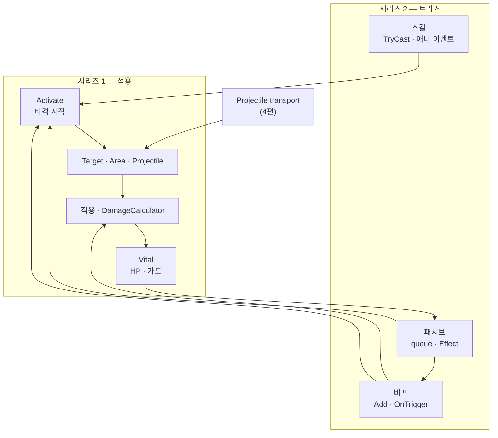

스킬·버프·패시브·투사체가 한 번의 타격으로 모일 때, combat·HP·연쇄까지 이어지는 한 장 지도로 복습합니다. 시리즈 1·2를 마친 뒤 QA·회귀 확인 축으로 씁니다.

[트리거·연쇄]({{ "/notes/dragon-combat-cluster-read/" | relative_url }}) 시리즈 4편(마지막)입니다. **이 글은 새 개념을 추가하지 않습니다** — [타격·데미지]({{ "/notes/dragon-combat-character/" | relative_url }})·[트리거·연쇄 1~3편]({{ "/notes/dragon-combat-skill-bridge/" | relative_url }})을 한 장으로 묶는 capstone입니다. 스킬→히트마크 **직선**만 보려면 [스킬 시전]({{ "/notes/dragon-skill-cast/" | relative_url }})과 [적용 시점]({{ "/notes/dragon-combat-skill-bridge/" | relative_url }})을 먼저 보면 됩니다.

## 맥락

시리즈 1([타격·데미지]({{ "/notes/dragon-combat-character/" | relative_url }}))에서 Owner·능력치·적용·Projectile transport를 봤고, 시리즈 2([1편]({{ "/notes/dragon-combat-skill-bridge/" | relative_url }}~[3편]({{ "/notes/dragon-combat-passive-bridge/" | relative_url }}))에서 트리거·연쇄를 봤습니다. 한 타에 스킬·버프·패시브가 모이는 문제는 [블레이드 어썰트]({{ "/projects/blade-assault/" | relative_url }})에서도 있었고, 이 글은 드래곤 시리즈를 한 장으로 복습합니다. 여기서 **한 번의 입력/이벤트가 Vital·연쇄까지** 어떻게 모이는지 한 장으로 고정합니다.

**읽는 순서:** 왼쪽(스킬·버프·패시브)에서 Activate/Add/Effect로 combat에 진입 → 적용·Vital → (선택) 패시브 연쇄. Projectile은 transport([4편]({{ "/notes/dragon-combat-projectile/" | relative_url }}))만 거친 뒤 같은 적용.

## end-to-end

**입력 또는 이벤트 → (스킬/버프/패시브) → 전투 적용 → Vital → (패시브 연쇄)**

| 구간 | 시리즈 | 노트 |
|------|--------|------|
| BattleReady · Owner | 1 | [character]({{ "/notes/dragon-combat-character/" | relative_url }}) |
| 능력치 읽기 | 1 | [stat]({{ "/notes/dragon-combat-stat/" | relative_url }}) |
| 적용 · Vital | 1 | [hit-flow]({{ "/notes/dragon-combat-hit-flow/" | relative_url }}) |
| Projectile만 | 1 | [projectile]({{ "/notes/dragon-combat-projectile/" | relative_url }}) |
| 적용 경계 | 2 | [skill-bridge]({{ "/notes/dragon-combat-skill-bridge/" | relative_url }}) |
| 버프·CC | 2 | [buff-bridge]({{ "/notes/dragon-combat-buff-bridge/" | relative_url }}) |
| ExecuteAttack | 2 | [passive-bridge]({{ "/notes/dragon-combat-passive-bridge/" | relative_url }}) |

## 트리거 진입 vs 적용 (복습)

- **경로 A** — SkillEntity · Buff Handler · Passive Effect · 애니 → `Activate` (타격 **시작**만).
- **경로 B** — 적용 → Hitmark clone → [능력치 읽기]({{ "/notes/dragon-combat-stat/" | relative_url }}) → Vital ([hit-flow]({{ "/notes/dragon-combat-hit-flow/" | relative_url }})).

스킬 노트는 적용 **앞**에서 끊고, combat은 적용 **뒤**만 소유합니다.

## 형태별 분기

| 형태 | 언제 [projectile]({{ "/notes/dragon-combat-projectile/" | relative_url }})를 다시 보나 |
|------|-------------------------------------------------------------------------------------|
| Target · Area | transport 없음 — 3편 hit-flow만 |
| Projectile | Spawn/Tick/Hit — 4편 후 적용는 3편과 동일 |

## QA · 회귀 축

| 확인 | 증상 예 | 축 |
|------|---------|-----|
| 능력치 변경 후 동일 히트마크 | 버프 on/off 후 숫자 불일치 | 능력치 + combat |
| 버프 on/off → Modifier 쌍 | 해제 후 공격력 잔존 | 능력치 + 버프 |
| ExecuteAttack 연쇄 · 프레임 상한 | 한 프레임 연쇄 폭주 | 패시브 |
| DoT Trigger → 히트마크 | 틱마다 0 · 이중 적용 | 버프 + combat |
| Death Clear | 죽은 뒤 버프·능력치 잔존 | [character]({{ "/notes/dragon-combat-character/" | relative_url }}) |

## 다른 노트로

| 목적 | 노트 |
|------|------|
| 네 층 · 출시 요지 | [읽기 지도]({{ "/notes/dragon-combat-cluster-read/" | relative_url }}) |
| 플레이어 스킬 체감 | [스킬]({{ "/notes/dragon-skill-growth/" | relative_url }}) |
| 고정 데이터 | [`excel-json-fixed-data`]({{ "/notes/excel-json-fixed-data/" | relative_url }}) |

## 정리

한 타격은 **스킬/버프/패시브가 Activate·Add·Effect로 전투 적용에 들어가고, 능력치를 읽어 Vital에 닿으며, 이벤트로 패시브가 다시 연쇄**할 수 있는 구조입니다. 시리즈 1·2를 마쳤으면 [읽기 지도]({{ "/notes/dragon-combat-cluster-read/" | relative_url }})로 돌아가 네 층·출시 요지를 복습하거나, [`excel-json-fixed-data`]({{ "/notes/excel-json-fixed-data/" | relative_url }})로 데이터 경로를 이어가면 됩니다. GC·pool hot path는 Optimization·성능 노트에, Stage·Wave는 액션 Architecture에, 코드 경로·Handler 전수는 Architecture(스튜디오 내부)에 둡니다.
