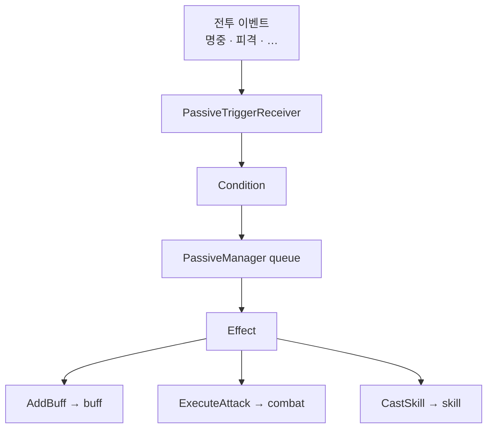

패시브는 맞았을 때·치명타 났을 때 같은 사건에 반응하는 규칙입니다. 한 타격이 연쇄로 다른 타격·버프·스킬을 부를 수 있어, 큐·프레임 상한·재발동 간격으로 폭주를 막습니다.

[트리거·연쇄]({{ "/notes/dragon-combat-cluster-read/" | relative_url }}) 시리즈 3편입니다. Passive **구조·폭주 제어**와 **combat 클러스터 연동**(ExecuteAttack · AddBuff Effect · CastSkill)을 함께 봅니다. [2편 buff]({{ "/notes/dragon-combat-buff-bridge/" | relative_url }})와 짝으로 읽으면 “타격 후 반응”이 잡힙니다.

## 맥락

Passive는 **사건 규칙**입니다. Buff는 **상태**(stack·duration)를 직접 들고, Passive는 Effect가 BuffSystem.Add · ExecuteAttack · CastSkill 등 **API에 위임**합니다([읽기 지도]({{ "/notes/dragon-combat-cluster-read/" | relative_url }})).

**연쇄 예:** 공격 성공 GlobalEvent → Passive ExecuteAttack → **또 한 번** [3편]({{ "/notes/dragon-combat-hit-flow/" | relative_url }}) Apply 파이프라인. 무한 루프·한 프레임 폭주가 나기 쉬워 **큐·상한·Rest**가 전제입니다.

트리거(50+ family) → 조건 → Effect 호출. 실행은 **PassiveManager** 지연 큐(`LateLogicUpdate`, `EXECUTE_MAX_COUNT`)로 모읍니다.

## Trigger → Effect

**PassiveTriggerReceiver → match · Condition → Manager queue → Effect**

| Effect | 본체 | 플레이어가 보는 결과 |
|--------|------|----------------------|
| AddBuff | [2편]({{ "/notes/dragon-combat-buff-bridge/" | relative_url }}) BuffSystem.Add | 상태·CC 부여 |
| ExecuteAttack | Hitmark Activate → [combat Apply]({{ "/notes/dragon-combat-hit-flow/" | relative_url }}) | 추가 타격·숫자 |
| CastSkill | [1편 skill]({{ "/notes/dragon-combat-skill-bridge/" | relative_url }}) TryCast 경로 | 연쇄 스킬 |

Skill이 시전 시 Passive를 **부여**하는 것과, 부여된 Passive가 **이벤트에 반응**하는 것은 단계가 다릅니다. 전자는 skill·buff 경로, 후자는 이 글의 Trigger→Effect입니다.

## ExecuteAttack ↔ combat

공격 성공/실패 GlobalEvent 이후 Passive가 ExecuteAttack Effect를 내면 **combat 경로 B**([3편]({{ "/notes/dragon-combat-hit-flow/" | relative_url }}))로 다시 들어갑니다. 한 프레임에 연쇄되기 쉬워 **큐·상한·Rest**가 전제입니다.

## 폭주를 막는 장치

Passive는 전투 이벤트에 연쇄되기 쉽습니다.

- **전역 큐** — 캐릭터 로컬에서 Effect를 즉시 끝내지 않음 (`PassiveManager`, `LateLogicUpdate`)
- **프레임당 실행 상한** — `EXECUTE_MAX_COUNT`로 한 프레임 반응 폭주 완화
- **Rest** — `PassiveRestTimeController`로 동일 규칙의 재발동 간격

대가는 발동이 다음 프레임·지연 뒤로 밀리거나, 상한에 걸려 그 프레임에 못 돌 수 있다는 점입니다. Buff RestTime · Skill Cast Rest와 **혼동하지 않습니다**([2편]({{ "/notes/dragon-combat-buff-bridge/" | relative_url }}), [스킬 시전]({{ "/notes/dragon-skill-cast/" | relative_url }})).

이벤트 순서(공격 성공 계열과 Passive·Buff·Damage)도 민감합니다. 같은 타격인데 버프가 먼저인지 같은 이슈는 [읽기 지도 출시 갭]({{ "/notes/dragon-combat-cluster-read/" | relative_url }})에 남깁니다.

## Death · tick

- [1편]({{ "/notes/dragon-combat-character/" | relative_url }}) OnDeath: PassiveSystem.Clear — Stat·Buff와 함께.
- LogicUpdate: `IsBattleReady` 게이트 아래 Passive tick([1편]({{ "/notes/dragon-combat-character/" | relative_url }})).

## 정리

Passive는 **이벤트 → 큐 → Effect 위임**입니다. ExecuteAttack은 combat Apply로, AddBuff는 buff 본체로 이어집니다. 마지막 [4편]({{ "/notes/dragon-combat-one-hit/" | relative_url }})에서 skill·buff·passive·combat·projectile을 한 줄기로 모읍니다. Trigger 50+ catalog·Condition DSL·partial은 Architecture(내부)에, Passive SO는 [`excel-json-fixed-data`]({{ "/notes/excel-json-fixed-data/" | relative_url }})에 둡니다.
