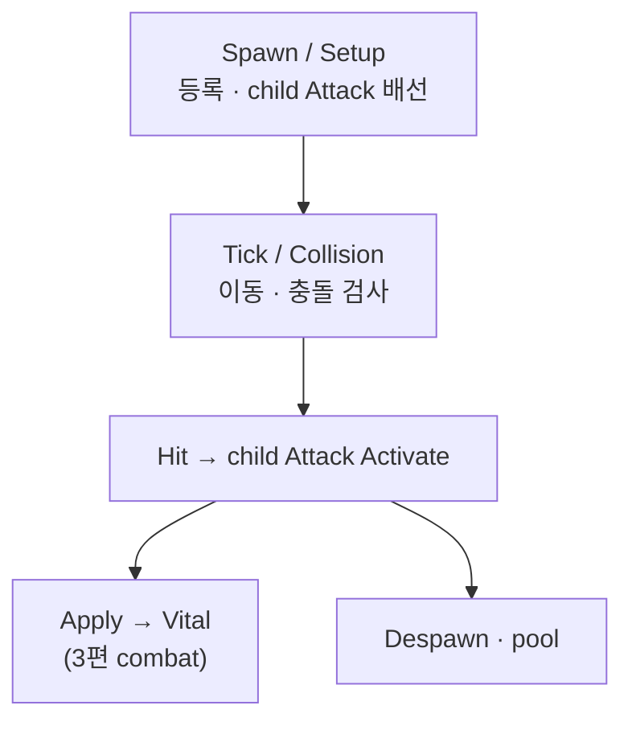

투사체는 날아가서 맞히는 것만 담당하고, 데미지 계산·HP 감소는 맞힌 뒤 기존 타격 파이프라인에 넘깁니다. Spawn부터 pool 반환까지 transport 경계만 정리합니다.

[타격·데미지]({{ "/notes/dragon-combat-cluster-read/" | relative_url }}) 시리즈 4편(마지막)입니다. [3편]({{ "/notes/dragon-combat-hit-flow/" | relative_url }})에서 Attack **형태** 중 Projectile은 “대상 확정 방식”으로만 소개했습니다. 이 글은 **비행·충돌·수명** transport 층만 깊게 봅니다. 피해식·Vital·Hitmark 정의는 [3편]({{ "/notes/dragon-combat-hit-flow/" | relative_url }})이 소유합니다.

## 맥락

투사체를 “작은 스킬”처럼 두면 **쿨·피해 식·pool·VFX**가 한 클래스에 섞입니다. 드래곤 이즈 데드에서는 **Projectile = transport(날아가 맞히기)**, **child Attack + Hitmark Apply = combat(숫자·HP)** 으로 경계를 둡니다.

QA에서 “화살이 맞았는데 0”이면 transport가 아니라 [3편]({{ "/notes/dragon-combat-hit-flow/" | relative_url }}) Apply·Hitmark 쪽을 봅니다. “안 맞음·벽에 막힘·pool 미반환”은 이 글 transport 쪽입니다.

| 계층 | 역할 |
|------|------|
| Projectile | movement · collision · pool · lifecycle |
| Combat | DamageCalculator · Vital · Hitmark clone · Apply |
| Resource | LeanPool · ResourcesManager (내부) |

## 경로

**Spawn · Setup → Tick · Collision → Hit · Despawn → (combat) Apply**

1. **Spawn / Setup** — 발사체 인스턴스, Owner·Hitmark ID·child AttackEntity 배선. registry에 등록.
2. **Tick / Collision** — 프레임 이동, 충돌 검사. active / pending registry 이중 구조(요지).
3. **Hit** — 충돌 대상에 child Attack으로 **combat 진입**. transport는 Apply **위임**만.
4. **Despawn** — 수명·관통 한도·벽 충돌 후 pool 반환.

맞은 뒤 숫자는 [3편]({{ "/notes/dragon-combat-hit-flow/" | relative_url }})과 **동일 Hitmark 파이프라인**입니다. Projectile이 DoT 식을 따로 갖지 않습니다.

## combat · skill 접점

- Skill 시전 → Projectile Spawn ([스킬 시전]({{ "/notes/dragon-skill-cast/" | relative_url }})) — Apply **앞**에서 끊음.
- Buff DoT Tick → Target Attack 등 **Projectile 없이** Hitmark 호출하는 경우도 많음([트리거·연쇄 2편]({{ "/notes/dragon-combat-buff-bridge/" | relative_url }})). 도트는 날아가는 오브젝트가 아닐 수 있습니다.
- [한 타격으로 모이기]({{ "/notes/dragon-combat-one-hit/" | relative_url }})에서 end-to-end로 다시 묶습니다.

## 이 글에서 다루지 않는 것

| 주제 | 위치 |
|------|------|
| DamageCalculator · ComputeByType | [3편]({{ "/notes/dragon-combat-hit-flow/" | relative_url }}) |
| Hitmark Scriptable 필드 | [`excel-json-fixed-data`]({{ "/notes/excel-json-fixed-data/" | relative_url }}) · Architecture |
| Pool·Resources 구현 | Resource Architecture (내부) |
| VFX · Feedbacks | 연출 (범위 밖) |
| 시리즈 2 — buff/passive 트리거 | [트리거·연쇄]({{ "/notes/dragon-combat-skill-bridge/" | relative_url }}) |

## 정리

Projectile은 **운반(transport)** 만 합니다. Spawn·Tick·Collision·Despawn과 registry·pool이 이 층이고, 맞힌 뒤는 child Attack으로 [3편]({{ "/notes/dragon-combat-hit-flow/" | relative_url }}) Apply·Vital로 넘깁니다. 시리즈 1을 마쳤으면 [Apply 시점]({{ "/notes/dragon-combat-skill-bridge/" | relative_url }})에서 트리거·연쇄 줄기로 넘어가면 됩니다.
