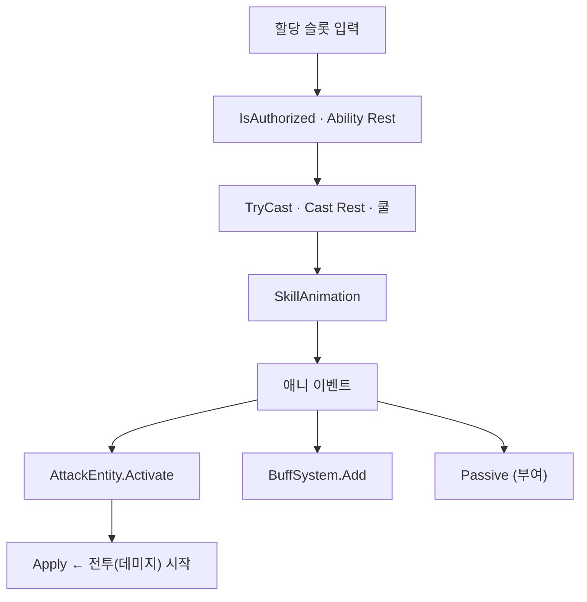

스킬 시전·연출과 데미지 계산의 경계인 Apply 호출, 애니 이벤트가 타격·버프·패시브를 부르는 지점을 정리합니다.

[트리거·연쇄]({{ "/notes/dragon-combat-cluster-read/" | relative_url }}) 시리즈 1편입니다. Owner·Stat·Apply를 모르면 [읽기 지도]({{ "/notes/dragon-combat-cluster-read/" | relative_url }}) → [타격·데미지 1~3편]({{ "/notes/dragon-combat-character/" | relative_url }})을 먼저 보면 됩니다. 플레이어 **성장·시전 How**는 [스킬 1·2편]({{ "/notes/dragon-skill-growth/" | relative_url }})이 담당합니다. 이 글은 **Apply 시점**만 고정합니다.

## 맥락

스킬 관련 글이 여러 갈래일 때 역할을 이렇게 나눕니다.

| 글 | 질문 |
|----|------|
| [스킬 성장]({{ "/notes/dragon-skill-growth/" | relative_url }}) | 프로필에 학습·슬롯·레벨이 어떻게 쓰이나 |
| [스킬 시전]({{ "/notes/dragon-skill-cast/" | relative_url }}) | 입력·쿨·Rest·TryCast·SkillAnimation · Skill 층 How |
| **이 글** | **Apply 호출 = combat(데미지) 시작** · SkillEntity가 넘기는 것 |

**플레이어 체감 타임라인:** 입력 → 쿨 소모 → 동작 재생 → **애니 이벤트(타격 프레임)** → 숫자·HP. 시전 성공의 산출물은 (1) TryCast 결정, (2) SkillAnimation 재생입니다. Hitmark·Buff·Passive **적용**은 대개 클립 **애니 이벤트** 시점입니다 — 버튼을 누른 순간 HP가 깎이지 않습니다.

## 시전 → Apply 전

**할당 슬롯 입력 → TryCast → SkillAnimation → (이벤트) 전투 층**

- [1편 캐릭터]({{ "/notes/dragon-combat-character/" | relative_url }}) BattleReady·`CharacterHandleSkill` 이후에만 입력이 열립니다.
- Ability Rest와 Cast Rest는 **합치지 않습니다**([스킬 시전]({{ "/notes/dragon-skill-cast/" | relative_url }})).
- SkillEntity partial은 Attack · Buff · Passive를 **호출**만 하고, 피해 식·스택·큐 본체는 각 층([3편 combat]({{ "/notes/dragon-combat-hit-flow/" | relative_url }}), [buff]({{ "/notes/dragon-combat-buff-bridge/" | relative_url }}), [passive]({{ "/notes/dragon-combat-passive-bridge/" | relative_url }})).

## Apply에서 끊음

**Combat = `AttackEntity.Apply` 이후** — DamageCalculator · Vital · Target/Area/Projectile 정책은 [타격·데미지 3편]({{ "/notes/dragon-combat-hit-flow/" | relative_url }}). **스킬 노트는 Apply 호출 직전에서 끝냅니다.**

| SkillEntity가 넘김 | 본체 |
|--------------------|------|
| Hitmark Activate | combat Apply |
| BuffSystem.Add | [2편 buff]({{ "/notes/dragon-combat-buff-bridge/" | relative_url }}) |
| Passive Add / CastSkill Effect | [3편 passive]({{ "/notes/dragon-combat-passive-bridge/" | relative_url }}) · skill |

몬스터 스킬도 같은 SkillEntity·Attack 경로를 쓰지만, 프로필 세이브·HUD 이벤트는 Player 전용입니다([스킬 성장]({{ "/notes/dragon-skill-growth/" | relative_url }})).

## 이 글에서 다루지 않는 것

| 주제 | 위치 |
|------|------|
| VCharacterSkill Learn/Assign | [스킬 성장]({{ "/notes/dragon-skill-growth/" | relative_url }}) · character-skill-data (내부) |
| Hitmark 피해 · Vital | [타격·데미지 3편]({{ "/notes/dragon-combat-hit-flow/" | relative_url }}) |
| Buff Handler · CC | [2편]({{ "/notes/dragon-combat-buff-bridge/" | relative_url }}) |
| Skill Json · SkillData | [`excel-json-fixed-data`]({{ "/notes/excel-json-fixed-data/" | relative_url }}) |

## 정리

스킬 층은 **TryCast·SkillAnimation·애니 이벤트에서 Attack/Buff/Passive를 호출**하고, **Apply부터는 combat**입니다. 다음 [2편]({{ "/notes/dragon-combat-buff-bridge/" | relative_url }})에서 Buff Add·Trigger가 stat·combat으로 이어지는 길을 봅니다.
