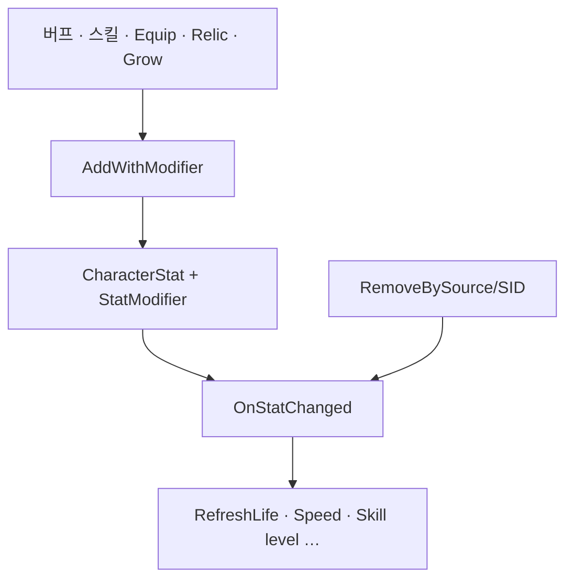

장비·버프·레벨이 섞여 공격력·체력이 바뀔 때, 어디서 숫자를 넣고 빼며, 타격·UI는 어디서만 읽는지를 정리합니다.

[타격·데미지]({{ "/notes/dragon-combat-cluster-read/" | relative_url }}) 시리즈 2편입니다. [1편]({{ "/notes/dragon-combat-character/" | relative_url }})에서 Initialize·Death Clear가 캐릭터 생명주기에 붙어 있었습니다. 이 글은 **StatSystem** — 능력치 **쓰기**의 유일한 입구와 **읽기** API만 다룹니다. 히트마크 적용는 [3편]({{ "/notes/dragon-combat-hit-flow/" | relative_url }})에서 소비 측으로 봅니다.

## 맥락

전투에서 “공격력이 올랐다”는 체감은 버프·장비·레벨·스킬이 한꺼번에 섞입니다. QA에서는 **스킬 UI 예상 피해와 실제 타격 숫자 불일치**, **버프 해제 후 능력치 잔존**이 자주 능력치·전투 경계 문제입니다.

Modifier 쓰기와 타격·UI 읽기를 가르는 경계는 [블레이드 어썰트]({{ "/projects/blade-assault/" | relative_url }})에서도 썼습니다. 드래곤에서는 **StatSystem**이 Modifier를 Add/Remove하고, **DamageCalculator**·UI 등은 **FindCalculateValue**로만 읽습니다. combat 층이 식을 복제하지 않게 하려면 이 경계를 지킵니다.

| 축 | 능력치 (`Stat`) | 전투 |
|----|-----------------|--------|
| Modifier Add/Remove | ✓ 유일한 쓰기 입구 | 소비만 |
| OnStatChanged · Refresh | ✓ | — |
| 히트마크 적용 · Vital | Owner 연결 | ✓ |

## Initialize

[1편]({{ "/notes/dragon-combat-character/" | relative_url }}) Initialize 안에서 능력치가 들어옵니다.

**플레이어** — 세이브·장비·유물·성장이 섞이는 경로

1. `AddDefaultStats` — Camp Json `StatData.Camps`
2. `AddCharacterStats` — `CharacterData.Stats` (+ StatConditionArea)
3. `OnLevelUp`(CharacterGrow) · 프로필 정수/Elixir/Food · 장비 `RefreshEquippedItemStats`
4. BattleReady — SkillBook · Relic → `MyVital.Initialize`

**몬스터** — 테이블 base만. 프로필·장비·유물 경로 없음.

Json StatData 정본·clone 경로는 [`excel-json-fixed-data`]({{ "/notes/excel-json-fixed-data/" | relative_url }})를 참고합니다.

## Modifier Add · Remove

**Producer → AddWithSourceInfo / RemoveBySource(SID)**

| Producer | SourceType | Remove 키 |
|----------|------------|-----------|
| 버프 | BuffEntity | RemoveBySource |
| 스킬 | SkillEntity | 동일 패턴 |
| 장비 | Item | SID + OptionIndex |
| Relic · CharacterGrow | 각 Source | Source/SID 쌍 |

**반드시 맞출 것:** Add/Remove **쌍**(동일 Source/SID). 버프 해제 후 능력치가 안 돌아오면 여기부터 봅니다. `StatModType.Once`는 Modifier 리스트에 남지 않고 OnAdd만. Death 시 `Stat.Clear()` — Attack·Passive·Buff Clear와 함께([1편]({{ "/notes/dragon-combat-character/" | relative_url }})).

## Read — FindCalculateValue

Consumer(DamageCalculator, UI, Movement) → `FindValueOrDefault` / **`FindCalculateValue`**(Life · Armor · AttackPower …) → [3편]({{ "/notes/dragon-combat-hit-flow/" | relative_url }}) `ComputeByType`.

**쓰기 vs 읽기:** 버프·장비·스킬이 능력치에 Modifier를 **넣고 빼고**, 타격·UI·이동은 **읽기만** 합니다. 능력치를 바꾼 뒤 **같은 히트마크**로 재측정하는 것은 능력치·전투 공통 QA입니다. 적용에서 능력치를 읽는 경로는 [3편]({{ "/notes/dragon-combat-hit-flow/" | relative_url }})과 같습니다.

## 한계

의도한 계약은 **힘(STR) → 물리 공격력**, **지능(INT) → 마법 공격력**입니다. 히트마크가 물리면 STR 쪽, 마법이면 INT 쪽을 읽어야 하고, STR만 올리면 물리 타격만·INT만 올리면 마법 타격만 바뀌는 것이 QA 기대입니다.

읽기 API에는 이름이 `AttackPower`인 **한 줄 합성값**이 있습니다. 설계상 물리·마법을 합친 능력치가 아니라, 피해·UI가 공통으로 탈 수 있는 **구현 식별자**에 가깝습니다. Physical·Magical(그리고 양쪽 DoT)이 이 경로를 같이 쓰면, 유형별 주속성 계약과 어긋날 수 있습니다.

쓰기·읽기 경계(Modifier는 능력치만, 타격·UI는 `FindCalculateValue`만)는 지켜도, UI가 유형별로 기대한 숫자와 적용가 뽑는 숫자가 **여기서** 갈라질 수 있습니다. 버프 해제 후 잔존 같은 *경계* 버그와는 별축입니다 — [들어가며 한계]({{ "/notes/dragon-combat-cluster-read/" | relative_url }}#한계).

## 정리

능력치는 **Modifier 쓰기**와 **FindCalculateValue 읽기**의 기준입니다. Initialize로 base가 깔리고, 버프·스킬·장비가 Add/Remove하며, combat은 적용 시점에만 읽습니다. 다음 [3편]({{ "/notes/dragon-combat-hit-flow/" | relative_url }})에서 그 읽기가 Vital까지 이어지는 한 줄기를 봅니다. 버프 Trigger → RefreshStats는 [트리거·연쇄 2편]({{ "/notes/dragon-combat-buff-bridge/" | relative_url }})에, StatData Json 필드 표는 [`excel-json-fixed-data`]({{ "/notes/excel-json-fixed-data/" | relative_url }})·Architecture에, Attribute 파생·Optimization hot path는 Architecture/Optimization(내부)에 둡니다.
