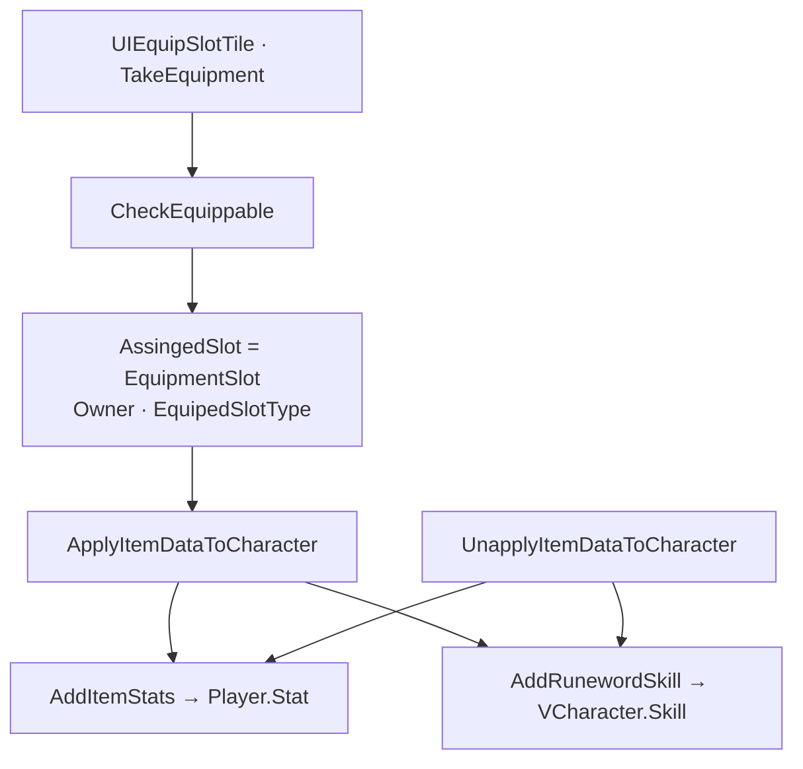

장비 슬롯에 끼운 아이템이 능력치 Modifier와 프로필 스킬에 반영되고, 해제·강화·캐릭터 전환 때 Unapply·Refresh로 맞추는 경로를 정리합니다.

인벤토리 시리즈 2편입니다. [1편]({{ "/notes/dragon-inventory-store/" | relative_url }})에서 SID 인스턴스가 프로필에 쌓이는 것까지 봤습니다. 이 글은 **착용 슬롯에 올라간 뒤** StatSystem·Skill 쪽으로 넘어가는 **Apply/Unapply**만 다룹니다. 획득·가방·ThrowGround는 1편입니다.

## 맥락

플레이어가 “장비 효과가 먹었다”고 느낄 때 실제로는 세 가지가 겹칩니다. 공격력·방어 등은 `StatOptions` → `Player.Stat` Modifier, 룬워드·신화·균열 보석 스킬은 `RunewordOptions` 등 → `VCharacter.Skill` Learn/Remove, 슬롯에 끼움은 `AssingedSlot` · Owner · `EquipedSlotType`입니다.

QA에서 자주 보는 증상:

- **벗었는데 공격력이 그대로** — Modifier Remove 쌍(SID) 깨짐 → [stat 2편]({{ "/notes/dragon-combat-stat/" | relative_url }})
- **착용 중 강화했는데 스킬·수치 안 바뀜** — Apply 재호출 누락
- **UI에는 끼었는데 전투 숫자 0** — Apply vs [타격 3편]({{ "/notes/dragon-combat-hit-flow/" | relative_url }}) 혼동 (인벤은 **쓰기**까지만)

Stat **읽기**(DamageCalculator)와 Hitmark Apply는 [타격·데미지]({{ "/notes/dragon-combat-cluster-read/" | relative_url }}) 층입니다. 인벤은 **Modifier·Skill을 넣고 빼는 쓰기**까지만 책임집니다.

## 이 글에서 쓰는 말

| 말 | 역할 | 코드에서는 (참고) |
|----|------|-------------------|
| **Apply** | 착용 시 Stat·Skill **반영** | `ApplyItemDataToCharacter` |
| **Unapply** | 해제·교체 시 Stat·Skill **제거** | `UnapplyItemDataToCharacter` |
| **Refresh** | Owner 장비 **일괄 재적용** | `RefreshEquippedItemStats` |
| **SID** | Modifier Remove 키 — [1편]({{ "/notes/dragon-inventory-store/" | relative_url }})과 동일 | item SID |

## 착용 경로

**UI 드래그 · 자동 착용 · ForceEquip → Apply**

1. `CheckEquippable` — Json `Wearable`, 양손/보조무기 규칙.
2. 슬롯·Owner 기록 — `FindEquippedItems()`는 **선택 캐릭터 Owner**만; `FindEquipped(slot)` 등은 `Owner.None`도 허용하는 API가 있어 QA에서 혼동하기 쉽습니다.
3. `ApplyItemDataToCharacter` — Stat + Skill을 **한 번에** (리팩터 목표는 Loadout과 Applier 분리).
4. `UnapplyItemDataToCharacter` — 해제·교체·ThrowGround 전 Remove.
5. `RefreshEquippedItemStats` — 해당 Owner의 EquipmentSlot 전체를 다시 Apply. 전투 진입·캐릭터 Stats 갱신·장비 일괄 변경 후 호출.

## Stat 연동

장비 Stat은 [타격·데미지 2편 stat]({{ "/notes/dragon-combat-stat/" | relative_url }})의 Producer **Item** 경로입니다. Add는 `AddItemStats` → `Player.Stat.AddWithModifier`(착용 후 공격력↑), Remove는 동일 **SID**로 Remove(해제 후 원복)입니다. OptionIndex로 옵션 슬롯별 Modifier를 구분하고, BattleReady 전 `RefreshEquippedItemStats`로 프로필·장비를 반영합니다([캐릭터 1편]({{ "/notes/dragon-combat-character/" | relative_url }})).

**Add/Remove 쌍**을 깨면 unequip·Death·교체 뒤 Modifier가 남습니다. Death 시 `Stat.Clear()`는 [캐릭터 1편]({{ "/notes/dragon-combat-character/" | relative_url }}) 경로와 함께 봅니다.

`IEquipmentStatReceiver`·`ITEM_STATS_CHANGED` 이벤트 Applier는 **계획만** 있고, 출시본은 `VInventory.itemStat.cs`가 `CharacterManager.Instance.Player.Stat`을 **직접** 호출합니다.

## Skill 연동

룬워드·신화·균열 보석 옵션은 **프로필** `VCharacter.Skill`에 Learn/Remove됩니다. [스킬 1편]({{ "/notes/dragon-skill-growth/" | relative_url }})의 학습·할당과 같은 저장소를 쓰지만, 진입은 **장비 Apply**입니다 — 트리에서 배운 스킬과 **같은 액션바**로 이어질 수 있습니다.

Equip / Unapply는 Runeword·Mythic·RiftGem 목록 Learn/Remove로 슬롯 스킬을 맞추고, 대장간 Enhance · Transcend · 각인은 착용 중이면 `ApplyItemDataToCharacter`를 **직접 재호출**합니다. 룬북 승급은 Stat/Skill 갱신 + `ITEM_BOOKOFRUNES_ITEM_UPGRADE` · 통계입니다.

이벤트 기반 mutator·idempotent Reapply는 Refactoring Phase 3~4 **목표**입니다. 출시본 QA는 “착용 중 강화 → 수치·스킬 한 번 더 Apply”를 수동으로 확인하는 편이 안전합니다.

## Initialize와의 접점

플레이어 Initialize 끝 무렵 [stat 2편]({{ "/notes/dragon-combat-stat/" | relative_url }}) 순서에 **프로필 Essence/Elixir/Food · `RefreshEquippedItemStats`** 가 있습니다. 세이브에 착용 정보가 있어도 **런타임 Player**가 없으면 Apply는 캠프·UI 타이밍에, 스폰 후에는 Refresh batch에 맞춰집니다.

몬스터는 프로필 장비 경로가 없습니다. 인벤 Apply 이야기는 **플레이어·캠프** 중심입니다.

## 출시에서 남긴 것

- Modifier **SID = item SID** — Buff/Skill Source와 겹치지 않게 장비만 이 키로 Remove
- **Equip/Unapply 쌍** — 가방↔Equip 교체 시 기존 장비 Unapply
- **착용 중 트랜잭션** — Blacksmith·룬북 UI 후 Apply 재호출
- **Legendary 전투 조회** — Stat Apply vs Skill Learn 경로 혼동 금지

## 기각·보류

- Equip은 Loadout만 바꾸고 Stat/Skill은 `EquipmentEffectApplier`가 구독 — **미구현**. God Object 안에서 Apply가 Loadout+Effect를 함께 처리.
- `RefreshEquippedItemStats`를 전역 이벤트 하나로 통일하지 않고, PlayerCharacter.Stats 등 **호출부가 여러 곳** — 호출 누락이 회귀 포인트.

## 정리

드래곤 이즈 데드 장비 착용은 **EquipmentSlot 배치 후 ApplyItemDataToCharacter로 Stat Modifier와 Profile Skill을 넣고, Unapply·Refresh로 빼는 경로**입니다. 전투에서 숫자를 **읽는** 쪽은 [stat 2편]({{ "/notes/dragon-combat-stat/" | relative_url }})·[hit-flow 3편]({{ "/notes/dragon-combat-hit-flow/" | relative_url }}), 스킬 **시전**은 [스킬 2편]({{ "/notes/dragon-skill-cast/" | relative_url }})이 이어 받습니다. Hitmark·DamageCalculator·Vital은 [타격·데미지 3편]({{ "/notes/dragon-combat-hit-flow/" | relative_url }})에, TryCast·SkillAnimation은 [스킬 2편]({{ "/notes/dragon-skill-cast/" | relative_url }})에, 유물 Stat·Synergy Skill은 [유물 2편]({{ "/notes/dragon-relic-apply/" | relative_url }})에 둡니다. InventoryRefactoring Phase 표는 Architecture(내부)에, UIEquipSlotTile 드래그·Compare는 Architecture_UI(내부)에 둡니다.
