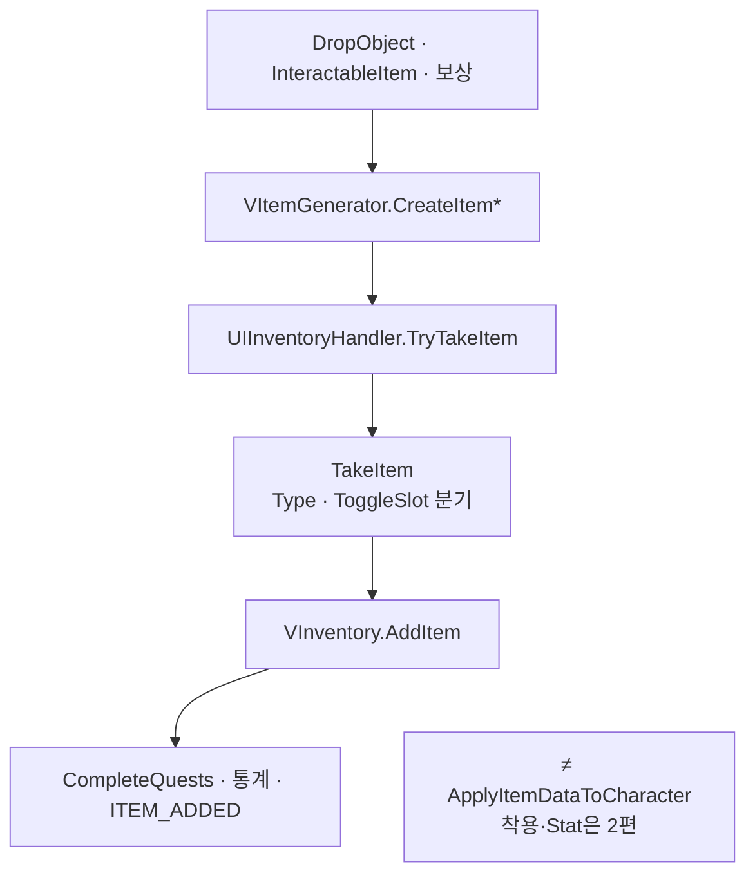

필드에서 아이템을 줍고 가방·장비 슬롯·Essence 탭에 넣을 때, 프로필 세이브에 인스턴스가 어떻게 쌓이고 ItemTypes별로 배치되는지를 정리합니다.

인벤토리 시리즈 1편입니다. [드래곤 이즈 데드]({{ "/projects/dragon-is-dead/" | relative_url }})에서 플레이어가 “아이템을 얻었다·가방에 넣었다”고 느끼는 체감은 착용·스탯 반영보다 먼저 **프로필 세이브에 인스턴스가 쌓이는 것**입니다. 이 글은 그 **보관·배치·획득**만 다룹니다. 장비를 끼었을 때 Stat·Skill이 바뀌는 경로는 [2편]({{ "/notes/dragon-inventory-equip/" | relative_url }})에 둡니다.

## 맥락

기획에서 디아블로 시리즈를 참고해 **장비 슬롯·격자 가방·등급/옵션 툴팁**을 잡았습니다. 구현에서는 **카탈로그(테이블)** 와 **세이브에 남는 한 자루(인스턴스)** 를 나눕니다.

QA에서 자주 갈라지는 체감:

- **줍았는데 가방에 없음** — TryTake 거절 · 가방 꽉 참 · Type별 분기
- **세이브에는 있는데 필드에도 떠 있음** — ThrowGround 순서(Remove 전 Spawn) 어긋남
- **같은 검 이름인데 퀘스트가 안 맞음** — Json 행 vs `VItem` SID 혼동

| 구분 | 정본 | 역할 |
|------|------|------|
| `ItemData` (Json) | Excel→Json | 이름·Type·Wearable·슬롯·등급 테이블. **읽기 전용** |
| `VItem` | 프로필 세이브 | SID·Level·옵션·슬롯 배치가 붙은 **인스턴스** |
| `VInventory` | `VProfile.Inventory` | SID → `VItem` 보관 |

Json 행을 런타임에 mutate하지 않고, 생성·검사·UI는 **clone 또는 읽기**만 씁니다. **「같은 검 이름」**과 **「내가 들고 있는 검 한 자루」**를 혼동하면 퀘스트·통계·착용 QA가 한꺼번에 어긋납니다.

## 이 글에서 쓰는 말

| 말 | 역할 | 코드에서는 (참고) |
|----|------|-------------------|
| **SID** | 세이브 안 아이템 **인스턴스** 고유 번호 | `GenerateItemSID` |
| **ItemTypes** | 장비·Essence·퀘스트 탭 등 **어디에 둘지** | Enum |
| **AssingedSlot / ToggleSlotType** | UI 탭·슬롯과 세이브 배치 **쌍** | Validator 보정 |
| **TryTake / TakeItem** | 줍기 **시도** → 프로필 **반영** | Handler |
| **ThrowGround** | 버리기 — **세이브에서 먼저 제거** 후 필드 스폰 | Remove → Spawn |

## 무엇이 한곳에 모이는가

출시본에서 `VInventory`는 **저장·조회·슬롯·착용·Stat/Skill 적용·퀘스트 부수 효과**까지 한 타입에 있습니다. 주변은 얇게 나뉩니다.

| 타입 | 역할 |
|------|------|
| `UIInventoryHandler` | 필드 픽업·버리기·판매 — 런타임 **명령** 진입 |
| `InventoryItemValidator` | 로드·가방 정렬 때 슬롯·탭 **쌍 보정** |
| `VItemGenerator` | 드랍·보상·Dev에서 `VItem` **생성** |

UI 팝업·드래그·Compare 위젯, 월드 `SpawnDrop*`, `RelicCollectionManager`는 **인벤 데이터 층 밖**입니다. 유물은 `VCharacter.Relic`(`VRelic`)이고, `EquipRelicSlot`은 UI 배치용 별 개념입니다 — [유물 1편]({{ "/notes/dragon-relic-acquire/" | relative_url }}).

## ItemTypes와 저장 경계

같은 `VItem` 타입이라도 **어디에 두는지**는 ItemTypes와 탭으로 갈립니다.

| ItemTypes | 프로필에서의 자리 | 획득 시 요지 |
|-----------|-------------------|--------------|
| Equipment | `MyItems` + Equipment 또는 Bag | 빈 Equip + 착용 가능하면 자동 착용, 아니면 가방 |
| RiftGem | `MyItems` + 균열 보석 슬롯 | 전용 Take 분기 |
| ETC · SkillBook · Prayers · Soulgem | `MyItems` + Quest 탭 | Soulgem 등은 **중복 시 새 슬롯 없이 Level만** |
| Essence | `MyItems` + CharacterEssence 탭 | 별도 저장소가 아니라 같은 Dictionary |
| Relic | `VCharacter.Relic` | 인벤 장비와 다른 축 |
| Rune · Potion 등 | `VProfile.Rune` · 캐릭터 포션 등 | 인벤 Store 밖 (리팩터 계획에서도 분리) |

**창고(`VStorage`)** 는 동일 `VItem` 타입·다른 컨테이너입니다. UI에서 옮길 때 `AssingedSlot`·Toggle을 다시 맞춥니다.

## 획득 경로

**월드 → 생성 → TryTake → TakeItem → AddItem**

`TryTakeItem`은 Type별로 빈 Equip 슬롯·가방·Essence·`IsOnlyOne` 중복을 먼저 봅니다. `TakeItem`은 ToggleSlot에 따라 Essence / Quest / Equipment·RiftGem으로 갈라집니다. 가방이 꽉 차면 빈 Equip을 시도하고, 그래도 안 되면 필드에 다시 떨어뜨리거나 거절합니다.

**버리기**는 순서가 고정입니다. `ThrowGroundItem` → **저장에서 Remove** → `ResourcesManager.SpawnDrop*`. Spawn만 하면 **세이브와 월드가 어긋납니다** — QA: “버렸는데 다시 줍으면 두 개”.

## 로드·슬롯 보정

프로필 로드 후처리에서 인벤은 **퀘스트 Migrate보다 앞**입니다 ([세이브 1편]({{ "/notes/dragon-save-shipped/" | relative_url }})과 같은 순서).

1. 각 `VItem.OnLoadGameData` — enum `*String`·옵션 Json 맞춤
2. `InventoryItemValidator.SetExceptItem` — 슬롯·탭 쌍 보정
3. 아이템별 `CompleteQuests`
4. … Storage · Statistics …
5. `Quest.OnLoadGameData`

`SortingExceptItem`은 **UI 가방 정렬** 전용이며 로드 경로가 아닙니다.

가방 인덱스는 `GameDefine.INVENTORY_BAG_*`와 UI 슬롯 상한을 함께 봅니다. 반지는 `Ring` **한 칸**만 씁니다(구 Ring1/Ring2 금지).

## 출시에서 지킨 것

| 경계 | QA에서 보이는 쪽 |
|------|------------------|
| **SID 유일성** — `GenerateItemSID()` 발급, 동일 SID 거부 | Stat Modifier 키와 공유([2편]({{ "/notes/dragon-inventory-equip/" | relative_url }})) |
| **AssingedSlot ↔ ToggleSlotType** 쌍 | 로드 후 슬롯·탭 어긋남 |
| **ThrowGround** — Remove 후 Spawn | 버린 아이템이 세이브에 남음 |
| **Inventory → Quest 로드 순서** | 퀘스트 Migrate·CompleteQuests 엇갈림 |

## 기각·보류

- `VInventory`를 Store·Queries·Router로 쪼개는 **InventoryRefactoring**은 Architecture에 **목표**로만 두고, 출시본은 monolith를 유지했습니다.
- 획득·퀘스트 Complete·통계 Increment를 Observer로 빼는 Phase는 **미적용**입니다. `CompleteQuests`는 여전히 `AddItem` 경로에 있습니다.

## 정리

드래곤 이즈 데드 인벤의 1층은 **프로필 `VInventory`에 SID 인스턴스를 쌓고, ItemTypes·탭·Validator로 배치를 맞추는 것**입니다. 전투 수치·스킬은 착용 Apply에서 [2편]({{ "/notes/dragon-inventory-equip/" | relative_url }})으로 이어집니다. Stat Modifier·FindCalculateValue는 [타격·데미지 2편 stat]({{ "/notes/dragon-combat-stat/" | relative_url }})에, 스킬 트리·학습·할당은 [스킬 1편]({{ "/notes/dragon-skill-growth/" | relative_url }})에, 유물 Synergy·Relic Skill은 [유물 1·2편]({{ "/notes/dragon-relic-acquire/" | relative_url }})에 둡니다. Drop 확률·스포너·Operate·partial 파일·메서드 표 전체는 Architecture(내부)에, 인벤 UI 드래그·Compare·Sorting 위젯은 Architecture_UI(내부)에 둡니다.
