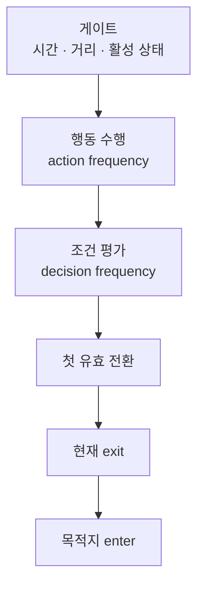

깨어난 뒤에도 뇌는 매 순간 명령하지 않습니다. 다른 간격으로 행동을 돌리고 조건을 본 뒤, 맞으면 다음 상태로 넘기는 시점만 정리합니다.

적 AI 시리즈 2편입니다. [1편]({{ "/notes/dragon-monster-brain-wake/" | relative_url }})에서 전투 준비로 뇌가 켜진 뒤를 전제로 합니다. 이 글은 **FSM이 어떻게 틱하고 상태가 바뀌는지**입니다. 행동이 캐릭터 API로 넘기는 내용은 [3편]({{ "/notes/dragon-monster-move/" | relative_url }})입니다.

## 맥락

1편의 「깨어남」과 이 글의 「명령」을 섞으면 QA가 어긋납니다.

- **거리 밖으로 나가면 멈추고, 돌아와도 안 움직임** — 컬링 후 재진입
- **표시상 상태 이름과 실제 패턴이 다름** — 목적지 문자열과 상태 이름 불일치
- **전환 직후 이전 행동이 한 번 더 나감** — 같은 프레임에서 행동이 조건보다 먼저

출시본은 Behavior Tree가 아니라 **프리팹에 직렬화된 유한 상태 기계**입니다. 기획·컨텐츠가 상태·전환을 프리팹에서 조립하고, 런타임은 순서와 게이트만 지킵니다.

## 이 글에서 쓰는 말

| 말 | 역할 | 코드에서는 (참고) |
|----|------|-------------------|
| **상태** | 지금 적 패턴 한 덩어리 | `TSAIState` |
| **행동** | 상태 안에서 반복 수행하는 의도 | `AIAction` |
| **조건** | 전환할지 말지 판정 | `AIDecision` |
| **전환** | 조건 결과 → 다음 상태 이름 | `TSAITransition` |
| **게이트** | timeScale · 플레이어 거리 등 tick 허용 | Brain Update |

## 한 틱에서 무엇이 도는가

**게이트 → 행동(간격) → 조건(간격) → 첫 유효 전환**

1. **게이트** — 시간 배율·플레이어와의 거리·활성 상태를 봅니다. 거리가 멀면 tick을 줄이거나 멈춥니다(출시본 기준 대략 30유닛 컬링).
2. **행동** — 정해 둔 간격이 지나면 현재 상태의 행동을 수행합니다. “지금 이 패턴으로 움직여라”는 쪽입니다.
3. **조건** — 다른 간격으로 전환 목록을 **적렬 순서**로 평가합니다. AND/OR 묶음이 있으면 그룹으로 봅니다.
4. **전환** — 첫 유효 목적지가 나오면 현재 상태의 행동·조건을 exit하고, **이름 문자열이 정확히 같은** 다음 상태로 enter합니다.

행동은 조건보다 **먼저** 돌아갑니다. 그래서 전환이 일어난 프레임에도 **나가는 쪽 행동**이 한 번 더 수행될 수 있습니다. “왜 한 대 더 치나”류 QA의 기준입니다.

## 상태 목록이 의미하는 것

각 상태는 **행동 목록 + 전환 목록**입니다. 첫 상태(목록 0번)는 [1편]({{ "/notes/dragon-monster-brain-wake/" | relative_url }}) Reset에서 들어갑니다. 상태 이름은 유일해야 하고, 전환의 True/False 목적지는 **표시 이름이 아니라 exact 문자열**이어야 합니다. 잘못된 이름이면 로그 후 현재 상태를 다시 enter할 수 있어, 화면과 패턴이 어긋나 보입니다.

*SkeletonWarrior — Hierarchy의 Action·Decision과 `TSAIBrain` 상태(Patrol 등)의 Actions·Transitions*

대상(타겟)은 뇌와 캐릭터의 타겟을 **같이** 맞춥니다. 한쪽만 바꾸면 추적·공격 방향이 갈라집니다.

## Pause · 컬링에서 자주 깨지는 것

| 상황 | 동작 | QA 포인트 |
|------|------|-----------|
| Pause | 뇌 컴포넌트 off · 상태 exit 없음 | 재개 후 같은 상태부터 |
| 거리 컬링 | tick 중단 · 반복 exit 가능 | 복귀 시 re-enter 누락 |
| 사망 | 상태 exit · 행동 연출 중단 | [1편]({{ "/notes/dragon-monster-brain-wake/" | relative_url }}) |
| 상태 전환 | frequency 시각을 전부 reset하지 않을 수 있음 | 전환 직후 간격 이상 |

Pause 중에도 자식 조건의 독립 Update가 남을 수 있습니다. “정지인데 조건만 변한다”면 이 축을 봅니다.

## 출시에서 남긴 것

- **행동 간격 ≠ 조건 간격** — 매 프레임 전부 돌리지 않음
- **첫 유효 전환만** — 목록 순서가 콘텐츠 우선순위
- **exact 상태 이름** — 프리팹 문자열 계약
- **FSM + 프리팹 조립** — 몬스터 늘릴 때 코드 분기보다 상태 그래프

## 기각·보류

- Behavior Tree / 유틸리티 AI를 전면 도입 — **기각(출시 범위)**. 직렬 FSM이 컨텐츠 속도와 QA에 맞았음.
- 전환 시 나가는 행동을 같은 프레임에서 무조건 스킵 — **보류**. 현재는 action-before-decision을 유지.

## 정리

뇌가 깨어난 뒤의 「명령」은 **매 프레임 전부가 아니라**, 게이트를 통과한 뒤 행동·조건을 다른 박자로 돌리고 **첫 유효 전환으로 상태를 바꾸는 것**입니다. 각 행동이 이동·공격·스킬을 어디에 넘기는지는 [3편]({{ "/notes/dragon-monster-move/" | relative_url }})에, 피격·피해 숫자는 [전투 읽기 지도]({{ "/notes/dragon-combat-cluster-read/" | relative_url }})에 둡니다.
