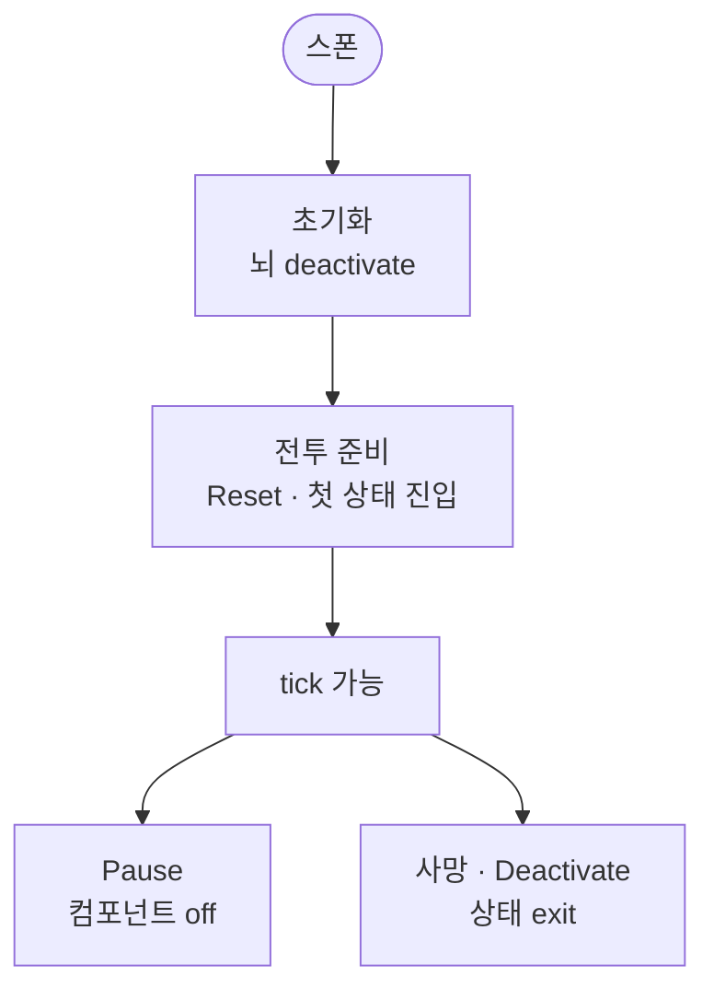

스폰 직후 적의 뇌는 꺼져 있습니다. 전투 준비가 된 뒤에야 켜지고, Pause와 사망에서 어떻게 멈추는지만 이 글에서 봅니다.

적 AI 시리즈 1편입니다. [드래곤 이즈 데드]({{ "/projects/dragon-is-dead/" | relative_url }})에서 몬스터·보스·동맹은 같은 캐릭터 런타임 위에 **뇌(Brain)** 를 붙입니다. 필드에 누가 서는지는 [캐릭터 1편]({{ "/notes/dragon-combat-character/" | relative_url }})이 담당하고, 이 글은 그 안의 **뇌가 언제 on/off 되는지**만 봅니다. 매 틱 명령·상태 전환은 [2편]({{ "/notes/dragon-monster-brain-command/" | relative_url }}), 이동·공격 의도 위임은 [3편]({{ "/notes/dragon-monster-move/" | relative_url }})입니다.

## 맥락

플레이·QA에서 자주 갈라지는 체감:

- **전투 준비 전** 적이 가만히 있음 — 아직 뇌가 꺼져 있음
- **Pause**인데 뭔가 조건만 도는 느낌 — 컴포넌트 off와 상태 exit가 다름
- **죽은 뒤**에도 패턴·연출이 남을 때 — 사망 경로에서 뇌를 끄는지

캐릭터 층은 스폰·초기화·전투 준비·사망 Clear를 소유합니다. 뇌는 그 생명주기에 **끼워진 스위치**이지, 스폰 스케줄이나 피해 공식이 아닙니다. Player·AI가 같은 실행 척추를 탄다는 문제의식은 [블레이드 어썰트]({{ "/projects/blade-assault/" | relative_url }}) [명령·게이트]({{ "/notes/blade-command-gate/" | relative_url }})와 통하고, 이 시리즈는 드래곤 쪽 **뇌 on/off·틱·위임** 손잡이입니다.

## 이 글에서 쓰는 말

| 말 | 역할 | 코드에서는 (참고) |
|----|------|-------------------|
| **뇌** | 몬스터 FSM의 중심 — 지금 어떤 상태인지 | `TSAIBrain` |
| **전투 준비** | 입력·AI·전투 tick이 열리는 시점 | BattleReady |
| **Reset** | 준비 시 뇌를 다시 맞추고 첫 상태로 들어감 | `ResetBrain` |
| **Pause** | 매니저가 몬스터 AI를 잠시 멈춤 | Brain 컴포넌트 disable |

## 언제 꺼지고 언제 켜지는가

**스폰 → 초기화(뇌 off) → 전투 준비(Reset · 첫 상태) → (tick) → Pause 또는 사망**

1. **스폰·초기화** — 캐릭터가 씬에 올라오고 하위 시스템을 붙입니다. 이 단계에서 뇌는 **꺼 둔 채** 초기화합니다. 전투 준비 전에 “이미 순찰·공격한다”고 가정하면 무반응·오류가 납니다.
2. **전투 준비** — 캐릭터 전투 준비와 맞춰 뇌를 **Reset**합니다. 행동·조건을 다시 맞춘 뒤 **첫 상태(목록의 0번)** 에 들어갑니다. 여기서부터 QA의 “AI가 움직인다” 기준입니다.
3. **Pause** — 매니저 Pause는 뇌 **컴포넌트만** 끕니다. 현재 상태를 exit하지 않습니다. 재개하면 같은 상태에서 tick이 이어질 수 있습니다.
4. **사망·비활성** — 상태를 exit하고 행동 쪽 연출·피드백을 끊습니다. “죽은 뒤에도 패턴이 남음”은 이 경로가 빠졌는지부터 봅니다.

플레이어는 입력·어빌리티 게이트를 쓰고, 몬스터는 **같은 캐릭터 생명주기** 위에서 뇌 스위치만 다릅니다. 보스·동맹도 뇌를 쓰는 캠프는 같은 on/off 계약을 따릅니다.

## 캐릭터 층과의 경계

| 질문 | 이 글 | 다른 노트 |
|------|-------|-----------|
| 누가 씬에 있나 | — | [캐릭터 1편]({{ "/notes/dragon-combat-character/" | relative_url }}) |
| 뇌가 언제 켜지나 | ✓ | — |
| 상태가 어떻게 바뀌나 | — | [2편]({{ "/notes/dragon-monster-brain-command/" | relative_url }}) |
| 이동·타격은 누가 실행하나 | — | [3편]({{ "/notes/dragon-monster-move/" | relative_url }}) · [타격·데미지]({{ "/notes/dragon-combat-cluster-read/" | relative_url }}) |

웨이브·스테이지가 **언제 몬스터를 스폰하는지**는 스테이지 쪽입니다. 뇌는 “이미 필드에 선 적”의 스위치만 봅니다.

## 출시에서 남긴 것

- **초기화에서 끄고, 전투 준비에서 켠다** — 준비 전 AI 가정을 코드로 막음
- **Pause ≠ 상태 exit** — 일시정지와 사망·비활성을 갈랐음
- **첫 상태는 목록 0번** — 프리팹에서 initial을 고정

## 기각·보류

- 스폰 직후 바로 뇌를 돌리기 — **기각**. 전투 준비 전 참조·애니·Attack 배선이 안 맞을 수 있음.
- Pause 때 상태를 매번 exit/enter — **기각**. 재개 시 패턴이 처음부터 다시 시작되는 체감이 커짐.

## 정리

적의 뇌는 **스폰과 함께 존재하지, 스폰과 함께 깨어나지 않습니다.** 전투 준비에서 Reset·첫 상태 진입으로 켜지고, Pause는 컴포넌트만, 사망은 상태 exit로 멈춥니다. 필드 Owner·전투 준비 전체는 [캐릭터 1편]({{ "/notes/dragon-combat-character/" | relative_url }})에, 피해·스킬 수치는 [전투 읽기 지도]({{ "/notes/dragon-combat-cluster-read/" | relative_url }})에, 지역 선스폰은 [스테이지 노트]({{ "/notes/stage-spawn-area-preload/" | relative_url }})에 둡니다.
