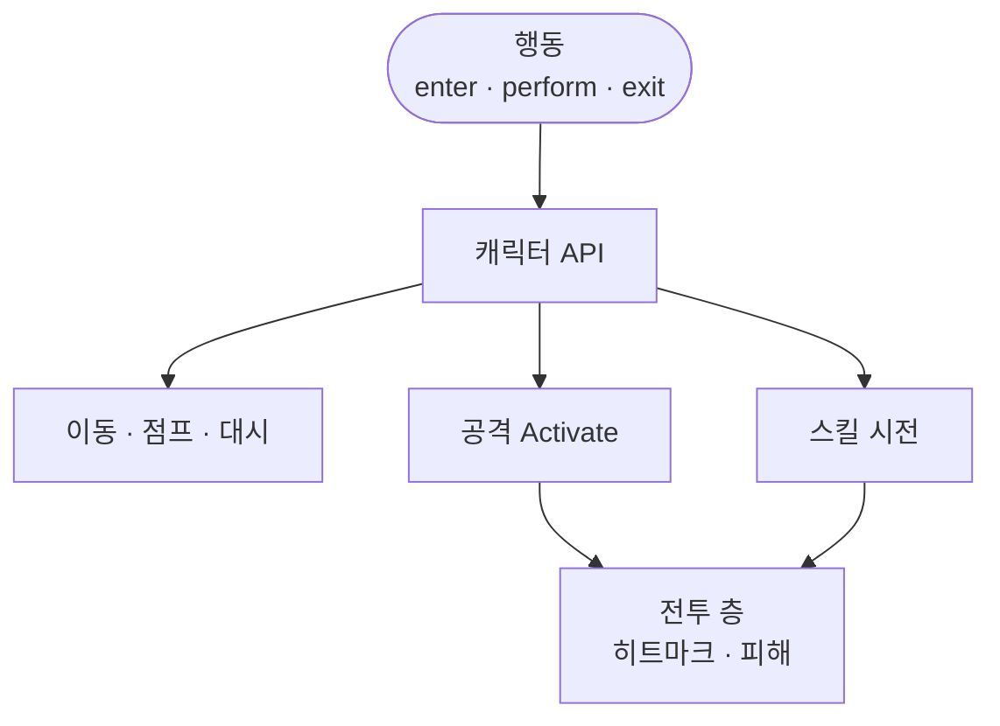

적은 이동·공격·스킬을 뇌 안에서 계산하지 않습니다. “하라”는 의도만 캐릭터와 같은 손잡이에 넘기고, 실제 타격·쿨은 그다음 층이 처리합니다.

적 AI 시리즈 3편입니다. [1편]({{ "/notes/dragon-monster-brain-wake/" | relative_url }})에서 뇌가 켜지고, [2편]({{ "/notes/dragon-monster-brain-command/" | relative_url }})에서 상태·틱이 정해진 뒤, 이 글은 **행동이 실행을 어디에 맡기는지**입니다. 점프·중력 공식이나 히트마크 피해 식 본문은 다루지 않습니다.

## 맥락

제목의 「움직인다」를 물리 컨트롤러 How로 읽으면 빗나갑니다. 여기서 말하는 움직임은 **의도 → 캐릭터 API → (이어서) 이동·공격·스킬 층**입니다.

QA에서 자주 보이는 혼동:

- **AI에 피해 식을 넣고 싶어짐** — 타격은 전투 층
- **몬스터만 다른 공격 파이프**라고 오해 — 같은 Attack 경로, 트리거만 AI
- **애니 exit 이벤트가 빠지면 공격 쿨이 고착** — 뇌 밖 타이밍

플레이어는 입력·어빌리티가 “하라”를 말하고, 몬스터는 **뇌 행동**이 같은 말을 합니다. 손잡이를 갈라 두지 않은 것이 출시 후 콘텐츠를 늘리기 쉬웠던 이유입니다. [블레이드 어썰트]({{ "/projects/blade-assault/" | relative_url }})에서도 Player·AI가 같은 Execute를 타게 했고, 게이트·명령 경계는 [명령·게이트]({{ "/notes/blade-command-gate/" | relative_url }})에 있습니다. 드래곤은 뇌를 FSM으로 두고 캐릭터 API에 위임하는 손잡이입니다.

## 이 글에서 쓰는 말

| 말 | 역할 | 코드에서는 (참고) |
|----|------|-------------------|
| **행동** | 상태 안에서 “하라”를 수행하는 단위 | `AIAction` |
| **캐릭터 API** | 이동·공격·스킬·애니에 넘기는 공통 손잡이 | Character / Ability |
| **의도** | 무엇을 할지 — 숫자·쿨·Hitmark 정의는 없음 | perform / enter / exit |

## 의도만 넘기는 흐름

**행동 enter · perform · exit → 캐릭터 API → 이동 / 공격 시작 / 스킬**

1. **enter** — 상태에 들어올 때 한 번. 잠금·배수·애니 bool 등을 걸 수 있습니다.
2. **perform** — [2편]({{ "/notes/dragon-monster-brain-command/" | relative_url }}) 틱의 행동 간격마다. “타겟 쪽으로”, “공격하라”, “스킬 써라”를 API에 요청합니다.
3. **exit** — 상태·뇌가 끝날 때. enter에서 건 **일시 효과는 되돌려야** 합니다. 안 되돌리면 다음 패턴에 이동 배수·무적 등이 남습니다.

공격 요청은 [피격 흐름]({{ "/notes/dragon-combat-hit-flow/" | relative_url }})의 Activate로 이어지고, 스킬 요청은 [스킬 시전]({{ "/notes/dragon-skill-cast/" | relative_url }})과 같은 시전 층을 탈 수 있습니다. 몬스터는 프로필 HUD·세이브 이벤트 경로는 플레이어와 갈라지지만, **타격 Entity 경로**는 공유합니다.

## 역할 분담

| 층 | 결정하는 것 | 넘기지 않음 |
|----|-------------|-------------|
| **뇌 · 행동** | 언제·어떤 의도인지 | 피해 식 · 쿨 본체 · 물리 적분 |
| **캐릭터** | 이동·어빌리티·생명주기 | Hitmark 수치 |
| **전투** | 히트마크 적용 · Vital | 상태 FSM |
| **스킬** | 시전 · Rest · 쿨 | AI 상태 이름 |

행동 subtype(순찰·비행·감지 반경 등) 전수 목록은 공개 노트에 두지 않습니다. 포트폴리오에서는 **경계**만 고정하면 됩니다.

## 출시에서 남긴 것

- **플레이어와 같은 Character API** — 몬스터 전용 피해 파이프를 새로 그리지 않음
- **exit 대칭** — 잠금·배수·무적 잔존 QA의 기준
- **애니 이벤트와 쿨** — 뇌가 쿨을 소유하지 않음. 이벤트 누락은 전투·애니 쪽 증상

## 기각·보류

- AI 행동 안에 DamageCalculator·Hitmark 식을 넣기 — **기각**. 전투 시리즈와 손잡이가 두 갈래가 됨.
- 몬스터 전용 Attack 스택을 캐릭터와 분리 — **기각(출시)**. 보스·잡몹을 늘릴 때 파이프라인을 다시 그리지 않으려 했음.

## 정리

적이 「움직이는」 방식은 뇌가 물리와 피해를 푸는 것이 아니라, **행동을 통해 캐릭터와 같은 손잡이에 의도만 넘기는 것**입니다. 깨움·멈춤은 [1편]({{ "/notes/dragon-monster-brain-wake/" | relative_url }})에, 틱·상태 전환은 [2편]({{ "/notes/dragon-monster-brain-command/" | relative_url }})에, 숫자·히트마크는 [전투 읽기 지도]({{ "/notes/dragon-combat-cluster-read/" | relative_url }})·[타격 3편]({{ "/notes/dragon-combat-hit-flow/" | relative_url }})에, 시전 게이트는 [스킬 시전]({{ "/notes/dragon-skill-cast/" | relative_url }})에 둡니다.
