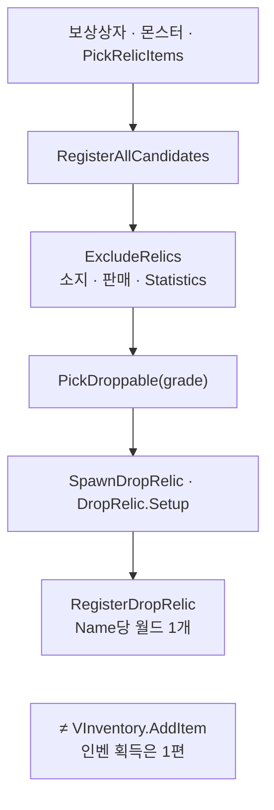
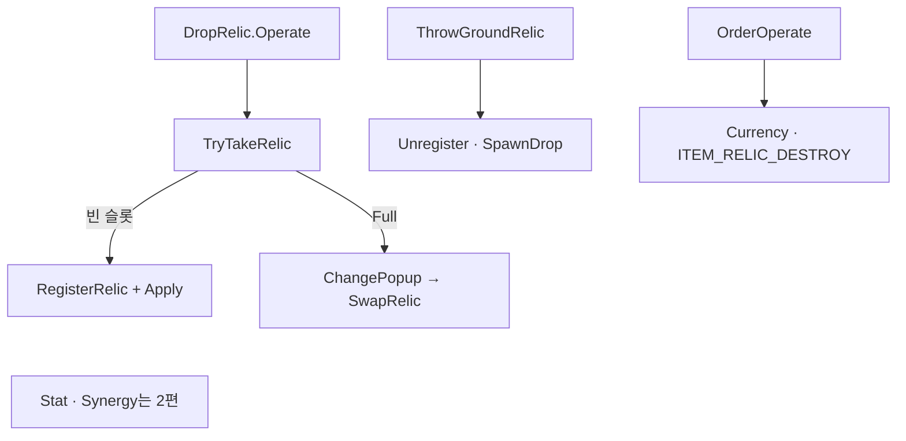

이번 도전에서 유물을 최대 9칸에 쌓고, 필드에서 줍·교체·버리는 흐름을 정리합니다. 장비(인벤)와 달리 도전이 끝나면 슬롯이 비워집니다.

유물 시리즈 1편입니다. [드래곤 이즈 데드]({{ "/projects/dragon-is-dead/" | relative_url }})에서 유물은 [인벤 1편]({{ "/notes/dragon-inventory-store/" | relative_url }})의 가방·장비와 **별 타입·별 컨테이너**입니다. 프로필 장비는 도전을 마쳐도 남지만, 유물 슬롯은 **도전이 끝날 때 비워지는 런 빌드**입니다. 이 글은 **후보·드랍·획득·교체·버리기**만 다룹니다. Stat·유물 스킬·Synergy 반영은 [2편]({{ "/notes/dragon-relic-apply/" | relative_url }})입니다.

## 맥락

로그라이트 전환 뒤 “**이번 도전에서 무엇을 들고 싸우는가**” 축 중 하나가 유물입니다. 장비(인벤)는 캠페인 프로필에 쌓이고, 유물은 **도전 중에만** 슬롯이 채워집니다.

QA에서 자주 갈라지는 체감:

- **도전 끝났는데 유물이 남아 있다 / 사라져야 하는데 장비까지 없어졌다** — ClearIngameData vs 인벤 경계
- **같은 유물 이름이 필드에 두 개** — Name당 월드 1개 규칙 위반
- **EquipRelicSlot과 9칸 슬롯 혼동** — UI 배치 vs 런타임 `MyRelics`

| 구분 | 인벤 장비 | 유물 |
|------|-----------|------|
| 인스턴스 | `VItem` | `VRelic` |
| 컨테이너 | `VProfile.Inventory` | `VCharacter.Relic` |
| 도전 종료 | 착용·가방 **유지** | 슬롯 **전체 Clear** |
| 필드 드랍 | `SpawnDropEquipment` | `SpawnDropRelic` |
| 런타임 매니저 | — | `RelicCollectionManager` (**세이브 아님**) |

Json 정본은 `RelicData` · `RelicSynergyData` · `DropRelicData`입니다. 카탈로그 읽기는 [고정 데이터]({{ "/notes/excel-json-fixed-data/" | relative_url }}) 층과 같고, **소유 인스턴스**는 캐릭터 Relic partial에 있습니다.

## 이 글에서 쓰는 말

| 말 | 역할 | 코드에서는 (참고) |
|----|------|-------------------|
| **VRelic** | 이번 도전에 들고 있는 유물 **한 개** | SID · StatOptions |
| **MyRelics[9]** | 캐릭터당 유물 **9칸** | `VCharacterRelic` |
| **후보 풀** | 아직 드랍되지 않은 추첨 대상 | `RelicCollectionManager` |
| **Operate** | 필드에서 줍기·파괴 상호 | `DropRelic` |
| **ClearIngameData** | 도전 종료 — **슬롯·후보 비움** | `RemoveIngameData` |

## 무엇이 한곳에 모이는가

| 타입 | 역할 |
|------|------|
| `VCharacterRelic` | `MyRelics[9]` · Register/Unregister · Apply 진입 |
| `VRelic` | SID · StatOptions · Enhances · CustomSynergy |
| `RelicCollectionManager` | 후보 풀 · Pick · Take · Throw · Swap · ChangePopup |
| `DropRelic` | 필드 Operate(획득) · OrderOperate(파괴·골드) |
| `VItemGenerator` (Relic partial) | 등급별 `PickRelicItems` |

`EquipRelicSlot`은 인벤 UI 배치용 특수 슬롯이고, **런타임 유물 9칸**은 `VCharacterRelic.MyRelics`입니다. 이름만 “Relic”으로 겹치므로 QA·문서에서 혼동하기 쉽습니다.

## 후보 풀 → 필드 드랍

**보상 · 몬스터 · Generator → 후보 등록 → Pick → Spawn**

1. `RegisterAllCandidates` — Json `RelicData`, `IsBlock` 제외.
2. `ExcludeRelics` — 이미 소지·판매 후보·Statistics에 잡힌 이름 제외.
3. `PickDroppable` — 후보에서 **1개 제거** 후 `RelicNames` 반환. 같은 유물 재드랍 방지.
4. `RegisterDropRelic` — `_droppedRelics`는 **Name 키 1개**. 동명 유물이 필드에 동시에 두 개 있을 수 없습니다.

`RelicCollectionManager`는 프로필 JSON에 저장되지 않습니다. 도전 리셋 시 `ClearCandidates`와 함께 비웁니다.

## 획득·교체·버리기

**DropRelic.Operate → TryTakeRelic**

| 동작 | 요지 | 플레이어가 보는 것 |
|------|------|-------------------|
| 빈 슬롯 획득 | `RegisterRelic` · `Acquired` · Analytics | 슬롯에 추가 |
| 9슬롯 Full | `SpawnRelicChangePopup` → `SwapRelic` | 교체 UI |
| 버리기 | Unregister → 필드 Spawn → Skill Remove | 슬롯 비움 · 필드에 떨어짐 |
| 파괴 | `OrderOperate` — DestroyPrice 골드 | 골드 획득 |

**동일 `RelicNames` 중복 착용 불가** — `TryAddRelic` · `Contains`. Swap은 old Unregister → new Take → old Throw 순입니다.

## 도전 리셋과 씬 Cleanup

유물 “수명”은 인벤과 갈라지는 지점입니다.

| 호출 | 유물·Manager | QA |
|------|--------------|-----|
| `VCharacter.ClearIngameData` | UnregisterAll · 슬롯 null · Synergy 추가치 Clear | 캐릭터 단위 리셋 |
| `GameData.ClearIngameData` (포기·균열 완료 등) | 위 + `ClearDroppedRelics` + `ClearCandidates` | **도전 종료** |
| `GameMainScene.CleanupCurrentScene` | `ClearDroppedRelics` **만** — 후보 풀 유지 | **씬 전환**만 |

프로필 **장비·가방**은 같은 `ClearIngameData`에서 통째로 지우지 않습니다. **「유물 = 이번 도전 빌드」** 를 코드로 고정한 부분입니다.

## 출시에서 지킌 것

| 경계 | QA에서 보이는 쪽 |
|------|------------------|
| **인벤과 분리 설계** | Relic을 VItem TryTake에 넣지 않음 |
| **Pick 후 UnregisterCandidate** | 같은 유물 재추첨 |
| **Apply/Unapply 쌍** | Throw·Unregister 후 Skill·Stat 잔존 → [2편]({{ "/notes/dragon-relic-apply/" | relative_url }}) |
| **씬 vs 런 리셋** | 씬 전환 vs 도전 포기 구분 |

## 기각·보류

- 유물을 `VInventory` ItemTypes 한 줄로 흡수 — **기각**. 저장·Clear·드랍 매니저가 전부 다름.
- 후보 풀을 프로필에 영속 — **기각**. `RelicCollectionManager` 비영속 유지.

## 정리

드래곤 이즈 데드 유물 1층은 **캐릭터 9슬롯에 `VRelic`을 쌓고, RelicCollectionManager로 후보·드랍·획득·교체를 처리하는 것**입니다. 인벤 장비와 달리 **도전이 끝나면 슬롯이 비워집니다**. 전투 반영은 [2편]({{ "/notes/dragon-relic-apply/" | relative_url }})으로 이어집니다. VItem·가방·Equipment Apply는 [인벤 1·2편]({{ "/notes/dragon-inventory-store/" | relative_url }})에, 스킬 트리·프로필 Learn은 [스킬 1편]({{ "/notes/dragon-skill-growth/" | relative_url }})에, SellingRelic·TryEnhance·보상 상자 Handler는 Interaction·2편 요지에 둡니다. ChangePopup·Synergy HUD 위젯은 Architecture_UI(내부)에, partial·코드 표 전수는 Architecture(내부)에 둡니다.
