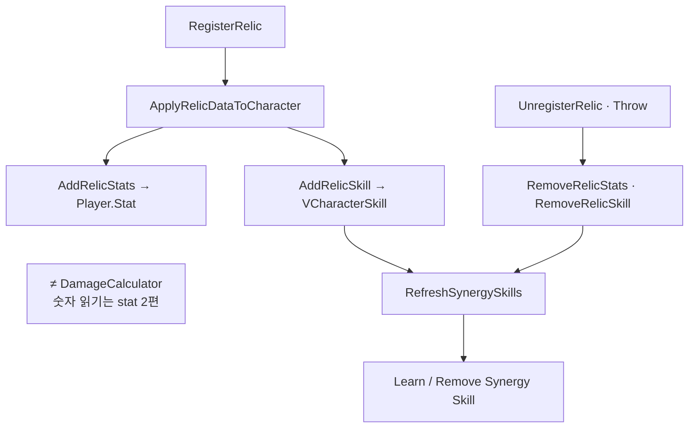

유물 슬롯에 등록한 뒤 능력치·유물 스킬·Synergy(조화) 스킬이 반영되고, 교체·버리기·도전 종료 때 Unapply·Refresh로 맞추는 경로를 정리합니다.

유물 시리즈 2편입니다. [1편]({{ "/notes/dragon-relic-acquire/" | relative_url }})에서 슬롯·후보·Operate까지 봤습니다. 이 글은 **Register 직후** StatSystem·프로필 Skill로 넘어가는 **Apply/Unapply**와 **Synergy Refresh**만 다룹니다. 획득·ChangePopup·ThrowGround는 1편입니다.

## 맥락

플레이어가 “유물·시너지가 켜졌다”고 느낄 때 겹치는 것은 세 가지입니다.

| 체감 | 구현상 반영 |
|------|-------------|
| 공격력·쿨 등 수치 | `StatOptions` → `Player.Stat` Modifier |
| 유물 고유 스킬 | `RelicData.RegisterSkills` → `VCharacterSkill.Learn` |
| 조화(Synergy) 임계 | 태그 합 vs `ActivatingCounts` → Synergy Skill Learn/Remove |

QA에서 자주 보는 증상:

- **유물 바꿨는데 Synergy HUD만 안 맞음** — `RefreshSynergySkills` 누락
- **버렸는데 스킬·스탯 잔존** — Unapply·Remove 쌍 깨짐 → [stat 2편]({{ "/notes/dragon-combat-stat/" | relative_url }})
- **트리에서 배운 스킬과 유물 스킬 수명 혼동** — 유물 Skill은 **도전 Clear**와 함께 제거

Stat **읽기**는 [타격·데미지 2편 stat]({{ "/notes/dragon-combat-stat/" | relative_url }})입니다. 유물 층은 **Modifier·Skill을 넣고 빼는 쓰기**까지만 책임집니다. 시전 입력은 [스킬 2편]({{ "/notes/dragon-skill-cast/" | relative_url }})입니다.

## 이 글에서 쓰는 말

| 말 | 역할 | 코드에서는 (참고) |
|----|------|-------------------|
| **Apply** | Register 후 Stat·Relic Skill **반영** | `ApplyRelicDataToCharacter` |
| **Unapply** | Unregister·Throw 시 **제거** | RemoveRelicStats · RemoveRelicSkill |
| **Synergy Refresh** | 태그 합으로 조화 Skill **Learn/Remove** | `RefreshSynergySkills` |
| **SID** | Stat Modifier Remove 키 | relic SID · source=`Relic` |

## 착용(Apply) 경로

**RegisterRelic → ApplyRelicDataToCharacter → RefreshSynergySkills**

1. `AddRelicStats` — `StatSystem.AddWithModifier`, source=`Relic`, **SID = relic SID**.
2. `AddRelicSkill` — Json `RegisterSkills` 목록 Learn. `MaxLevel` 도달 시 early return — 다중 RegisterSkills 루프 QA 주의.
3. `RefreshSynergySkills` — `GetMySynergies` + `AdditionalSynergyCounts` vs `ActivatingCounts` → Synergy Skill Learn/Remove.
4. `UnregisterRelic` / Throw — Stat Remove · Relic Skill Remove · **RefreshSynergySkills** 재호출.

Add/Remove·Synergy Refresh **쌍**을 깨면 교체·Throw·Clear 뒤 Modifier나 Synergy Skill이 남습니다.

## Synergy

Synergy는 **보유 유물의 태그 합**으로 임계를 넘깁니다. 예: Rapidity 3/5.

| 항목 | 규칙 | 플레이어가 보는 것 |
|------|------|-------------------|
| 카운트 | `GetTotalSynergyCount` — 보유 + `AdditionalSynergyCounts` | Synergy UI 숫자 |
| 활성 | `ActivatingCounts` 이상이면 Synergy Skill Learn | 쿨 감소 등 효과 |
| 교체 UI | `PreviewRelicName` — ChangePopup 미리보기 | 교체 전 Synergy 미리보기 |
| 강화 | `TryEnhance` Synergy 분기 → `RefreshSynergySkills` | 강화 후 조화 재계산 |

[스킬 1편]({{ "/notes/dragon-skill-growth/" | relative_url }})에서 유물·장비가 같은 `VCharacterSkill` 저장소로 Learn하지만, **유물 Skill은 도전 Clear와 함께 RemoveIngameData**에서 빠집니다. 프로필 스킬 트리 학습과 **수명이 다릅니다**.

## BattleReady와의 접점

플레이어 [캐릭터 1편]({{ "/notes/dragon-combat-character/" | relative_url }}) BattleReady 순서에 장비·유물·Skill/Buff OnBattleReady·HUD가 있습니다. 유물 Stat은 Apply 시점에 Modifier가 들어가고, Synergy HUD는 Refresh 이후 UI 이벤트로 맞춥니다.

도전 중 슬롯이 바뀔 때마다 **Register/UnRegister → RefreshSynergySkills** 누락이 회귀 포인트입니다. Enhance(Option/Synergy)도 같은 Refresh 분기를 탑니다.

## Clear와 대칭

1편과 짝입니다. `RemoveIngameData`는 UnregisterAll 후 **빈 슬롯 배열**로 돌아갑니다. Apply로 넣었던 Stat·Skill은 Unregister 경로에서 먼저 빠져야 합니다.

| 시나리오 | 확인 |
|----------|------|
| 9슬롯 Full → Swap | old Throw · new Apply · Synergy HUD |
| ThrowGround | Stat/Skill Remove · Synergy Refresh |
| ClearIngameData | 슬롯 empty · Manager 후보 Clear([1편]({{ "/notes/dragon-relic-acquire/" | relative_url }})) |
| 캐릭터 2명 | `VCharacter.Relic` 분리 — 선택 캐릭터만 |

## 출시에서 지킨 것

| 경계 | QA에서 보이는 쪽 |
|------|------------------|
| **SID = Modifier 키** | [인벤 2편]({{ "/notes/dragon-inventory-equip/" | relative_url }})과 같이 Relic SID로 Remove |
| **Synergy Refresh 필수** | Add/Remove/Enhance/Throw마다 — “Stat만”으로 끝내지 않음 |
| **Analytics** | `ArtifactAcquired` · `ArtifactSynergyActive` |

## 기각·보류

- Synergy를 Buff Entity로만 표현 — Skill Learn 경로로 유지. HUD는 UI 셸 분리.
- 유물 Stat을 Equipment source와 합치 — source=`Relic` 분리 유지.

## 이 글에서 다루지 않는 것

| 주제 | 위치 |
|------|------|
| 후보 · Pick · Operate · Swap UI 흐름 | [1편]({{ "/notes/dragon-relic-acquire/" | relative_url }}) |
| FindCalculateValue · DamageCalculator | [stat 2편]({{ "/notes/dragon-combat-stat/" | relative_url }}) |
| TryCast · SkillAnimation | [스킬 2편]({{ "/notes/dragon-skill-cast/" | relative_url }}) |
| ThrowRelic Passive Trigger | [passive 3편]({{ "/notes/dragon-combat-passive-bridge/" | relative_url }}) |
| SellingRelic · RewardBoxEnhancedRelic | Interaction (내부) |
| UICharacterRelicChangePopup · Synergy Scroll | Architecture_UI (내부) |

## 정리

드래곤 이즈 데드 유물 2층은 **Register 후 Apply로 Stat·Relic Skill을 넣고, RefreshSynergySkills로 조화 Skill까지 맞추는 경로**입니다. 도전이 끝나면 [1편]({{ "/notes/dragon-relic-acquire/" | relative_url }}) Clear와 함께 Modifier·Skill도 빠집니다. 전투에서 숫자를 **읽는** 쪽은 [stat 2편]({{ "/notes/dragon-combat-stat/" | relative_url }})·[hit-flow 3편]({{ "/notes/dragon-combat-hit-flow/" | relative_url }}), **시전**은 [스킬 2편]({{ "/notes/dragon-skill-cast/" | relative_url }})이 이어 받습니다.
