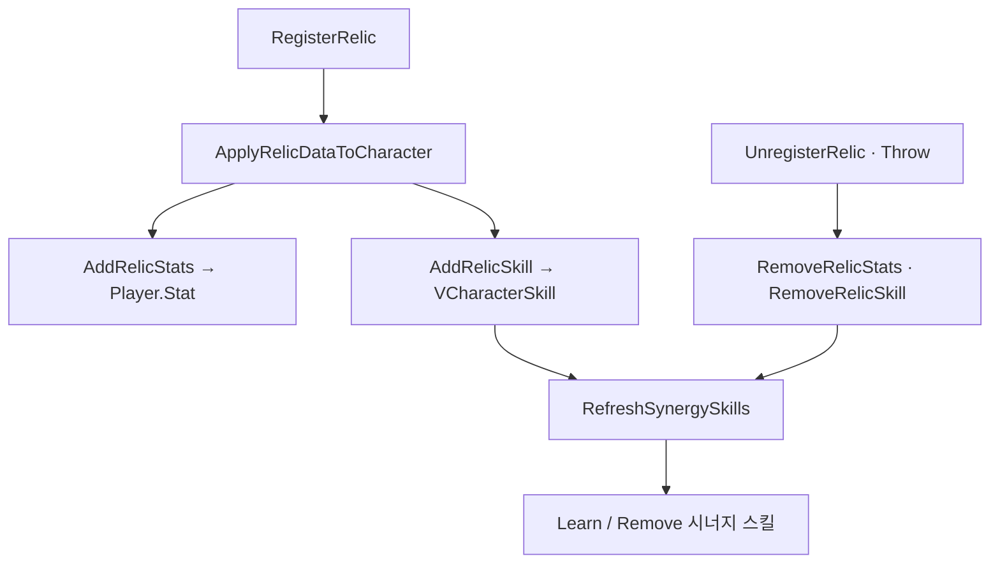

유물 슬롯에 등록한 뒤 능력치·유물 스킬·시너지 스킬이 반영되고, 교체·버리기·도전 종료 때 해제·Refresh로 맞추는 경로를 정리합니다.

유물 시리즈 2편입니다. [1편]({{ "/notes/dragon-relic-acquire/" | relative_url }})에서 슬롯·후보·Operate까지 봤습니다. 이 글은 **Register 직후** StatSystem·프로필 Skill로 넘어가는 **적용/해제**와 **시너지 Refresh**만 다룹니다. 획득·ChangePopup·ThrowGround는 1편입니다.

## 맥락

플레이어가 “유물·시너지가 켜졌다”고 느낄 때 겹치는 것은 세 가지입니다.

공격력·쿨 등 수치는 `StatOptions` → `Player.Stat` Modifier, 유물 고유 스킬은 `RelicData.RegisterSkills` → `VCharacterSkill.Learn`, 시너지 임계는 태그 합 vs `ActivatingCounts` → 시너지 스킬 Learn/Remove입니다.
QA에서 자주 보는 증상:

- **유물 바꿨는데 시너지 HUD만 안 맞음** — `RefreshSynergySkills` 누락
- **버렸는데 스킬·스탯 잔존** — 해제·Remove 쌍 깨짐 → [stat 2편]({{ "/notes/dragon-combat-stat/" | relative_url }})
- **트리에서 배운 스킬과 유물 스킬 수명 혼동** — 유물 Skill은 **도전 Clear**와 함께 제거

능력치 **읽기**는 [타격·데미지 2편 능력치]({{ "/notes/dragon-combat-stat/" | relative_url }})입니다. 유물 층은 **Modifier·스킬을 넣고 빼는 쓰기**까지만 책임집니다. 시전 입력은 [스킬 2편]({{ "/notes/dragon-skill-cast/" | relative_url }})입니다.

## 이 글에서 쓰는 말

| 말 | 역할 | 코드에서는 (참고) |
|----|------|-------------------|
| **적용** | Register 후 능력치·유물 스킬 **반영** | `ApplyRelicDataToCharacter` |
| **해제** | Unregister·Throw 시 **제거** | RemoveRelicStats · RemoveRelicSkill |
| **시너지 Refresh** | 태그 합으로 시너지 스킬 **Learn/Remove** | `RefreshSynergySkills` |
| **SID** | 능력치 Modifier Remove 키 | relic SID · source=`Relic` |

## 착용(적용) 경로

**RegisterRelic → ApplyRelicDataToCharacter → RefreshSynergySkills**

DamageCalculator 경로가 아닙니다. 전투 중 숫자 읽기는 [stat 2편]({{ "/notes/dragon-combat-stat/" | relative_url }})입니다.

1. `AddRelicStats` — `StatSystem.AddWithModifier`, source=`Relic`, **SID = relic SID**.
2. `AddRelicSkill` — Json `RegisterSkills` 목록 Learn. `MaxLevel` 도달 시 early return — 다중 RegisterSkills 루프 QA 주의.
3. `RefreshSynergySkills` — `GetMySynergies` + `AdditionalSynergyCounts` vs `ActivatingCounts` → 시너지 스킬 Learn/Remove.
4. `UnregisterRelic` / Throw — 능력치 Remove · 유물 스킬 Remove · **RefreshSynergySkills** 재호출.

Add/Remove·시너지 Refresh **쌍**을 깨면 교체·Throw·Clear 뒤 Modifier나 시너지 스킬이 남습니다.

## 시너지

Synergy는 **보유 유물의 태그 합**으로 임계를 넘깁니다. 예: 신속 3/5. `GetTotalSynergyCount`(보유 + `AdditionalSynergyCounts`)가 시너지 UI 숫자이고, `ActivatingCounts` 이상이면 시너지 스킬 Learn(쿨 감소 등)입니다. 교체 UI는 `PreviewRelicName`으로 ChangePopup 미리보기를 주고, `TryEnhance` 시너지 분기도 `RefreshSynergySkills`로 재계산합니다.

[스킬 1편]({{ "/notes/dragon-skill-growth/" | relative_url }})에서 유물·장비가 같은 `VCharacterSkill` 저장소로 Learn하지만, **유물 Skill은 도전 Clear와 함께 RemoveIngameData**에서 빠집니다. 프로필 스킬 트리 학습과 **수명이 다릅니다**.

## BattleReady와의 접점

플레이어 [캐릭터 1편]({{ "/notes/dragon-combat-character/" | relative_url }}) BattleReady 순서에 장비·유물·스킬/버프 OnBattleReady·HUD가 있습니다. 유물 능력치는 적용 시점에 Modifier가 들어가고, 시너지 HUD는 Refresh 이후 UI 이벤트로 맞춥니다.

도전 중 슬롯이 바뀔 때마다 **Register/UnRegister → RefreshSynergySkills** 누락이 회귀 포인트입니다. Enhance(Option/시너지)도 같은 Refresh 분기를 탑니다.

## Clear와 대칭

1편과 짝입니다. `RemoveIngameData`는 UnregisterAll 후 **빈 슬롯 배열**로 돌아갑니다. 적용로 넣었던 능력치·스킬은 Unregister 경로에서 먼저 빠져야 합니다.

회귀 확인 축: 9슬롯 Full → Swap(old Throw · new 적용 · 시너지 HUD), ThrowGround(능력치/스킬 Remove · 시너지 Refresh), ClearIngameData(슬롯 empty · Manager 후보 Clear — [1편]({{ "/notes/dragon-relic-acquire/" | relative_url }})), 캐릭터 2명(`VCharacter.Relic` 분리 — 선택 캐릭터만).

## 출시에서 남긴 것

- **SID = Modifier 키** — [인벤 2편]({{ "/notes/dragon-inventory-equip/" | relative_url }})과 같이 Relic SID로 Remove
- **시너지 Refresh 필수** — Add/Remove/Enhance/Throw마다 — “Stat만”으로 끝내지 않음
- **Analytics** — `ArtifactAcquired` · `ArtifactSynergyActive`

## 기각·보류

- Synergy를 버프 Entity로만 표현 — 스킬 Learn 경로로 유지. HUD는 UI 셸 분리.
- 유물 Stat을 Equipment source와 합치 — source=`Relic` 분리 유지.

## 정리

드래곤 이즈 데드 유물 2층은 **Register 후 적용으로 능력치·유물 스킬을 넣고, RefreshSynergySkills로 시너지 스킬까지 맞추는 경로**입니다. 도전이 끝나면 [1편]({{ "/notes/dragon-relic-acquire/" | relative_url }}) Clear와 함께 Modifier·스킬도 빠집니다. 전투에서 숫자를 **읽는** 쪽은 [능력치 2편]({{ "/notes/dragon-combat-stat/" | relative_url }})·[hit-flow 3편]({{ "/notes/dragon-combat-hit-flow/" | relative_url }}), **시전**은 [스킬 2편]({{ "/notes/dragon-skill-cast/" | relative_url }})이 이어 받습니다. FindCalculateValue·DamageCalculator는 [능력치 2편]({{ "/notes/dragon-combat-stat/" | relative_url }})에, TryCast·SkillAnimation은 [스킬 2편]({{ "/notes/dragon-skill-cast/" | relative_url }})에, ThrowRelic 패시브 Trigger는 [패시브 3편]({{ "/notes/dragon-combat-passive-bridge/" | relative_url }})에 둡니다. SellingRelic·RewardBoxEnhancedRelic는 Interaction(내부)에, UICharacterRelicChangePopup·시너지 Scroll은 Architecture_UI(내부)에 둡니다.
