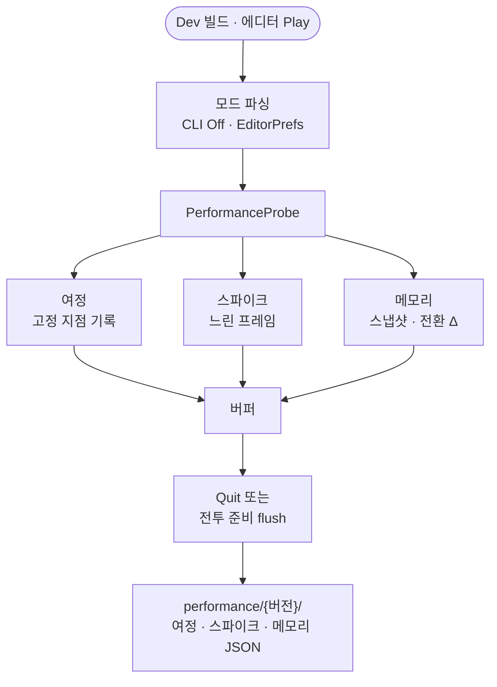

Unity Profiler만으로는 재현·비교가 흐려질 때가 있습니다. [드래곤 이즈 데드]({{ "/projects/dragon-is-dead/" | relative_url }}) **Dev 빌드**에, 플레이 한 세션마다 여정·스파이크·메모리를 모듈별 JSON으로 남기는 런타임 계측을 붙였습니다.

## 맥락

최적화 before/after의 **주 도구는 Development Build + Unity Profiler**입니다. 다만 “부트부터 전투 준비까지 몇 초·몇 MB였나”, “스테이지 이동 직후 30fps 아래가 몇 번 났나”처럼 **고정 시나리오와 구간 지점**을 파일로 남겨 두면, Profiler를 매번 붙이지 않아도 회귀 비교가 쉬워집니다.

이 계측은 **플레이어 exe·에디터 Play**가 Dev define(`DEVELOPMENT_BUILD` 또는 `TS_DEVELOPMENT_BUILD`)일 때만 파일을 씁니다. [Win64 빌드 소요 계측]({{ "/notes/dragon-win64-build-metrics/" | relative_url }})·CI·제품 Analytics·Steam 리더보드는 이 글 범위 밖입니다.

## 문제

콘솔 Warning과 Profiler 타임라인만 남기면 아래처럼 비교가 어려워집니다.

| 증상 | 원인 |
|------|------|
| “이번 플레이가 느린가”를 며칠 뒤 말하기 어렵다 | 세션마다 로그 형식·구간이 달라 파일로 고정되지 않음 |
| 부트에서 전투 준비까지 **구간**을 한눈에 보기 어렵다 | 지점·경과 ms·allocated가 흩어짐 |
| 느린 프레임만 골라 보기 번거롭다 | 30fps 미만 프레임을 발생 이벤트와 묶어 두지 않음 |
| 씬 전환 메모리 Δ를 남기기 어렵다 | Begin/End 쌍이 콘솔 한 줄로만 끝남 |

**핵심:** 게임 코드는 **한 진입점**만 호출하고, Dev에서만 **버퍼 → Quit(또는 여정 종료) flush**로 모듈당 JSON **최대 1개**를 남깁니다.

## 해결

측정은 **모드가 다른 세 모듈**(여정·스파이크·메모리)로 나눕니다. 게임·씬 코드는 아래 진입점만 호출합니다.

**플레이 → 세션 파일**

- **여정** — 부트·프로필·메인 씬·지역 진입·스테이지 스폰·전투 준비까지 **고정 지점**과 경과 ms·allocated/reserved
- **스파이크** — 이벤트 직후 약 10초(전투 준비는 약 5초) 동안 **33ms(30fps) 이상** 프레임만 기록
- **메모리** — 단독 스냅샷 또는 씬 전환 **Begin/End Δ** (슬롯 1개, 중첩 미지원)
- 모듈당 파일 ≤ 1 · 레코드 0건이면 해당 파일 **없음**

### 저장 위치와 파일명

| 항목 | 규칙 |
|------|------|
| 루트 | `Application.persistentDataPath/performance/` (Windows 예: `%LocalLow%/TeamSuneat/ProjectDragon/performance/`) |
| 버전 폴더 | `Application.version` (= `PlayerSettings.bundleVersion`) — 예: `v1.3.004` |
| 파일명 | `{yyyyMMdd_HHmmss}_{sessionId}_{kind}.json` |
| kind | `journey` · `spike` · `memory` |
| stamp | 세션당 1회 — 같은 플레이의 모듈이 **공유** |

Win64 **빌드** 메트릭(`Builds/Win64/BuildMetrics/…`)과 **버전 문자열만** 같고, 저장 루트는 다릅니다.

### 여정 지점

기본 경로는 새 캐릭터 생성부터 첫 지역 Cliffshire까지입니다. 세션끼리 비교하려면 지점 **문자열이 고정**되어 있어야 하므로, 상수로 묶어 두고 그대로 파일에 씁니다.

| 지점 | 의미 |
|------|------|
| `R0_boot` | 부트 (세션당 1회) |
| `profile_created` | 프로필 생성 (1회) |
| `main_scene_ready` | 메인 씬 전환 완료 (1회) |
| `area_enter:Cliffshire` | Cliffshire 첫 스폰 (1회) |
| `stage_spawn:{스테이지명}` | 스테이지 스폰 (매번) |
| `battle_ready` | 플레이어 전투 준비 (1회) → **flush** |

### 스파이크 감시 구간

스파이크는 플레이 내내 켜 두지 않고, 히치가 의심되는 **이벤트 직후**만 봅니다. 스테이지 이동·스폰, 메인 씬 완료, 폰트 워밍업, 타이틀 진입, 언어 변경은 약 10초를 감시하고, 플레이어 전투 준비만 노이즈를 줄이려 약 5초로 짧게 둡니다. 보행·대시처럼 상시 구간은 자동 감시하지 않습니다.

여정이 **기록 중**이면 스파이크는 기동하되 그 구간 이벤트는 버퍼에 넣지 않습니다. 파일에 스파이크가 안 쌓일 수 있다는 뜻입니다. 평균 프레임 타임 before/after의 **주 도구는 Profiler**이고, 스파이크 파일은 순간 끊김을 재현·수집하는 보조 증적입니다.

### 켜기·끄기

Dev에서는 세 모듈이 **기본 ON**입니다. 끄는 수단만 두었고, 켜는 opt-in 인자는 없습니다.

| 수단 | 모듈별 Off | 세션 이름 |
|------|-----------|-----------|
| 실행 인자 | `-performanceJourneyOff` · `-performanceSpikeOff` · `-performanceMemoryOff` | `-performanceJourneyId=` |
| 에디터 Play | 개발자 창 **퍼포먼스** 탭 (`EditorPrefs` 미러) | 동일 |
| Win64 exe | 실행 인자만 — `EditorPrefs`는 전달되지 않음 | 실행 인자 |

플레이어 설정(`GamePrefs`)과는 저장소·이름을 공유하지 않습니다.

### 빌드별 동작

파일을 쓰는 조건은 Dev 컴파일 심볼입니다. 에디터·Development 빌드·`TS_DEVELOPMENT_BUILD`를 넣은 릴리즈에서는 세 모듈이 모두 파일을 남기고, 심볼이 없는 Release·Live에서는 여정·스파이크 구현이 컴파일에서 빠집니다. 메모리 API는 릴리즈에도 남지만 **버퍼·파일 I/O 없이** 호출만 통과합니다.

## 이 글에서 쓰는 말

아래는 본문 역할과 코드 타입의 대응입니다.

| 역할 | 코드 (참고) |
|------|-------------|
| 외부 진입점 | `PerformanceProbe` |
| 여정 기록 | `PerformanceJourneyRecorder` |
| 스파이크 감시 | `PerformanceSpikeWatcher` |
| 메모리 버퍼 | `PerformanceMemoryLog` |

## 실측에서 쓰는 방식

숫자는 “이 값을 넘으면 실패”가 아니라 **기록**용입니다.

1. **같은 Dev 프리셋** — 측정 파일이 켜지는 빌드(`ReleaseTsDev` 등)로 before/after를 맞춥니다.
2. **세션 이름으로 구분** — `-performanceJourneyId=preload-test`처럼 시나리오 이름을 파일명에 남깁니다.
3. **여정으로 구간 비교** — 전투 준비까지의 지점·경과 ms·allocated를 한 파일에서 봅니다.
4. **Profiler와 병행** — 시나리오별 평균·최대 프레임 타임과 GC Alloc은 Profiler를 정본으로 두고, 세션 JSON은 보조로 씁니다.

## 기각·보류

**지점마다 디스크에 쓰기** — 핫 패스 I/O로 측정이 측정을 방해합니다. 버퍼에 모아 두고 종료·전투 준비에서만 flush합니다.

**제품 Analytics·Steam 텔레메트리에 흡수** — 개발 진단 전용이라 릴리스 원격 수집과 경계를 둡니다.

**플레이어 설정과 연동** — 측정 모드를 게임 옵션에 노출하지 않습니다.

**빌드 시 Off 인자 자동 주입** — 빌더는 주입하지 않고, 필요하면 실행할 때 넘깁니다.

**GPU·카테고리별 ms 자동 수집** — Unity Profiler 범위입니다. 이 계측은 고정 지점·느린 프레임·메모리 스냅샷만 담당합니다.

## 확인 포인트

- Dev 빌드를 종료한 뒤 `performance/{bundleVersion}/`에 `_journey` · `_spike` · `_memory` 중 **켜진 모듈만** (기록 0건이면 파일 없음)
- 같은 플레이에서 나온 파일들이 stamp와 세션 이름을 공유하는지
- 에디터 Play는 개발자 창 **퍼포먼스** 탭에서 모듈별로 끄고, Play **시작 전**에 설정했는지

## 정리

게임 코드는 진입점 하나로 여정·스파이크·메모리를 호출하고, 세션이 끝나면 버전 폴더에 모듈별 JSON이 남습니다. before/after는 고정 지점·세션 이름·같은 Dev 빌드로 맞추고, 평균 성능 숫자는 Profiler를 정본으로 둡니다. [빌드 소요 계측]({{ "/notes/dragon-win64-build-metrics/" | relative_url }})·CI·릴리스 텔레메트리는 이 계측과 겹치지 않습니다.

**권장 읽기** — [Win64 빌드 계측]({{ "/notes/dragon-win64-build-metrics/" | relative_url }}) · [조건부 로그]({{ "/notes/conditional-log-build-cost/" | relative_url }}) · [스테이지 preload]({{ "/notes/stage-spawn-area-preload/" | relative_url }}) · [GPU Global·Ambient]({{ "/notes/stage-visual-gpu-optimize/" | relative_url }})
