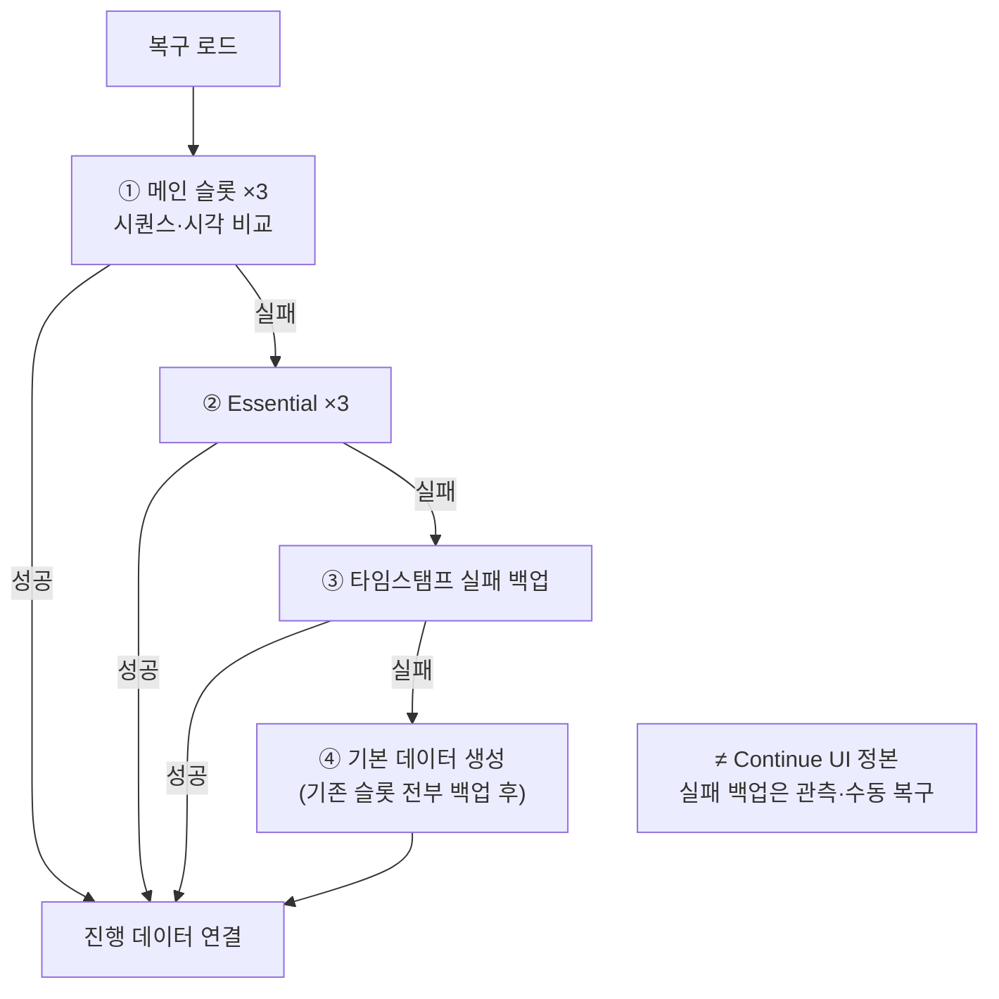

슬롯 로테이션·필수 세이브·복구 체인·스키마 마이그레이션으로 얼리 액세스부터 정식까지 유지했던 세이브의 경계와 역할을 정리합니다.

세이브 레이아웃 시리즈 1편입니다. [Dragon is Dead]({{ "/projects/dragon-is-dead/" | relative_url }})는 소규모 팀으로 Steam 얼리 액세스·정식 출시까지 클라이언트를 유지했고, 세이브 손상·복구·스키마 변경은 라이브에서 진행 유실로 바로 이어질 수 있는 축이었습니다. 이 글은 완벽한 세이브 프레임워크를 목표로 한 글이 아니라, **출시본 게임 세이브 안에서 무엇을 어떻게 지켰는지**를 공개 가능한 수준으로 적습니다.

## 맥락

[Dragon is Dead (프로젝트)]({{ "/projects/dragon-is-dead/" | relative_url }}) 출시본의 프로필 세이브를 다룹니다. 프로필 세이브는 타이틀 **세이브 관리**와 **슬롯별 진행 묶음**이 담당합니다. 밸런스 Json·설정과 **경로·역할·로드 순서가 분리**되어 있고, 이 글의 세이브는 그 프로필 층만 가리킵니다.

출시 과정에서 세이브는 다음을 동시에 맞춰야 했습니다.

| 압력 | 대응 방향 |
|------|-----------|
| 잦은 저장 요청 | 쿨다운·보류 큐로 디스크 부담·실패 범위 완화 |
| 크래시·손상·빈 파일 | 로드 실패 시 타임스탬프 백업 → 없음 처리, 복구 체인 |
| EA 이후 스키마 변경 | JSON 저장 버전 단계 마이그레이션 + 진행 데이터 마이그레이션 |
| Steam Cloud | PC 로컬 저장 폴더 정본 · Auto-Cloud 동기화 (Steam API 직접 연결 없음) |

역할(영구 진행·짧은 진행·선택 슬롯·실패 백업)은 **디스크 레인 계약으로 갈라 두지 않고** 게임 세이브 한 덩어리와 파일 읽기·쓰기 코드에 함께 있습니다. 아래는 그 출시본의 지도입니다.

## 디스크와 런타임 단위

**파일 로테이션(×3).** 메인 세이브는 PC 로컬 저장 폴더 아래 인덱스 1~3 파일을 **순환**합니다. 한 번의 쓰기가 이전 파일을 덮어쓰지 않아, 직전 세대를 다른 슬롯에 남길 수 있습니다.

**필수(Essential) 세이브(×3).** 메인과 **별도 필수 저장 파일**을 같은 방식으로 로테이션합니다. 쿨다운 안에서도 반드시 남겨야 하는 순간에는 메인과 같은 저장 내용을 필수 경로에 **추가 기록**합니다.

**플레이어 프로필(×3).** 게임 세이브 안에 프로필 3개와 선택 슬롯 번호가 함께 저장됩니다. UI 슬롯·캠페인 진행·통계는 프로필 진행 묶음(캐릭터·인벤·스테이지·퀘스트 등)에 모입니다.

| 단위 | 무엇인가 | 몇 개 |
|------|----------|-------|
| 메인 파일 슬롯 | 디스크 로테이션 | 3 |
| Essential 파일 슬롯 | 필수 기록 로테이션 | 3 |
| 프로필 | 플레이어 캠페인 슬롯 (JSON 내부) | 3 |

플레이어 3슬롯과 디스크 3로테이션은 이름만 같을 뿐 다른 축입니다. 둘 다 타이틀 세이브 코드가 소유합니다.

## 부트 → 로드

고정 데이터(표→Json→Scriptable) 준비 뒤 **복구 로드**가 실행됩니다. 성공하면 게임 세이브 읽기 → 각 프로필 **로드 후처리**가 이어집니다.

**복구 로드 순서**

메인·Essential 각각 3슬롯에서 **가장 최신**을 고릅니다. 저장 시퀀스만으로는 부족할 수 있어 저장 시각·파일 수정 시각을 함께 봅니다. 파일 복원 실패·빈 읽기는 해당 파일만 타임스탬프 백업으로 치우고 없음으로 둡니다.

프로필 로드 후처리는 **순서가 고정**되어 있습니다. 인벤토리 정리(완료 퀘스트 반영) 뒤 퀘스트 마이그레이션이 옵니다. 스테이지·아이템 등 **진행 데이터 마이그레이션**은 JSON 버전 마이그레이션 이후 이 단계에서 돌아갑니다.

## 저장

저장 요청은 게임 루프에서 **보류분을 처리**합니다.

| 경로 | 언제 | 동작 |
|------|------|------|
| 일반 저장 | 평상시 | 쿨다운 1초 · 보류 큐 |
| 필수 저장 | 반드시 남겨야 할 순간 | 쿨다운 중에도 필수 저장 표시 · 메인 + 필수 파일 |
| 보류 저장 처리 | 게임 루프 | 쿨다운 경과 후 보류분 기록 |

쓰기 직전 저장 시퀀스와 UTC 시각을 올립니다. **디스크 쓰기 실패 시 메타데이터를 롤백**합니다. 릴리스 빌드는 AES 암호화 후 `.dat`로 기록하고, 에디터·개발 빌드는 설정에 따라 `.json` 또는 개발용 `.dat`를 씁니다.

일반 저장만 PC·에디터 빌드에서 허용합니다. 콘솔·휴대형 포팅 경로에서는 저장 호출 자체를 막아 저장 정책을 타이틀에서 통제합니다.

## 손상·백업

타임스탬프 **실패 백업** 파일은 **파일 복원·읽기 실패 산출물**입니다. 플레이어가 이어하기로 고르는 정본이 아닙니다. 로드 체인 ③에서 최신 백업 복구를 시도하고, 전부 실패하면 ④에서 기존 슬롯을 백업한 뒤 기본 데이터를 만듭니다.

백업 파일은 개수·보존 일수 상한으로 정리합니다. Steam Cloud에는 올리되, **실패 흔적과 정본 세이브를 같은 제품 규칙으로 섞지 않**으려는 쪽에 가깝습니다.

## 마이그레이션

마이그레이션은 **두 층**입니다.

| 층 | 시점 | 내용 |
|----|------|------|
| JSON 저장 버전 | 파일 복원 전 | 구 버전 JSON을 단계적으로 현재 형식으로 변환 |
| 진행 데이터 | 프로필 로드 후 | 스테이지·퀘스트·인벤 등 필드·값 정리 |

필드 이름 변경·밸런스 테이블·Continue UI 분기는 레이아웃이 아니라 **타이틀 저장 형식** 몫입니다. EA 이후 패치에서 스키마 버전을 올리고, 구 세이브는 로드 경로에서 단계적으로 끌어올렸습니다.

## Steam Cloud

세이브를 Steam API에 직접 묶지 않고 **Auto-Cloud**로 PC 로컬 저장 폴더를 동기화했습니다. 한 번에 기록·손상 복구·쿨다운은 타이틀이 처리하고, Steam은 파일 미러링만 담당합니다. Steam 응답 타이밍과 저장 실패 롤백이 한 흐름에 섞이지 않게 하려는 선택입니다.

## 출시에서 지킨 것 · 한계

**지킨 것**

- 슬롯 로테이션으로 직전 세대를 디스크에 남김
- Essential 레인으로 쿨다운과 반드시 남길 순간 분리
- 로드 복구 체인(메인 → Essential → 실패 백업 → 신규)과 실패 시 백업
- JSON 버전 + 진행 데이터 마이그레이션으로 EA 이후 스키마 변경 수용
- 밸런스 Json·설정·프로필 세이브 경로 분리

**한계 (이 글의 전제)**

- 영구 진행·Essential·선택 슬롯·실패 백업이 **같은 타이틀 코드**에 있습니다. 손상 치우기, 세션 스냅샷, Continue 정본을 디스크 레인 계약으로 밖에 드러내지 않습니다.
- 선택 슬롯 번호가 별도 Meta 파일이 아니라 게임 세이브 한 덩어리 안에 있어, 세이브 세트 이동·클라우드 충돌 해석을 레이아웃만으로 설명하기 어렵습니다.
- 구현 클래스명·필드 표는 내부 Architecture·Canvas 정본에 두었습니다.

## 이 글에서 다루지 않는 것

| 주제 | 위치 |
|------|------|
| Main·Side·Meta 레이아웃 계약·Save Layout Why | [2편 (노트)]({{ "/notes/save-layout-boundaries/" | relative_url }}) · [3편 (노트)]({{ "/notes/save-layout-side-lane/" | relative_url }}) · [Save Layout (프로젝트)]({{ "/projects/save-layout/" | relative_url }}) |
| Excel→Json 고정 데이터 | [Excel을 JSON으로 바꿔 고정 데이터를 읽은 이유 (노트)]({{ "/notes/excel-json-fixed-data/" | relative_url }}) |
| 세이브 코드 모듈·프로필 필드 표 | 내부 Architecture / Canvas |
| NDA·내부 수치 | 공개하지 않음 |

## 정리

Dragon 출시 세이브는 **슬롯 로테이션·Essential·복구 체인·이중 마이그레이션**으로 라이브에서 진행을 지킨 기록입니다. 완벽한 레이아웃 분리가 아니라, 소규모 팀이 게임 세이브 한곳에 저장·복구·스키마를 모아 출시까지 버틴 형태입니다. 디스크 레인만 따로 뽑는 설계는 이후 과제로 남습니다.

**권장 읽기**

1. [Dragon is Dead (프로젝트)]({{ "/projects/dragon-is-dead/" | relative_url }})
2. Dragon 출시 세이브(이 글)
3. [Main·Side·Meta로 나눈 이유 (노트)]({{ "/notes/save-layout-boundaries/" | relative_url }})
4. [슬롯 백업 대신 Side 레인을 둔 이유 (노트)]({{ "/notes/save-layout-side-lane/" | relative_url }})
5. [Save Layout (프로젝트)]({{ "/projects/save-layout/" | relative_url }})

**시리즈: 세이브 레이아웃 (1/3)** — **1** · [2 (노트)]({{ "/notes/save-layout-boundaries/" | relative_url }}) · [3 (노트)]({{ "/notes/save-layout-side-lane/" | relative_url }})
