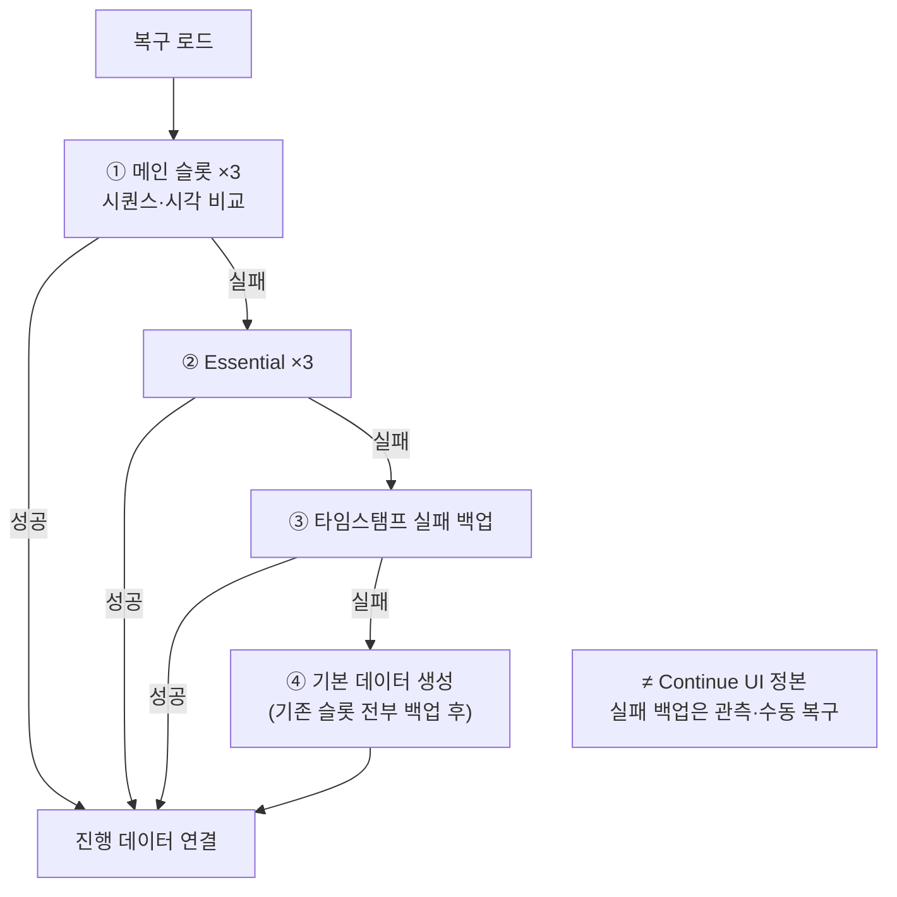

크래시·패치·Steam Cloud 환경에서 플레이어 진행을 지키기 위해, 슬롯 로테이션·복구 체인·스키마 마이그레이션을 출시본에서 어떻게 맞췄는지 정리합니다.

세이브 레이아웃 시리즈 1편입니다. [드래곤 이즈 데드]({{ "/projects/dragon-is-dead/" | relative_url }})는 소규모 팀으로 Steam 얼리 액세스·정식 출시까지 클라이언트를 유지했고, **세이브가 깨지면 진행 유실**로 바로 이어질 수 있는 축이었습니다. 이 글은 완벽한 세이브 프레임워크가 아니라, **출시본에서 무엇을 어떻게 지켰는지**를 공개 가능한 수준으로 적습니다.

## 맥락

[드래곤 이즈 데드]({{ "/projects/dragon-is-dead/" | relative_url }}) **프로필 세이브** — 캠페인 슬롯별 진행(캐릭터·인벤·퀘스트 등) — 를 다룹니다. 밸런스 표·설정과 **경로·역할·로드 순서가 분리**되어 있고, 이 글은 프로필 층만 가리킵니다.

플레이·QA에서 자주 보이는 증상:

- **크래시 후 빈 슬롯·로드 실패** — 손상 파일 복구 체인
- **EA 패치 후 구 세이브 호환** — JSON 버전 + 진행 데이터 마이그레이션
- **「디스크 3칸」과 「캐릭터 3슬롯」 혼동** — 이름만 같고 다른 축
- **Steam Cloud와 로컬 불일치** — Auto-Cloud 미러, API 직접 연결 없음

출시 과정에서 세이브는 다음을 동시에 맞춰야 했습니다.

| 압력 | 대응 방향 |
|------|-----------|
| 잦은 저장 요청 | 쿨다운·보류 큐로 디스크 부담·실패 범위 완화 |
| 크래시·손상·빈 파일 | 로드 실패 시 타임스탬프 백업 → 없음 처리, 복구 체인 |
| EA 이후 스키마 변경 | JSON 저장 버전 단계 마이그레이션 + 진행 데이터 마이그레이션 |
| Steam Cloud | PC 로컬 저장 폴더 정본 · Auto-Cloud 동기화 |

영구 진행·짧은 진행·선택 슬롯·실패 백업 역할은 **디스크 레인 계약으로 밖에 드러내지 않고** 게임 세이브 한 덩어리에 있습니다. 아래는 그 출시본 지도입니다. 레인만 분리한 설계는 [세이브 레이아웃]({{ "/projects/save-layout/" | relative_url }}) 시리즈 [2·3편]({{ "/notes/save-layout-boundaries/" | relative_url }}).

## 이 글에서 쓰는 말

| 말 | 역할 | 코드에서는 (참고) |
|----|------|-------------------|
| **프로필 세이브** | 캠페인 슬롯별 진행 묶음 | `VProfile` 등 |
| **메인 로테이션(×3)** | 디스크에 세대를 남기는 파일 순환 | 인덱스 1~3 |
| **Essential** | 쿨다운 중에도 반드시 남기는 별도 기록 | Essential 파일 ×3 |
| **실패 백업** | 깨진 파일을 치울 때 생기는 타임스탬프 사본 | Continue 정본 아님 |
| **마이그레이션** | 구 버전 세이브를 읽을 수 있게 변환 | JSON 버전 + 진행 데이터 |

## 디스크와 런타임 단위

**파일 로테이션(×3).** 메인 세이브는 PC 로컬 저장 폴더 아래 인덱스 1~3 파일을 **순환**합니다. 한 번의 쓰기가 이전 파일을 덮어쓰지 않아, 직전 세대를 다른 슬롯에 남길 수 있습니다.

**Essential(×3).** 메인과 **별도 필수 저장 파일**을 같은 방식으로 로테이션합니다. 반드시 남겨야 하는 순간에는 메인과 같은 내용을 필수 경로에 **추가 기록**합니다.

**플레이어 프로필(×3).** 게임 세이브 **안에** 프로필 3개와 선택 슬롯 번호가 함께 저장됩니다. UI 슬롯·캠페인 진행·통계는 프로필 진행 묶음에 모입니다.

| 단위 | 무엇인가 | 몇 개 | 혼동 주의 |
|------|----------|-------|-----------|
| 메인 파일 슬롯 | 디스크 로테이션 | 3 | ≠ UI 캐릭터 슬롯 |
| Essential 파일 슬롯 | 필수 기록 로테이션 | 3 | |
| 프로필 | 캠페인 슬롯 (JSON 내부) | 3 | |

## 부트 → 로드

고정 데이터([Excel→Json]({{ "/notes/excel-json-fixed-data/" | relative_url }})) 준비 뒤 **복구 로드**가 실행됩니다. 성공하면 게임 세이브 읽기 → 각 프로필 **로드 후처리**가 이어집니다.

**복구 로드 순서**

메인·Essential 각각 3슬롯에서 **가장 최신**을 고릅니다. 파일 복원 실패·빈 읽기는 해당 파일만 타임스탬프 백업으로 치우고 없음으로 둡니다.

프로필 로드 후처리는 **순서가 고정**되어 있습니다. [인벤 정리]({{ "/notes/dragon-inventory-store/" | relative_url }})(완료 퀘스트 반영) 뒤 퀘스트 마이그레이션이 옵니다. 스테이지·아이템 등 **진행 데이터 마이그레이션**은 JSON 버전 마이그레이션 이후 이 단계에서 돌아갑니다.

## 저장

저장 요청은 게임 루프에서 **보류분을 처리**합니다.

| 경로 | 언제 | 동작 |
|------|------|------|
| 일반 저장 | 평상시 | 쿨다운 1초 · 보류 큐 |
| 필수 저장 | 반드시 남겨야 할 순간 | 쿨다운 중에도 필수 저장 · 메인 + Essential |
| 보류 저장 처리 | 게임 루프 | 쿨다운 경과 후 보류분 기록 |

쓰기 직전 저장 시퀀스와 UTC 시각을 올립니다. **디스크 쓰기 실패 시 메타데이터를 롤백**합니다. 릴리스 빌드는 암호화 후 `.dat`로 기록합니다.

## 손상·백업

타임스탬프 **실패 백업**은 **파일 복원·읽기 실패 산출물**입니다. 플레이어가 이어하기로 고르는 정본이 **아닙니다**. 로드 체인 ③에서 최신 백업 복구를 시도하고, 전부 실패하면 ④에서 기존 슬롯을 백업한 뒤 기본 데이터를 만듭니다.

## 마이그레이션

마이그레이션은 **두 층**입니다.

| 층 | 시점 | 내용 |
|----|------|------|
| JSON 저장 버전 | 파일 복원 전 | 구 버전 JSON을 단계적으로 현재 형식으로 변환 |
| 진행 데이터 | 프로필 로드 후 | 스테이지·퀘스트·인벤 등 필드·값 정리 |

EA 이후 패치에서 스키마 버전을 올리고, 구 세이브는 로드 경로에서 단계적으로 끌어올렸습니다.

## Steam Cloud

세이브를 Steam API에 직접 묶지 않고 **Auto-Cloud**로 PC 로컬 저장 폴더를 동기화했습니다. 저장·손상 복구·쿨다운은 게임이 처리하고, Steam은 파일 미러링만 담당합니다.

## 출시에서 지킨 것 · 한계

| 지킨 것 | QA·플레이어 쪽 |
|---------|----------------|
| 슬롯 로테이션 | 직전 세대 파일 잔존 |
| Essential | 쿨다운 중에도 중요 순간 저장 |
| 복구 체인 | 크래시 후 진행 복구 시도 |
| 이중 마이그레이션 | EA 패치 후 구 세이브 |
| 밸런스 Json·프로필 분리 | 데이터·진행 경계 |

**한계:** 영구 진행·Essential·실패 백업·선택 슬롯이 **같은 타이틀 코드**에 있습니다. 디스크를 Main·Side·Meta로만 설명하기 어렵습니다 — [2편]({{ "/notes/save-layout-boundaries/" | relative_url }})이 그 분리 시도입니다. 구현 필드 표는 Architecture(내부).

## 이 글에서 다루지 않는 것

| 주제 | 위치 |
|------|------|
| Excel→Json 고정 데이터 | [excel-json-fixed-data]({{ "/notes/excel-json-fixed-data/" | relative_url }}) |
| Main·Side·Meta 레이아웃 Why | [2편]({{ "/notes/save-layout-boundaries/" | relative_url }}) · [3편]({{ "/notes/save-layout-side-lane/" | relative_url }}) |
| 세이브 레이아웃 패키지 | [projects/save-layout]({{ "/projects/save-layout/" | relative_url }}) |
| 세이브 코드 모듈·필드 표 | Architecture (내부) |

## 정리

드래곤 이즈 데드 출시 세이브는 **로테이션·Essential·복구 체인·이중 마이그레이션**으로 라이브에서 진행을 지킨 기록입니다. 완벽한 레이아웃 분리가 아니라, 소규모 팀이 게임 세이브 한곳에 저장·복구·스키마를 모아 출시까지 버틴 형태입니다.
