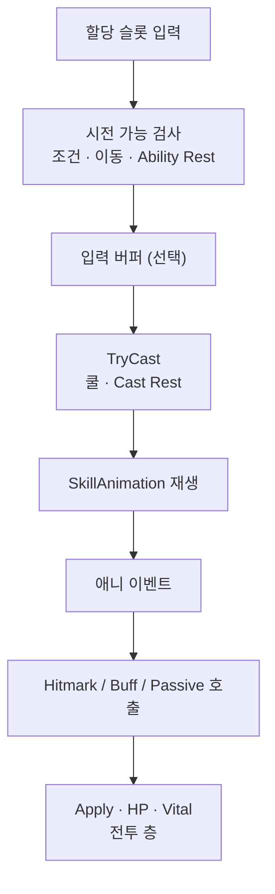

액션바에 할당된 슬롯 입력이 권한·쿨·Rest를 거쳐 TryCast되고, SkillAnimation과 애니 이벤트에서 타격·버프·패시브로 넘기는 흐름을 정리합니다. 데미지 숫자는 Apply 이후 전투 층입니다.

스킬 시리즈 2편입니다. [1편]({{ "/notes/dragon-skill-growth/" | relative_url }})에서 프로필 세이브에 올라온·슬롯에 **할당된** 스킬만 입력 대상이 됩니다. 이 글은 **지금 이 스킬을 쓴다**는 결정과 연출까지입니다. HP·데미지·Buff 스택은 [Apply 시점]({{ "/notes/dragon-combat-skill-bridge/" | relative_url }})·[타격·데미지 3편]({{ "/notes/dragon-combat-hit-flow/" | relative_url }})에 둡니다.

## 맥락

플레이어는 버튼을 누르면 곧바로 스킬이 나간다고 느끼지만, 구현에서는 **입력 → TryCast → 애니 재생 → (이벤트) 타격**이 단계로 나뉩니다. QA에서 자주 보이는 증상:

- **눌렀는데 안 나감** — BattleReady 전 · Ability Rest · Recast · 할당 안 됨
- **나갔는데 숫자가 없음** — 아직 애니 이벤트 전 · Apply 이전
- **쿨 UI와 체감이 다름** — Cast Rest vs Ability Rest · 입력 버퍼

드래곤 이즈 데드에서 시전 층은 **언제 쓰는지**와 **어떤 클립을 재생할지**만 소유합니다.

**플레이어 체감 타임라인:** 입력 → (권한·버퍼) → TryCast·쿨 → 동작 재생 → **애니 이벤트(타격 프레임)** → 숫자·HP

시전 성공의 산출물은 두 가지입니다.

1. 지금 이 스킬을 쓴다는 **결정**(TryCast 성공)
2. **SkillAnimation** 재생 시작

Hitmark·Buff·Passive 적용은 대개 클립의 **애니 이벤트** 시점입니다. 버튼을 누른 프레임과 HP가 깎이는 프레임은 같지 않을 수 있습니다.

## 이 글에서 쓰는 말

| 말 | 역할 | 코드에서는 (참고) |
|----|------|-------------------|
| **TryCast** | “지금 이 스킬을 쓴다” **결정** | 쿨·Cast Rest 소비 |
| **SkillAnimation** | 시전 **연출** 클립 | Scriptable |
| **Ability Rest** | 입력 Ability가 쉬는 구간 — 이동·다른 행동과 섞이는 경직 | Ability Rest |
| **Cast Rest** | 이 스킬 TryCast **직후** 붙는 Rest | Cast Rest (Ability Rest와 별개) |
| **입력 버퍼** | 애니·경직 중 입력을 잠시 보관 → 가능해지면 TryCast | Input buffer |
| **Apply** | 데미지·HP 반영 **시작** — 시전 층 밖 | [combat Apply]({{ "/notes/dragon-combat-hit-flow/" | relative_url }}) |

## 시전 경로

**할당 슬롯 입력 → TryCast → 애니 → (이벤트) 전투 층**

시전 성공은 TryCast 결정 + 애니까지입니다. 데미지 숫자는 Hitmark **Apply** 이후입니다. 캐릭터 아래에는 스킬 런타임 목록·스킬 입력 Ability·캐릭터당 입력 버퍼가 있습니다. [1편]({{ "/notes/dragon-skill-growth/" | relative_url }})의 프로필 세이브 할당과 맞춰진 뒤, [BattleReady]({{ "/notes/dragon-combat-character/" | relative_url }}) 게이트를 지나야 이 경로가 열립니다.

## 입력에서 TryCast까지

1. **할당된 액션 슬롯**만 스킬 입력 Ability가 받습니다.
2. 조건·이동 블록·**Ability Rest**를 검사합니다.
3. 당장 시전할 수 없으면 **입력 버퍼**에 넣었다가, 가능해지면 TryCast로 꺼냅니다.
4. TryCast 성공 시 **쿨다운**과 **Cast Rest**를 시작합니다.
5. 같은 스킬 **Recast 대기** 중이면 TryCast를 막습니다.

버퍼와 쿨다운이 동시에 걸리면 입력 타이밍 QA가 필요합니다. “눌렀는데 안 나감”과 “나갔는데 쿨 UI가 어색함”을 나눠 볼 때 **Ability Rest · Cast Rest · 버퍼** 세 축을 같이 봅니다.

## 시전 이후

TryCast가 성공하면 **SkillAnimation**(Scriptable)을 스킬 ID로 조회해 재생합니다.

| 단계 | 시전 층 | 넘기는 쪽 | 플레이어가 보는 것 |
|------|---------|-----------|-------------------|
| 클립 선택·재생 | SkillAnimation SO | — | 동작 시작 |
| 휘두르는 시점 | 애니 이벤트 | Hitmark Activate | 타격 타이밍 |
| 부가 효과 | 애니 이벤트 또는 시전 흐름 | Buff Add · Passive Add | 버프·패시브 |
| 피해·Vital | — | Hitmark **Apply** 이후 | 데미지 숫자·HP |

언제 휘두를지·언제 맞출지의 체감 타이밍은 애니 이벤트가 잡고, 한 방의 수치·타입은 Hitmark가 잡습니다. 스킬 Entity는 Attack·Buff·Passive를 **호출만** 하고, 피해 식·스택·큐 본체는 [전투 코드 읽기 지도]({{ "/notes/dragon-combat-cluster-read/" | relative_url }}) 각 층에 둡니다.

입력 버퍼는 이 재생 구간을 전제로 합니다. 애니 재생 중에도 다음 스킬 입력을 받아 두었다가, 시전 가능 시점에 소비해 연계가 끊기는 느낌을 줄입니다.

## Rest를 둘로 둔 이유

**Ability Rest**와 **Cast Rest**를 한 플래그로 합치면, 입력 전체가 쉬는 것과 이 스킬만 시전 직후 쉬는 것이 구분되지 않습니다. 연계·캔슬·재시전 QA가 어려워져 두 경로를 나눴습니다.

| Rest | 누가 | 언제 | QA |
|------|------|------|-----|
| Ability Rest | 입력 Ability | 이동·다른 행동과 섞이는 입력 경직 | “아무 입력도 안 먹음” |
| Cast Rest | 스킬 Entity | 이 스킬 TryCast 직후 | “이 스킬만 잠깐 막힘” |

Buff RestTime · Passive Rest와도 **혼동하지 않습니다**([buff 2편]({{ "/notes/dragon-combat-buff-bridge/" | relative_url }}), [passive 3편]({{ "/notes/dragon-combat-passive-bridge/" | relative_url }})).

## 전투 준비

시전 입력은 [BattleReady]({{ "/notes/dragon-combat-character/" | relative_url }}) 이후에 열립니다. 대략 순서는 다음과 같습니다.

1. 스킬 Entity 등록 · 입력 버퍼 초기화
2. 전투 준비 → HUD·슬롯 UI
3. 허용 스킬 등록(별 경로)
4. 할당·조건·Rest 검사 통과 후 Cast

BattleReady 전에 Cast가 되면 “슬롯은 있는데 입력이 안 먹는다”와 반대로, 준비 전에 쿨·HUD만 어긋날 수 있습니다.

## 정리

드래곤 이즈 데드 스킬 시전은 **할당 슬롯 입력 → 권한·버퍼·쿨·Rest → TryCast → SkillAnimation → 애니 이벤트에서 전투 층으로 넘기기**입니다. 한 방의 의미와 숫자는 Hitmark·**Apply 이후**, 지속 상태·사건 규칙은 Buff·Passive에 맡깁니다. Apply 경계·애니→combat은 [Apply 시점]({{ "/notes/dragon-combat-skill-bridge/" | relative_url }})에, Hitmark→피해 계산→Vital은 [타격·데미지 3편]({{ "/notes/dragon-combat-hit-flow/" | relative_url }})에, Buff 스택·Passive 큐·연쇄 상한은 [트리거·연쇄]({{ "/notes/dragon-combat-skill-bridge/" | relative_url }})에 둡니다. 클립명·이벤트 키·Animator 내부는 범위 밖이고, SkillAsset SO 이관·물리/마법 공격력 계약 감사는 후속 과제입니다.
