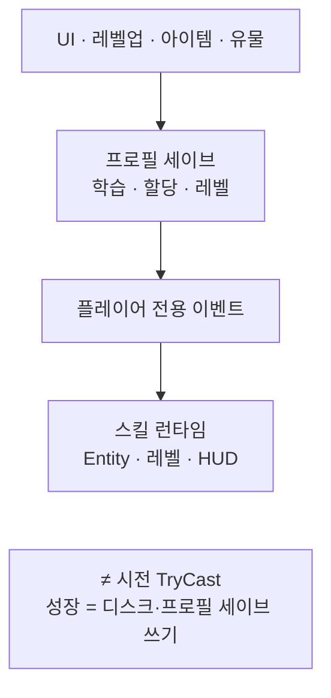

스킬 트리·보상·유물에서 늘어난 스킬이 학습·슬롯·레벨로 프로필 세이브에 남고, 전투 준비 때 런타임과 HUD에 맞춰지는 흐름을 정리합니다.

스킬 시리즈 1편입니다. [드래곤 이즈 데드]({{ "/projects/dragon-is-dead/" | relative_url }})에서 플레이어가 “스킬을 얻었다·올렸다”고 느끼는 체감은 시전(TryCast)보다 먼저 **세이브 데이터에 기록되는 변경**입니다. 이 글은 그 성장 쓰기만 다룹니다. 버튼을 눌러 한 방이 나가는 흐름은 [2편]({{ "/notes/dragon-skill-cast/" | relative_url }})에 둡니다.

## 맥락

드래곤 이즈 데드의 스킬은 기획에서 디아블로 4의 액션바·스킬 트리를 참고해 **습득 → 액션 슬롯 할당 → 레벨** 순으로 잡혔습니다. 레벨업·장비(룬워드)·유물·보상에서도 같은 스킬 ID가 들어올 수 있습니다.

기획에서 디아블로 4를 참고해 잡은 **기본 / 핵심 / 보조 / 숙련 / 궁극** 카테고리를 기준으로 구현했습니다.

구현에서는 이 변경이 한곳에 모입니다. 캐릭터 **프로필 세이브**(캠페인 슬롯별 진행 데이터)의 **스킬 상태**(학습 목록·할당 슬롯·레벨)가 정본이고, 전투 씬의 스킬 런타임은 그 뒤를 따라갑니다. 스킬 로직·밸런스 표는 Excel→Json, 학습·슬롯·레벨은 프로필 세이브에 남습니다.

| 체감 | 프로필 세이브에서 바뀌는 것 |
|------|---------------------|
| 트리에서 배움 | 학습 목록에 스킬 ID 추가 |
| 액션바에 끼움 | 입력 슬롯 ↔ 스킬 ID 할당 |
| 레벨업·강화 | 해당 스킬 레벨 |
| 유물·장비 부여 | 학습 또는 할당과 같은 경로로 반영 |

## 성장 경로

**프로필 세이브 변경 → 이벤트 → 런타임**

스킬 트리 UI·인벤토리·유물 창은 프로필 세이브를 바꿉니다. 바뀐 뒤 플레이어 캐릭터에만 등록된 이벤트가 스킬 런타임에 **추가·제거·레벨 갱신·슬롯 동기화**를 요청합니다. 몬스터는 같은 스킬 Entity를 쓰더라도 이 HUD·프로필 세이브 이벤트 경로와는 갈라집니다.

| 이벤트 역할 | 런타임 쪽 |
|-------------|-----------|
| 스킬 추가·제거 | Entity 가감 |
| 레벨 갱신 | Entity 레벨 → 타격 시 Hitmark에 전달 |
| 슬롯 할당·해제 | 입력 슬롯과 스킬 ID 동기화 |
| 허용 스킬 등록 | 전투 준비와 별 경로로 목록 갱신 |

학습 가능 여부는 별도 규칙 클래스 없이 **TryLearn / Learn / GetSkillState**로 UI에 넘깁니다. “배울 수 있는가” 판정과 “프로필 세이브에 반영”은 같은 모델 안에 두었습니다.

## 무엇이 정본인가

**Assign·Add가 슬롯과 학습 목록의 SSOT입니다.**

- 같은 스킬 ID가 슬롯에 두 번 올라가지 않게 합니다.
- 세이브 로드 뒤에도 슬롯·학습 목록을 한 번 더 정리해 **유령 스킬·슬롯 겹침**을 막습니다.
- 스킬 ID(enum)와 런타임 Entity 이름은 1:1로 맞춥니다. 중복 등록은 경고로 남깁니다.

스킬 포인트 리셋은 출처에 따라 다릅니다. 레벨업으로 받은 포인트만 남은 포인트로 돌려주고, 아이템으로 받은 포인트는 리셋 시 소멸합니다. 의도된 규칙이며, QA에서 “포인트가 남았다/사라졌다” 착각이 나기 쉬운 지점입니다.

## 전투 준비와의 연결

성장만으로 버튼이 바로 열리지는 않습니다. 캐릭터가 전투에 들어가면 대략 다음 순서로 맞춥니다.

1. 스킬 런타임 Entity 등록 · 입력 버퍼 초기화
2. 전투 준비 이벤트 → HUD·슬롯 UI 갱신
3. (별 경로) 허용 스킬 목록 등록
4. 할당·조건·Rest 검사가 켜진 뒤, **할당된 슬롯만** 시전 입력을 받음

프로필 세이브에 스킬이 있어도 할당되지 않았거나 전투 준비 전이면 Cast로 이어지지 않습니다. “갖고 있다”와 “지금 슬롯에 있다”는 성장 쪽에서 이미 갈라져 있습니다.

## 데이터 요지

| 구분 | 요지 |
|------|------|
| 스킬 로직·표 | Json 행(clone). ID·쿨·코스트 등 |
| 학습·슬롯·레벨 | 프로필 세이브. 캐릭터마다 보관 |
| SkillAnimation | Scriptable. 시전 연출·이벤트 타이밍 (2편) |
| Hitmark / Buff / Passive | Scriptable. ID로 연결. 본체는 각 전투 층 |

## 이 글에서 다루지 않는 것

| 주제 | 위치 |
|------|------|
| Hitmark 피해 · Buff 스택 · Passive 큐 | 전투 층 (별도 노트 예정) |
| 스킬 트리 UI 레이아웃·학습 팝업 전부 | UI 범위 (요지만 위) |
| 프로필 직렬화 필드·Learn/Assign 코드 표 | 내부 Architecture / Canvas |

## 정리

드래곤 이즈 데드 스킬의 성장은 **프로필 세이브에 학습·할당·레벨을 쓰고, 이벤트로 런타임·HUD를 맞추는 경로**입니다. 시전은 그다음에, 슬롯에 올라온 스킬만 입력으로 받습니다.
