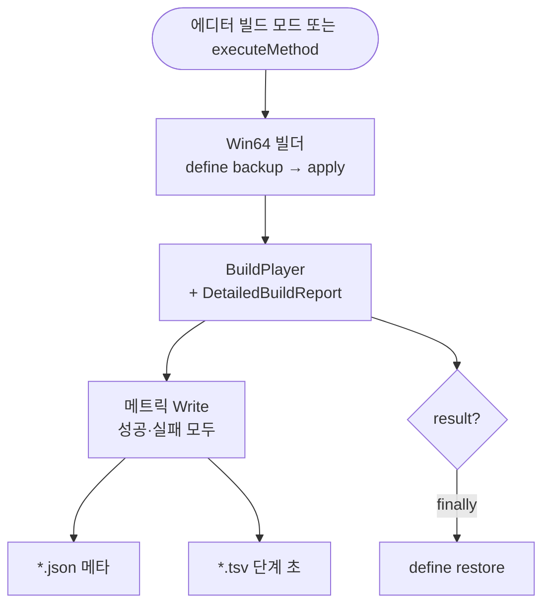

Unity `BuildReport`는 콘솔에만 남기면 before/after가 흐려집니다. [드래곤 이즈 데드]({{ "/projects/dragon-is-dead/" | relative_url }}) **Win64(Windows 64비트) 플레이어 빌드**에, 빌드가 끝날 때마다 메타 JSON과 단계 TSV를 버전 폴더에 쌍으로 남기는 계측을 붙였습니다.

## 맥락

에디터 **개발자 창** 빌드 모드와 `-executeMethod`로 Win64 exe를 만들 때, `BuildReport`의 총 소요와 단계별 초를 파일로 고정합니다. `ReleaseTsDev` 풀빌드는 수 분 걸리고, 단계 리포트에서 `Analyze resource dependencies`처럼 한 단계가 100초대로 보이는 경우가 있습니다. 무엇을 고쳤을 때 빨라졌는지 보려면 **같은 형식·같은 프리셋**으로 before/after 숫자를 남겨 두어야 합니다.

File → Build Settings 수동 빌드·CI·게임 **플레이 중** Profiler 세션은 이 글 범위 밖입니다.

## 문제

`BuildPipeline.BuildPlayer`가 돌려주는 `BuildReport`에는 총 소요와 단계 트리가 같이 있습니다. 파일로 고정해 두지 않으면 비교가 막히는 지점은 다음과 같습니다.

| 증상 | 원인 |
|------|------|
| 며칠 뒤 “전보다 빨라졌나”를 말하기 어렵다 | 콘솔 로그만 남고 파일로 고정되지 않음 |
| 스프레드시트에 넣기 번거롭다 | 요약(메타)과 단계 표가 한 덩어리면 용량·중복이 커짐 |
| 게임 버전·프리셋이 섞인다 | 날짜만 파일명에 있으면 `v1.3.003`과 `v1.3.005` 결과가 한곳에 쌓임 |
| 풀빌드와 스크립트만 빌드가 섞인다 | 총 초만 보면 씬까지 포함한 exe 빌드인지 구분이 어려움 |

**핵심:** “어느 단계가 느렸나”는 **TSV**가 정본이고, “어떤 빌드끼리 비교하나”는 **JSON**에 게임 표시 버전·프리셋·빌드 종류를 남깁니다.

## 해결

빌드 실행 직후, 성공·실패와 관계없이 **항상** 두 파일을 씁니다. 저장 로직은 빌더와 분리한 static 클래스 한곳에 두고, 빌더는 `BuildPlayer` 반환 직후 `Write`만 호출합니다.

**빌드 → 메트릭 기록**

- **JSON** — *이 빌드가 무엇이었는지* (총 초, 성공/실패, 프리셋, define, 씬 개수, 스크립트만 빌드 여부)
- **TSV** — *어느 단계가 몇 초였는지* (`stepName`, `depth`, `seconds`, UTF-8 BOM). 단계 초는 **여기만** 봅니다
- 같은 베이스네임으로 `.json` + `.tsv` **쌍**을 남김. 단계 초는 JSON에 넣지 않음

### 저장 위치와 파일명

| 항목 | 규칙 |
|------|------|
| 루트 | `Builds/Win64/BuildMetrics/` (Unity 프로젝트 루트 기준 · 레포에서는 `Project/ProjectDragon/`, **gitignore**) |
| 버전 폴더 | `PlayerSettings.bundleVersion` — 예: `v1.3.004` |
| 파일명 | `win64-{UTC}-{프리셋}.json` + 동일 베이스 `.tsv` |
| 프리셋 | `Release` · `Development` · `ReleaseTsDev` |

폴더명은 게임 **표시 버전**(`bundleVersion`)입니다. Release/Development 같은 Win64 프리셋과는 별개로, 버전마다 하위 폴더를 둡니다.

### JSON 메타 (`metricsSchemaVersion` 1)

| 필드 | 의미 |
|------|------|
| `totalSeconds` | 빌드 총 소요(초) |
| `result` | Succeeded / Failed 등 |
| `preset` | Win64 프리셋 이름 |
| `scriptingDefines` | 빌드 직후 Standalone define 스냅샷 |
| `buildScriptsOnly` | 스크립트만 빌드 옵션이 켜져 있었는지 |
| `hasBuildingScenes` | TSV에 `Building scenes` 단계가 있으면 true — **씬까지 포함한 빌드** |
| `hasScriptsOnlyBuild` | TSV에 `Run script only build` 단계가 있으면 true |
| `firstEnabledScene` · `enabledSceneCount` | Build Settings enabled 씬 |

풀빌드 시간을 비교할 때는 `hasBuildingScenes == true`인 결과만 씁니다. false이면 씬을 거치지 않은 빌드(스크립트만 등)라서, before/after 숫자가 맞지 않습니다.

### TSV 읽기

Unity build step은 **겹쳐 보이는** 트리입니다. `depth`는 포함 관계라, 부모 행의 초에 자식 초를 더하면 **두 번 더한 값**이 됩니다. 병목은 **같은 깊이의 형제 step**만 서로 비교합니다.

비교할 때 자주 보는 단계 예: `Analyze resource dependencies`, `ProducePlayerScriptAssemblies`, `Packaging assets - resources.assets`. 총 소요는 JSON의 `totalSeconds`와 맞춥니다.

## 이 글에서 쓰는 말

| 역할 | 코드 (참고) |
|------|-------------|
| 빌드 메트릭 기록 | `Win64BuildMetrics` |
| Win64 빌드 실행 | `Win64PlayerBuilder` |
| 빌드 리포트 | Unity `BuildReport` / `BuildStep` |

## 실측에서 쓴 방식

병목 조사는 여기서 **측정을 마쳤고**, Resources·Addressables 완화는 **별 작업**입니다. 숫자는 “이 값을 넘으면 실패”가 아니라 **기록**용입니다.

1. **before 고정** — 로컬에 쌓인 원본을 비교용 스냅샷 폴더에 복사하고, 파일 이름·게임 버전·UTC를 문서에 적습니다.
2. **같은 프리셋·가능하면 같은 게임 버전** — after도 같은 JSON+TSV 형식으로 남깁니다.
3. **after 정본** — 출력 비우기와 **Library player 빌드 캐시 삭제** 후 첫 full(`hasBuildingScenes == true`)을 after로 씁니다. `Library/PlayerDataCache`가 남으면 scripts-only 경로가 흔합니다. 연속 2회째(warm)는 참고용으로, 캐시를 비우지 않고 바로 다시 빌드한 결과입니다.
4. **판정 예** — `Assets/Resources`를 임시로 빼고 빌드하면 total ~251초→~70초, Analyze ~107초→~4초로 줄어, 그 축이 주원인으로 확정됐습니다.

## 기각·보류

**전역 `IPostprocessBuildWithReport` 훅** — File → Build Settings 수동 빌드까지 메트릭이 섞입니다. **Win64 스크립트 빌더 경로만** 기록합니다.

**step을 JSON에도 넣기** — TSV가 정본인데 메타에 복제하면 용량·드리프트만 늘어납니다.

**`BuildReport.messages` 저장** — 조사에는 step 초만 필요했고, 로그 덤프는 범위 밖입니다.

**메트릭 폴더를 git에 올리기** — 로컬 산출물은 ignore하고, 비교용만 스냅샷으로 고정합니다.

## 확인 포인트

- Win64 빌드 후 `Builds/Win64/BuildMetrics/{bundleVersion}/`에 `.json`·`.tsv` **쌍**이 생김
- 풀빌드 비교 시 JSON `hasBuildingScenes == true`인지
- 개발자 창 **메트릭 폴더 열기**로 현재 버전 폴더를 탐색기에서 열 수 있음
- **플레이 중** Journey/Spike/Memory 성능 로그는 `persistentDataPath/performance/{bundleVersion}/` — 빌드 시간과 **다른 경로**입니다

## 정리

Win64 빌더는 `BuildPlayer` 직후 버전 폴더에 메타 JSON과 step TSV를 남깁니다. JSON으로 “같은 종류 빌드끼리” 거른 뒤, TSV에서 형제 step 초로 병목을 봅니다. 수동 빌드·CI·플레이 중 성능 로그는 이 계측과 겹치지 않습니다.

**권장 읽기** — [Win64 빌드 계측]({{ "/notes/dragon-win64-build-metrics/" | relative_url }}) · [조건부 로그]({{ "/notes/conditional-log-build-cost/" | relative_url }}) · [스테이지 preload]({{ "/notes/stage-spawn-area-preload/" | relative_url }}) · [GPU Global·Ambient]({{ "/notes/stage-visual-gpu-optimize/" | relative_url }})
