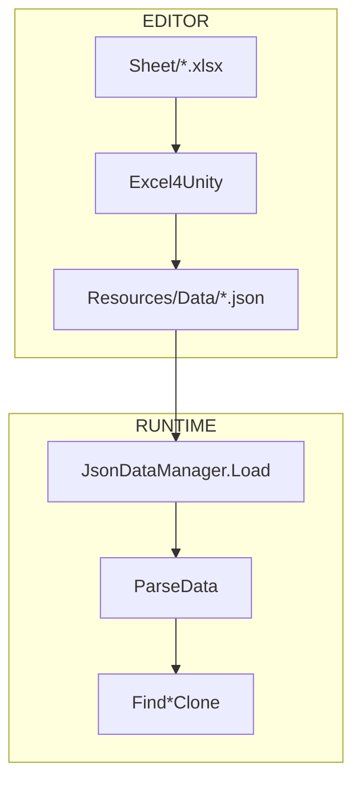

기획자가 Unity를 켜지 않고 밸런스를 고칠 수 있게 Excel로 두고, 빌드에는 에디터에서 JSON으로 굳혀 타입드 조회로만 읽는 고정 데이터 경계를 정리합니다.

[드래곤 이즈 데드]({{ "/projects/dragon-is-dead/" | relative_url }})에서 캐릭터·스킬·아이템·문자열 같은 **표로 고치는 고정값**에 쓴 방식입니다. 코드·저장소 없이 읽을 때는 **기획 시트 → 빌드 JSON → 게임 조회** 세 단계만 보면 됩니다. 변환 기반은 [Excel4Unity](https://github.com/joexi/Excel4Unity)이고, [블레이드 어썰트]({{ "/projects/blade-assault/" | relative_url }})에도 같은 Excel→JSON 패턴이 있습니다.

## 맥락

밸런스·카탈로그·다국어 문자열은 비개발자가 자주 고칩니다. QA·플레이에서 자주 보이는 증상:

- **패치 후 수치가 안 맞음** — 시트는 고쳤는데 변환·빌드 갱신을 안 한 경우
- **런타임 크래시·빈 이름** — 시트 열 추가·빈 칸·배열 표기가 JSON 파싱까지 전달된 경우
- **전투 연출이 표에 없음** — Buff·Passive·Hitmark는 ScriptableObject 경로 (이 글 밖)

그때마다 Unity를 열고 Scriptable·Inspector를 만지게 하면, 편집 도구가 클라이언트 전제에 묶입니다. 시트(`.xlsx`)로 두면 Excel만으로 수치를 맞출 수 있고, 프로그래머는 변환 메뉴로 JSON을 갱신해 빌드에 넣습니다.

출시 클라이언트에서 고정 데이터는 엑셀 파일이 있으면 그만이 아닙니다. 기획 워크플로는 시트로 두고, 플레이어 경로에는 파싱 비용·의존성·스키마를 예측 가능하게 넣어야 합니다. 런타임에 `.xlsx`를 열면 Office 스택·시트 규약이 빌드에 붙고, 열 추가·빈 칸·배열 표기가 그대로 크래시 면이 됩니다.

그래서 변환은 **에디터 메뉴**에만 두고, 플레이어 빌드는 `Resources`의 JSON만 읽게 했습니다. 프로젝트 페이지 [세이브·데이터]({{ "/projects/dragon-is-dead/" | relative_url }}#세이브데이터) 절의 Excel→Json / Scriptable 한 줄이 그 경계입니다.

## 이 글에서 쓰는 말

| 말 | 역할 | 코드에서는 (참고) |
|----|------|-------------------|
| **고정 데이터** | 패치마다 갱신되는 표 기반 카탈로그 | Character / Skill / Item / String 등 |
| **변환** | 시트 → JSON (에디터만) | Excel4Unity + 타이틀 메뉴 |
| **로드** | 빌드에서 JSON 한 번 읽기 | `JsonDataManager` |
| **조회** | 게임플레이가 바꾸지 않는 복제본 | `Find*Clone` |
| **Scriptable 경로** | 트리거·연출·참조 묶음 | Buff / Passive / Hitmark |

## 두 경로

| | Excel → JSON | Scriptable |
|--|--------------|------------|
| 맞는 질문 | Unity 없이 표로 고칠 수치·이름·문자열인가 | 에디터에서 트리거·연출·참조를 묶을 것인가 |
| 편집 | `.xlsx` (기획) → 변환 메뉴 (클라) | Inspector |
| 런타임 | `JsonDataManager` 로드·조회 | `ScriptableDataManager` |
| 예 | Character / Skill / Item / String* | Buff / Passive / Hitmark |

**에디터에서 굳히고, 런타임은 JSON만**

- Scriptable 파이프라인(Buff / Passive / Hitmark)은 이 도식 밖에 둡니다.

## 변환 계약

변환기는 [Excel4Unity](https://github.com/joexi/Excel4Unity)(`.xlsx` 읽기·시트→JSON)를 바탕으로 했습니다. 그 위에 타이틀용 `ExcelNames`·도메인/String 메뉴·헤더·센티널·언어 시트 처리를 맞췄습니다.

입력은 프로젝트 루트 옆 `Sheet/{이름}.xlsx`, 출력은 `Assets/Resources/Data/{시트이름}.json`입니다. 워크북의 시트 하나가 JSON 배열 파일 하나가 됩니다. 시트·컬럼 이름에 `#`가 있으면 변환에서 빠집니다.

시트 상단은 헤더로 고정합니다.

| 행 | 역할 |
|----|------|
| 1 | 필드명 |
| 2 | 타입 (`bool`, `int`, `float`, `enum`, `string`, 배열·`struct` 등) |
| 3 | 설명(기획·문서용. 변환기는 쓰지 않음) |
| 4~ | 데이터. 식별 열이 비면 읽기를 멈춤 |

빈 칸은 센티널(`-`)로 두고, 타입별 기본값(`false` / `0` / 빈 문자열 / `None`)으로 씁니다. 배열·다중 enum은 JSON에 **문자열**로 남기고, 런타임 `ParseData`에서 쉼표·공백·개행으로 나눕니다. 언어 시트는 일반 공백을 non-breaking space로 바꿔 UI 줄바꿈이 의도치 않게 한 경우가 있습니다.

에디터 메뉴는 전체 변환 외에 도메인별(캐릭터·스킬·아이템…)·String 묶음을 둡니다. 도메인 메뉴는 데이터 시트와 대응 문자열 시트를 같이 돌리는 경우가 많습니다.

## 런타임 계약

로드는 한 번입니다. JSON을 행 목록으로 역직렬화한 뒤, 행마다 `ParseData`로 TID·배열·enum을 확정하고 딕셔너리에 넣습니다. 모델에 `OnLoadData`가 있으면 다른 시트 참조나 에디터 검증을 이 시점에 붙입니다.

조회 기본은 `Find*Clone`입니다. 캐시 원본을 게임플레이가 직접 바꾸지 않게 복제본을 넘깁니다. `CheckLoaded`로 대표 시트가 채워졌는지 보고, 로딩·에디터 미리보기에서 필요할 때만 `Load`를 호출합니다.

리소스 경로는 파일명 → `Resources` leaf를 메타로 찾아 갑니다. JSON을 추가·이름 바꾼 뒤에는 그 메타도 맞춰야 로드가 실패하지 않습니다.

문자열 JSON은 이 파이프라인의 산물이며, TMP Static 문자셋 추출의 입력이기도 합니다 ([TMP Static 아틀라스로 Dynamic hitch 피하기]({{ "/notes/tmp-static-font-atlas/" | relative_url }})).

## 기각·보류

- 시트에서 C# 모델 코드를 매번 재생성하는 쪽에 의존하지 않았습니다. upstream이 제공하는 생성 경로는 두고, 스키마는 헤더와 손수 맞춘 모델(`ParseData`·Excel 전용 원시 필드)이 계약입니다.
- 세이브 프로필·런 진행은 이 경로가 아닙니다. 고정 카탈로그와 진행 저장은 [세이브·데이터]({{ "/projects/dragon-is-dead/" | relative_url }}#세이브데이터)에서 따로 둡니다.

## 정리

upstream은 시트→JSON까지이고, 타이틀 규약·`JsonDataManager`·Scriptable 분리는 그 위에 얹은 경계입니다.

**권장 읽기** — [Excel4Unity](https://github.com/joexi/Excel4Unity) (변환 기반) → [드래곤 이즈 데드 · 세이브·데이터]({{ "/projects/dragon-is-dead/" | relative_url }}#세이브데이터) → [TMP Static 아틀라스]({{ "/notes/tmp-static-font-atlas/" | relative_url }}) (String JSON 소비) → [Conditional 로그]({{ "/notes/conditional-log-build-cost/" | relative_url }}) (에디터 vs 플레이어 빌드 비용 경계)
