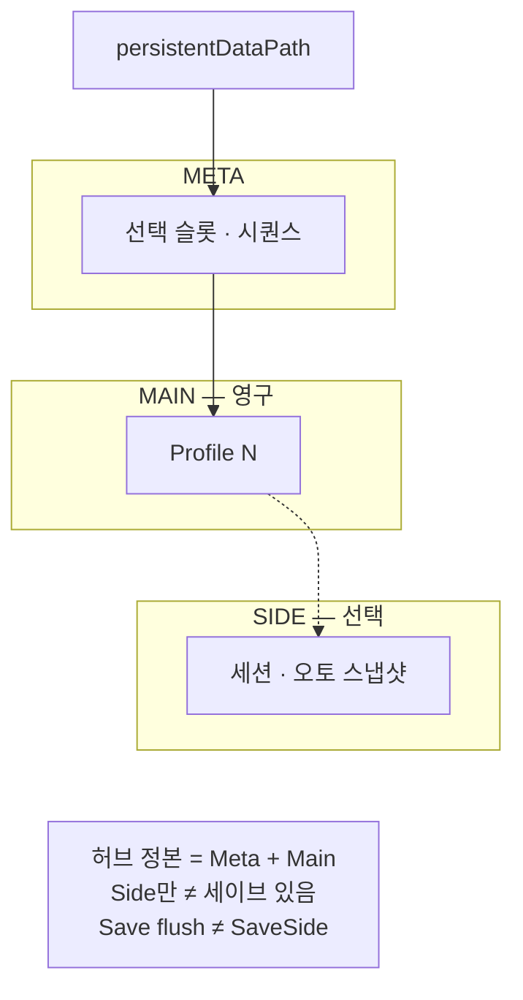

출시 타이틀에서 프로필·슬롯·백업이 타이틀 코드에 섞일 때 생기는 경계를, Main·Side·공유 Meta로만 남긴 이유를 정리합니다.

**독자:** 세이브 레이아웃 패키지·출시 타이틀의 디스크 계약을 읽는 개발자. 구현 API는 [GitHub README](https://github.com/monet5379/unity-save-layout)가 정본입니다.

초점은 **디스크 단위를 누가 소유하는지**입니다. 출시 맥락은 [블레이드 어썰트 (프로젝트)]({{ "/projects/blade-assault/" | relative_url }})·[드래곤 이즈 데드 (프로젝트)]({{ "/projects/dragon-is-dead/" | relative_url }}), 구현은 [세이브 레이아웃 (프로젝트)]({{ "/projects/save-layout/" | relative_url }})입니다.

## 맥락

출시에서 세이브를 지켜도, 역할이 타이틀 코드에 섞여 있으면 **레이아웃 계약만** 재현·설명하기 어렵습니다.

## 출시 타이틀의 한계

[블레이드 어썰트 (프로젝트)]({{ "/projects/blade-assault/" | relative_url }})와 [드래곤 이즈 데드 (프로젝트)]({{ "/projects/dragon-is-dead/" | relative_url }})는 같은 축에서 세이브를 출시까지 지켰지만, **영구 진행·짧은 진행·실패 백업·선택 메타를 디스크 레인 계약으로 갈라 두지는 않았습니다.**

| | 블레이드 어썰트 | 드래곤 이즈 데드 |
|--|---------------|----------------|
| 출시에서 한 일 | 슬롯·쿨다운·필수 세이브·백업을 타이틀 코드에서 처리. 실서비스 이중 파일·암호화 경험 | 슬롯별 프로필을 로컬 저장 폴더에 두고, 쿨다운·필수 세이브·다중 백업·마이그레이션·손상 복구를 게임 세이브 한곳에서 처리. Steam Cloud는 Auto-Cloud ([출시 세이브 노트]({{ "/notes/dragon-save-shipped/" | relative_url }})) |
| 한계 | 레인이 계약으로 드러나지 않아, 손상·이어하기·저장 주기의 역할이 한곳에 섞이기 쉬움 | 동일. 세이브 레이아웃만 따로 재현·설명하기 어려움 |

## 이 글에서 쓰는 말

| 말 | 역할 |
|----|------|
| **Main** | 슬롯당 영구 진행 (프로필 파일 1) |
| **Side** | 슬롯당 짧은 진행·스냅샷 (옆 레인) |
| **Meta** | 어떤 슬롯이 선택됐는지 (프로필 본문 없음) |
| **Backup/** | 손상·빈 파일을 치울 때 생기는 로컬 흔적 (Continue 정본 아님) |

출시본은 전투·UI·밸런스와 섞인 채 **세이브를 지킨 기록**입니다. 이전 타이틀의 단점을 마이그레이션 코드로 증명하지는 않습니다. 출시 요약은 각 프로젝트 페이지의 세이브 절·[드래곤 출시 세이브 노트]({{ "/notes/dragon-save-shipped/" | relative_url }})를 보면 됩니다.

## 세이브 레이아웃에서 시도한 것

그 경계를 [세이브 레이아웃 (프로젝트)]({{ "/projects/save-layout/" | relative_url }})에서 **레이아웃 계약**으로만 뽑았습니다.

| 축 | 출시에서 섞이기 쉬웠던 것 | 여기서 고정한 것 |
|----|---------------------------|------------------|
| 레인 | 타이틀 세이브 코드에 역할이 함께 있음 | 슬롯당 Main + 선택 Side + 공유 Meta |
| Meta | 선택 슬롯을 세트 밖(`PlayerPrefs` 등)에 두기 쉬움 | Meta에 두고 세트와 같이 이동 |
| Backup vs Continue | 슬롯 백업으로 이어하기를 흉내 내는 유혹 | `Backup/` = 치운 흔적만. Continue·오토는 Side ([2편 (노트)]({{ "/notes/save-layout-side-lane/" | relative_url }})) |

아래 **세 축**이 그 계약의 지도입니다. 쓰기 주기·허브 정본의 세부는 표·도식과 [2편 (노트)]({{ "/notes/save-layout-side-lane/" | relative_url }})에 맡깁니다.

## 세 축

| 축 | 질문에 답한다 | 소유하는 것 | 넘기지 않는 것 |
|----|---------------|-------------|----------------|
| **Main** | 이 슬롯의 영구 진행은 무엇인가 | 슬롯당 Profile 파일 1, 쿨다운·pending 저장 | Side 페이로드, 다른 슬롯 Main |
| **Side** | 이 슬롯의 짧은 진행·스냅샷은 무엇인가 | 슬롯당 옆 파일, 즉시 기록, `valid` 힌트 | Main·Meta를 같은 호출로 덮기 |
| **Meta** | 세이브 세트에서 무엇이 선택돼 있는가 | 선택 슬롯 인덱스·Meta 시퀀스 | 프로필 본문, 장르 Continue 규칙 |

**Main · Side · Meta**



허브 디스크 정본은 **Meta + Profile Main**입니다. Side만으로는 세이브 있음이 아니고, 손상·빈 파일은 그 파일만 `Backup/`으로 치운 뒤 null로 둡니다. `Backup/`과 Side의 차이는 [2편 (노트)]({{ "/notes/save-layout-side-lane/" | relative_url }})입니다.

## 왜 이렇게 잘랐는가

경계를 나눈 이유는 레이어를 예쁘게 보이려는 것이 아니라, **저장·실패·삭제의 단위**를 짐작할 수 있게 하려는 것이었습니다. (레인·Meta·Backup 구분은 위 시도 표.)

**슬롯이 단위다.** 저장·손상 복구·의도적 삭제가 같은 경계를 쓰면, 어느 파일만 손댔는지가 로그·백업·UI에 그대로 드러납니다. 한 허브 JSON에 전 슬롯을 넣으면, 한 번의 깨진 쓰기가 전체를 위협합니다.

**Payload는 껍데기다.** 레이아웃은 경로·원자 기록·슬롯 격리·`valid`만 고정합니다. 필드 rename·밸런스 테이블·Continue UI는 타이틀이 `schemaVersion` 등으로 소유합니다. 세이브 Json과 밸런스 Json을 한 파이프에 두지 않습니다. 파일에 남는 모양만 보면 대략 이렇습니다.

```csharp
// Meta — 선택만 (프로필 본문 없음)
class Meta { int selectedProfileIndex; long metaSequence; }

// Main (Profile) — 영구 진행은 payload 껍데기
class Profile { int schemaVersion; object payload; }

// Side — 옆 레인 + valid 힌트 (Main과 같은 호출로 안 씀)
class Side { int schemaVersion; bool valid; object payload; }
```

## 기각·보류

| 두지 않은 것 | 이유 |
|--------------|------|
| 레거시·타 포맷 **이관** | 레이아웃 패키지 범위 밖. 타이틀·툴링 몫 |
| Payload **필드 마이그레이션** | 스키마는 게임이 소유 |
| 별도 **`runs/` 트리**·런 전용 제품 API | Side 레인 또는 타이틀 필드로 충분하다고 봄 |
| Rot·AES·Steam Cloud merge UI | 레이아웃은 Cloud에 올리기 쉽게 두고, 동기화·충돌은 타이틀 |
| 타이머 오토·Continue 분기 | Side *레이아웃*만 제공. 제품 규칙은 타이틀 |
| Excel→Json·SO **Facade** | 고정 정의 파이프는 별도 관심사 |

Demo의 페이로드·Title UI는 놀이터입니다. 출시 `GameData` 스키마가 아닙니다.

## 이 글에서 다루지 않는 것

| 주제 | 위치 |
|------|------|
| 설치·API·불변조건 표·실패 시나리오 | [GitHub README](https://github.com/monet5379/unity-save-layout) |
| 무엇을 만들었는지·계보·비범위 요약 | [세이브 레이아웃 (프로젝트)]({{ "/projects/save-layout/" | relative_url }}) |
| 블레이드 어썰트 / 드래곤 이즈 데드 세이브 출시 요약 | [블레이드 어썰트 (프로젝트)]({{ "/projects/blade-assault/" | relative_url }}) · [드래곤 이즈 데드 (프로젝트)]({{ "/projects/dragon-is-dead/" | relative_url }}) |
| 내부 Architecture·NDA 수치 | 공개하지 않음 |

## 정리

세이브 레이아웃에서 지킨 것은 완벽한 세이브 시스템이 아니라, **슬롯당 Main·선택적 Side·공유 Meta**라는 소유 질문입니다. 어디에 쓸지·언제 쓸지·선택이 어디에 있는지가 섞이지 않으면, 타이틀은 스키마와 장르 규칙만 얹으면 됩니다.
