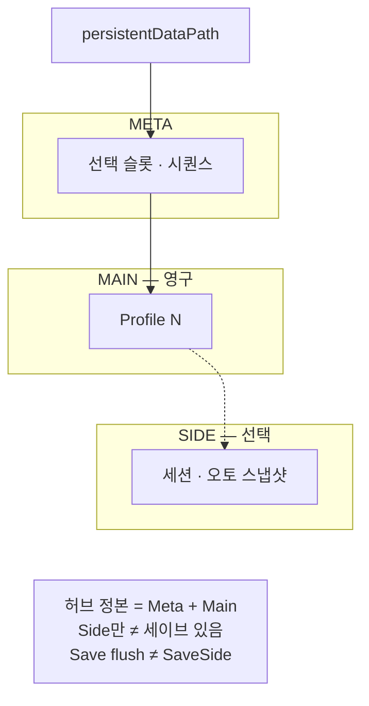

출시 타이틀에서 프로필·슬롯·백업이 타이틀 코드에 섞일 때 생기는 경계를, Main·Side·공유 Meta로만 남긴 이유를 정리합니다.

[Blade Assault]({{ "/projects/blade-assault/" | relative_url }})·[Dragon is Dead]({{ "/projects/dragon-is-dead/" | relative_url }})에서 프로필 세이브를 다루며 반복해서 쓴 계약입니다. 클래스 목록이 아니라 **디스크 단위를 누가 소유하는지**와 **왜 그렇게 잘랐는지**에 초점을 둡니다. 같은 계약을 게임 밖으로 뺀 구현은 [Save Layout]({{ "/projects/save-layout/" | relative_url }})입니다.

## 맥락

출시 클라이언트에서 세이브는 «잘 저장되면 그만»이 아닙니다. 저장 중 종료·디스크 오류로 파일이 비거나 JSON이 깨지고, 프로필을 한 파일에 묶으면 한 슬롯 손상이 다른 진행까지 위협합니다. 런·세션처럼 짧은 진행을 영구 진행과 같은 주기로 쓰면, 둘 다 같이 흔들릴 수 있습니다.

Dragon 프로젝트 페이지의 [세이브·데이터]({{ "/projects/dragon-is-dead/" | relative_url }}) 절 — 슬롯·쿨다운·필수 세이브·백업, `persistentDataPath`와 Steam Cloud 경로 — 은 그 문제 의식을 타이틀 안에서 지킨 기록입니다. 타이틀 코드에만 두면 전투·UI·밸런스 파이프라인과 섞여, **세이브 레이아웃만** 재현·설명하기 어렵습니다.

[Save Layout]({{ "/projects/save-layout/" | relative_url }})은 그 경험을 **레이아웃 계약**으로만 남긴 결과입니다. 이전 타이틀의 단점을 마이그레이션 코드로 증명하지는 않습니다.

## 세 축

한 줄로 보면 역할은 이렇게 나뉩니다.

| 축 | 질문에 답한다 | 소유하는 것 | 넘기지 않는 것 |
|----|---------------|-------------|----------------|
| **Main** | 이 슬롯의 영구 진행은 무엇인가 | 슬롯당 Profile 파일 1, 쿨다운·pending 저장 | Side 페이로드, 다른 슬롯 Main |
| **Side** | 이 슬롯의 짧은 진행·스냅샷은 무엇인가 | 슬롯당 옆 파일, 즉시 기록, `valid` 힌트 | Main·Meta를 같은 호출로 덮기 |
| **Meta** | 세이브 세트에서 무엇이 선택돼 있는가 | 선택 슬롯 인덱스·Meta 시퀀스 | 프로필 본문, 장르 Continue 규칙 |

**Main · Side · Meta**



<div class="callout" markdown="1">

- **Main**: 이 슬롯의 영구 진행 — Profile 파일, 쿨다운·pending
- **Side**: 짧은 진행·스냅샷 — 옆 파일, 즉시 기록, `valid`
- **Meta**: 세트에서 무엇이 선택돼 있는가 — 선택 슬롯 인덱스·시퀀스

</div>

허브 정본은 Meta+Main입니다. Side만으로는 «세이브 있음»이 아니고, Save flush와 SaveSide도 다른 API입니다.

의존은 한쪽으로 둡니다. 허브 디스크 정본은 **Meta + Profile Main**입니다. Side는 `TryGetSide`로 읽고, Side만 있어도 «세이브가 있다»고 보지 않습니다. `Save` / flush는 Main + Meta만 쓰고, Side는 `SaveSide` / `InvalidateSide` / `ClearSide`로만 다룹니다.

손상·빈 파일은 **그 파일만** 로컬 `Backup/`으로 치운 뒤 null로 둡니다. 슬롯 N Main이 깨져도 슬롯 M은 유지됩니다. `Backup/`과 Side는 역할이 다릅니다 — 차이는 [2편]({{ "/notes/save-layout-side-lane/" | relative_url }})에서 풉니다.

## 왜 이렇게 잘랐는가

경계를 나눈 이유는 레이어를 예쁘게 보이려는 것이 아니라, **저장·실패·삭제의 단위**를 짐작할 수 있게 하려는 것이었습니다.

**슬롯이 단위다.** 저장·손상 복구·의도적 삭제가 같은 경계를 쓰면, «어느 파일만 손댔는지»가 로그·백업·UI에 그대로 드러납니다. 한 허브 JSON에 전 슬롯을 넣으면, 한 번의 깨진 쓰기가 전체를 위협합니다.

**Main과 Side는 주기가 다르다.** 영구 진행은 쿨다운·pending으로 I/O를 묶고, 런 이어하기·주기 스냅샷은 즉시 써도 Main을 흔들지 않게 옆 레인으로 둡니다. 장르 이름(로그라이크 Temp·캠페인 오토)은 Runtime에 붙이지 않습니다.

**Meta는 세트와 함께 간다.** 마지막 선택 슬롯만 `PlayerPrefs`에 두면, 클라우드·백업·기기 이동 때 본편 파일과 어긋나기 쉽습니다. 선택 인덱스는 Meta에 두고 세이브 세트와 같이 움직이게 합니다.

**Payload는 껍데기다.** 레이아웃은 경로·원자 기록·슬롯 격리·`valid`만 고정합니다. 필드 rename·밸런스 테이블·Continue UI는 타이틀이 `schemaVersion` 등으로 소유합니다. 세이브 Json과 밸런스 Json을 한 파이프에 두지 않습니다. 파일에 남는 모양만 보면 대략 이렇습니다.

```csharp
// Meta — 선택만 (프로필 본문 없음)
class Meta { int selectedProfileIndex; long metaSequence; }

// Main (Profile) — 영구 진행은 payload 껍데기
class Profile { int schemaVersion; object payload; }

// Side — 옆 레인 + valid 힌트 (Main과 같은 호출로 안 씀)
class Side { int schemaVersion; bool valid; object payload; }
```

## 기각·보류

| 두지 않은 것 | 이유 |
|--------------|------|
| 레거시·타 포맷 **이관** | 레이아웃 패키지 범위 밖. 타이틀·툴링 몫 |
| Payload **필드 마이그레이션** | 스키마는 게임이 소유 |
| 별도 **`runs/` 트리**·런 전용 제품 API | Side 레인 또는 타이틀 필드로 충분하다고 봄 |
| Rot·AES·Steam Cloud merge UI | 레이아웃은 Cloud에 올리기 쉽게 두고, 동기화·충돌은 타이틀 |
| 타이머 오토·Continue 분기 | Side *레이아웃*만 제공. 제품 규칙은 타이틀 |
| Excel→Json·SO **Facade** | 고정 정의 파이프는 별도 관심사 |

Demo의 페이로드·Title UI는 놀이터입니다. 출시 `GameData` 스키마가 아닙니다.

## 이 글에서 다루지 않는 것

| 주제 | 위치 |
|------|------|
| `Backup/`과 Side를 섞지 않은 이유 | [2편]({{ "/notes/save-layout-side-lane/" | relative_url }}) |
| 설치·API·불변조건 표·실패 시나리오 | [GitHub README](https://github.com/monet5379/unity-save-layout) |
| 무엇을 만들었는지·계보·비범위 요약 | [Save Layout]({{ "/projects/save-layout/" | relative_url }}) |
| Dragon 세이브·데이터 출시 요약 | [Dragon is Dead]({{ "/projects/dragon-is-dead/" | relative_url }}) |
| 내부 Architecture·NDA 수치 | 공개하지 않음 |

## 정리

Save Layout에서 지킨 것은 완벽한 세이브 시스템이 아니라, **슬롯당 Main·선택적 Side·공유 Meta**라는 소유 질문입니다. 어디에 쓸지·언제 쓸지·선택이 어디에 있는지가 섞이지 않으면, 타이틀은 스키마와 장르 규칙만 얹으면 됩니다.

**권장 읽기** — Main·Side·Meta(이 글) → [슬롯 백업 대신 Side 레인을 둔 이유]({{ "/notes/save-layout-side-lane/" | relative_url }}).

**시리즈: 세이브 레이아웃 (1/2)** — **1** · [2]({{ "/notes/save-layout-side-lane/" | relative_url }})
