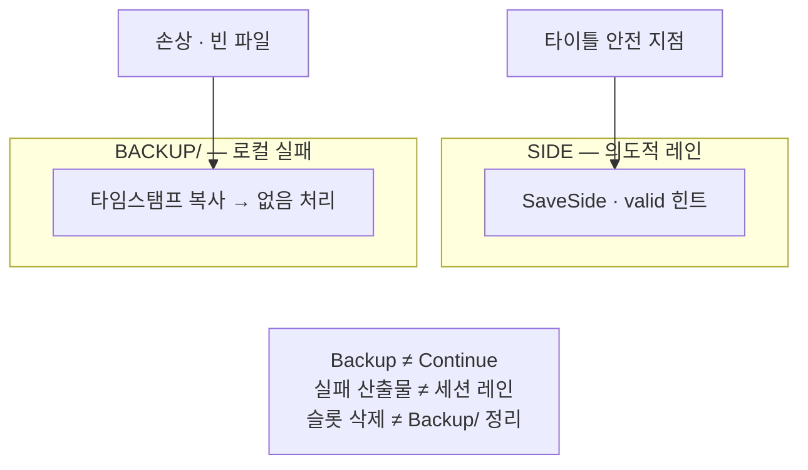

손상 복구용 Backup/과 세션·오토용 Side 레인을 섞지 않은 이유와, 슬롯 백업으로 Continue를 흉내 내지 않기로 한 경계를 정리합니다.

**독자:** [1편]({{ "/notes/save-layout-boundaries/" | relative_url }})에서 Main·Side·Meta 지도를 본 뒤, **왜 Backup/과 Side를 나눴는지**만 보려는 개발자.

[Main·Side·Meta로 나눈 이유 (노트)]({{ "/notes/save-layout-boundaries/" | relative_url }})에서 출시 타이틀의 한계와 Main·Side·Meta 지도를 둔 뒤, 이 글은 **Side를 왜 `Backup/`으로 대체하지 않았는지**만 봅니다. 구현은 [세이브 레이아웃 (프로젝트)]({{ "/projects/save-layout/" | relative_url }})입니다.

## 맥락

슬롯마다 Main을 두면, 손상·빈 파일을 만났을 때 그 슬롯만 타임스탬프 백업 후 null로 격리할 수 있습니다. 세이브 레이아웃도 그렇게 합니다. 로컬 `Backup/`은 **실패 산출물**입니다.

여기서 유혹이 생깁니다. 런을 시작하기 전 Main을 슬롯 백업으로 복사해 두고, 포기·크래시 뒤에 그 백업을 Continue처럼 되돌리면 되지 않을까. 오토세이브도 주기적으로 Backup에 덮어쓰기로 퉁칠 수 있지 않을까.

그 길을 택하지 않았습니다. **복구용 사본**과 **의도한 옆 진행**을 한 폴더·한 API에 두지 않기로 한 것입니다.

## Backup/이 하는 일 · 하지 않는 일

| | `Backup/` (슬롯 실패 백업) | Side 레인 |
|--|---------------------------|-----------|
| **언제 쓰나** | 손상·빈 Main/Side를 치울 때 | 세션·오토 등 타이틀이 정한 안전 지점 |
| **의미** | 이 파일은 깨져서 치웠다 | 이 슬롯의 짧은 진행·스냅샷 |
| **제품 Continue** | 쓰지 않음 | `valid`·타이틀 정책으로 읽음 |
| **클라우드** | 로컬 전용. 정본으로 등록하지 않음 | 넣을지는 타이틀 (권장: Main 우선) |
| **API** | 실패 경로의 부수 효과 | `SaveSide` / `InvalidateSide` / `ClearSide` |

**Backup/ ≠ Side**

`Backup/`은 손상·빈 파일을 치울 때 생기는 실패 산출물입니다. Side는 세션·오토 등 의도한 옆 진행이고, Continue 흉내에 쓰지 않습니다.

`Backup/`은 관측·수동 복구용입니다. 플레이어가 이어하기로 고르는 데이터가 아닙니다. 타임스탬프가 쌓이고, 정책이 치운 뒤 null이라 게임 상태 머신과 맞추기 어렵습니다.

## 왜 별도 레인인가

**쓰기 주기가 다르다.** Main은 쿨다운·pending으로 묶습니다. 런 중 잦은 스냅샷을 같은 경로에 넣으면 영구 진행 I/O와 실패 반경이 커집니다. Side는 즉시 쓰고 Main flush와 한 호출에 섞지 않습니다.

**무효와 삭제가 다르다.** `InvalidateSide`는 파일을 남기고 `valid=false`만 켭니다. Give Up·비정상 종료 후 Continue를 막을 때 Main을 건드리지 않습니다. `Backup/`에서 어느 타임스탬프가 유효한 Continue인가를 고르는 제품 규칙을 Runtime에 넣지 않습니다.

**슬롯 삭제와 운명이 같다.** `ClearProfileSlot(N)`은 Main과 Side를 함께 지웁니다. 실패 백업 트리는 의도적 삭제 경로와 다릅니다. 이 슬롯을 지운다와 깨진 파일을 치운다를 같은 폴더 관례로 묶지 않습니다.

**허브 정본이 흔들리지 않는다.** 로드는 Meta + Profile Main으로 허브를 조립합니다. Side만 있어도 세이브가 있다고 보지 않습니다. 백업 폴더를 Continue 정본으로 쓰면, 허브와 진짜 진행이 두 갈래가 됩니다.

## 기각한 대안

| 대안 | 기각 이유 |
|------|-----------|
| 런 전 Main → `Backup/` 복사 후 복원으로 Continue | 실패 산출물과 제품 상태를 혼동. 클라우드·정리 정책이 꼬임 |
| Main 안에 런 필드를 넣고 저장 주기만 바꿈 | 한 파일에 영구·짧은 진행이 섞여 손상·쿨다운 반경이 공유됨 |
| 별도 `runs/` 트리·런 전용 제품 API | [1편 (노트)]({{ "/notes/save-layout-boundaries/" | relative_url }}) 기각과 동일 — Side로 충분 |
| 크래시 시 Runtime이 Side를 자동 Invalidate | 장르 정책. 타이틀 몫으로 둠 |

타이틀 레시피 예(강제 아님): Session은 안전 지점에서 `SaveSide`, 포기·비정상이면 `InvalidateSide`. Autosave는 `valid`를 유지하고 Continue 기본은 Main.

## 이 글에서 다루지 않는 것

| 주제 | 위치 |
|------|------|
| API·실패 시나리오·Demo F1 | [GitHub README](https://github.com/monet5379/unity-save-layout) |
| 케이스 스터디 요약 | [세이브 레이아웃 (프로젝트)]({{ "/projects/save-layout/" | relative_url }}) |

## 정리

`Backup/`은 **깨진 파일을 치우는 로컬 흔적**이고, Side는 **슬롯에 붙인 의도적 옆 진행**입니다. Continue·오토·세션을 슬롯 백업으로 흉내 내지 않은 덕분에, 복구와 장르 규칙이 같은 폴더를 두고 싸우지 않습니다.
