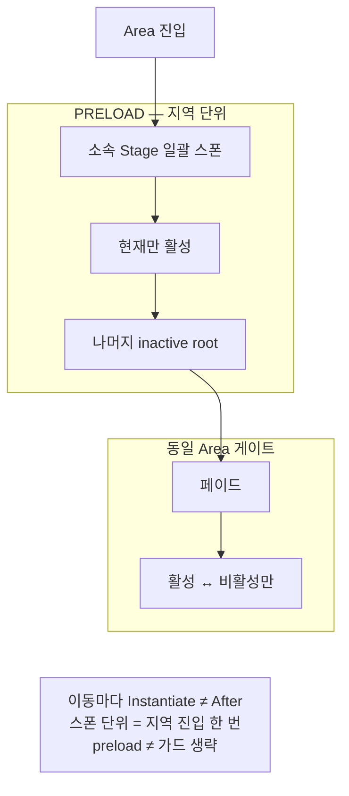

지역 소속 스테이지를 미리 일괄 스폰하고, 동일 지역 내 이동은 활성/비활성만 하도록 바꾼 이유를 정리합니다.

[드래곤 이즈 데드]({{ "/projects/dragon-is-dead/" | relative_url }}) 스테이지 이동 최적화에서 적용한 내용입니다. **플레이어·QA 증상:** 같은 지역 안에서 게이트로 이동할 때마다 짧은 끊김(hitch)이 반복되는 경우.

## 맥락

월드는 **Area(지역)** 여러 개로 나뉘고, 각 Area는 **Stage(스테이지 프리팹)** 여러 개를 가집니다. 플레이어는 **게이트**로 Stage 사이를 이동하며, Area가 바뀌는 이동과 Area 안 이동을 구분합니다. 이 노트는 **StageSpawn** — Stage 인스턴스를 언제 만들고 언제 켜는지 — 정책입니다.

예: Area A에서 Stage 1→2→3을 탐험할 때, 게이트마다 Instantiate·로드가 끼면 hitch가 반복됩니다. 비용을 **이동마다**가 아니라 **지역 진입 한 번**으로 옮기는 것이 목표입니다.

| 용어 | 의미 |
|------|------|
| inactive root | 비활성 Stage를 모아 두는 부모. 계층은 유지하되 업데이트·연출을 끔 |
| Spread | 일괄 preload의 **프레임 분산**. preload 정책 자체를 바꾸지 않음 |
| Resident 메모리 | preload로 상주하는 Stage 인스턴스 메모리 |
| 저사양 마일스톤 | 콘솔·저사양 빌드 이후 후보(Addressables 스트리밍 등) |

## 문제

스테이지 게이트를 지날 때마다 해당 스테이지를 Instantiate·로드하던 방식은, 지역 안을 탐험하는 동안 로딩과 hitch가 반복되었습니다.

| 증상 | 원인 |
|------|------|
| 스테이지 이동마다 로딩·대기 | 이동 시점에 해당 스테이지만 생성 |
| 지역 내 탐험이 끊김 | hitch가 게이트 통과·플레이 중 입력과 겹침 |

비용을 **이동마다** 치르던 방식을, **지역 진입 한 번**으로 옮겼습니다.

## 해결

| 항목 | 내용 |
|------|------|
| 단위 | Area에 속한 스테이지를 지역 진입 시 일괄 스폰 |
| 활성 | 현재 스테이지만 활성, 나머지는 inactive root 하위 |
| 동일 지역 이동 | 페이드 → 현재 비활성 → 대상 활성 — 재 Instantiate 없음 |
| 지역 변경 | 이전 정리 후 새 지역을 다시 일괄 스폰 |

흐름은 다음과 같습니다.

1. Area 진입 → 소속 Stage 일괄 스폰
2. 현재 Stage만 활성, 나머지는 inactive root 하위
3. 동일 Area 게이트 → 페이드 후 활성·비활성 전환만 (재생성 없음)
4. Area 변경 → 이전 정리 후 새 Area 일괄 스폰

**Area preload → 게이트는 활성만**

지역 진입 때 소속 Stage를 일괄 스폰하고, 같은 Area 안 이동은 활성·비활성만 바꿉니다. preload만 넣고 공존 가드를 빼면 안 됩니다.

예산 감각은 Area당 Stage 수 수준을 전제로 두고, 전 월드 preload는 하지 않습니다.

### Before / After

| | Before | After |
|--|--------|-------|
| 스폰 시점 | 스테이지 이동마다 | 지역 진입 시 |
| 이동 비용 | Instantiate / 로딩 | 활성·비활성 전환 |
| 대가 | — | 지역 진입 시간·Resident 메모리·활성/비활성 공존 가드 |

### 활성/비활성 공존 가드

Before는 스테이지가 사실상 1개라 Awake/Start = 현재 Stage로 충분했습니다. After는 지역 내 여러 스테이지가 동시에 존재하므로 lifecycle 가정이 깨집니다. 비활성 스테이지의 사이드이펙트를 막고 재활성 시 상태를 복구하는 가드가 필요합니다.

대표적으로 현재 스테이지가 아니면 플레이어 스폰·UI 마커·트리거를 돌리지 않고, 재활성 뒤에는 NPC 표시·Waypoint·Trigger 등을 다시 초기화합니다. preload만 넣고 가드를 빼면 비활성 쪽 로직과 재활성 깨짐이 남습니다.

### 분산 스폰

일괄 preload와 별도로, 지역 진입 한 프레임 hitch를 줄이기 위해 간격을 두고 스폰할 수 있습니다. 활성화할 스테이지를 먼저 스폰·활성하고, 나머지를 프레임 간격으로 올립니다. Spread는 preload 정책을 대체하지 않고, 비용을 프레임에 나눌 뿐입니다.

현재는 Standalone·Editor에서 스테이지 1개 / 프레임 1로 분산합니다. Spread가 꺼진 플랫폼은 동기 일괄 스폰이라 진입 비용이 그대로일 수 있습니다.

## 기각·보류

| 결정 | 사유 |
|------|------|
| 스테이지마다 on-demand 생성 | 이동마다 로딩 — 기각 |
| 전 월드 일괄 preload | 메모리·부팅 비용 — 기각 (지역 단위만) |
| 동일 지역도 매번 씬 리로드 | 불필요 hitch — 기각 |
| 가드 없이 preload만 | 비활성 사이드이펙트·재활성 깨짐 — 기각 |
| Addressables 스트리밍·거리 기반 로드 | 콘솔·저사양 마일스톤 이후 후보 — 보류 |

## 트레이드오프

- 지역 스테이지 수 ↑ → 지역 진입 시간·Resident 메모리 ↑
- preload의 **유지보수 대가**: 활성/비활성 공존 가드
- 측정할 때는 **지역 진입**과 **동일 지역 게이트 이동**을 분리합니다
- 실기기(예: Switch) 수치 없이 완료로 닫지 않습니다

## 확인 포인트

- 지역 최초 진입: 소속 스테이지가 스폰되고 현재만 활성
- 동일 지역 게이트 이동: 재생성 없이 전환, 긴 로딩·Instantiate hitch 없음
- 지역 변경: 이전 정리 + 새 지역 일괄 스폰
- Spread on: 현재 스테이지 먼저 활성 → 나머지 간격 스폰, 중복 없음
- Spread off: 동기 경로로 지역 전체 스폰
- 정리 후 비활성 스테이지 잔존·누수 없음
- 비활성 스테이지에서 플레이어 스폰·마커·트리거가 돌지 않음
- 동일 지역 재활성: NPC·Waypoint·Trigger가 정상 재초기화

## 정리

동일 지역 탐험의 체감은 **이동 비용 제거**로 맞추고, 그 대가는 **지역 진입 한 번**과 **공존 가드 유지보수**에 모읍니다. 전 월드 preload는 하지 않고, 지역 단위 예산 안에서만 스테이지 수를 늘립니다.

**권장 읽기** — StageSpawn preload(이 글) · [이동 중 GPU를 Global·Ambient 두 레버로]({{ "/notes/stage-visual-gpu-optimize/" | relative_url }}).
