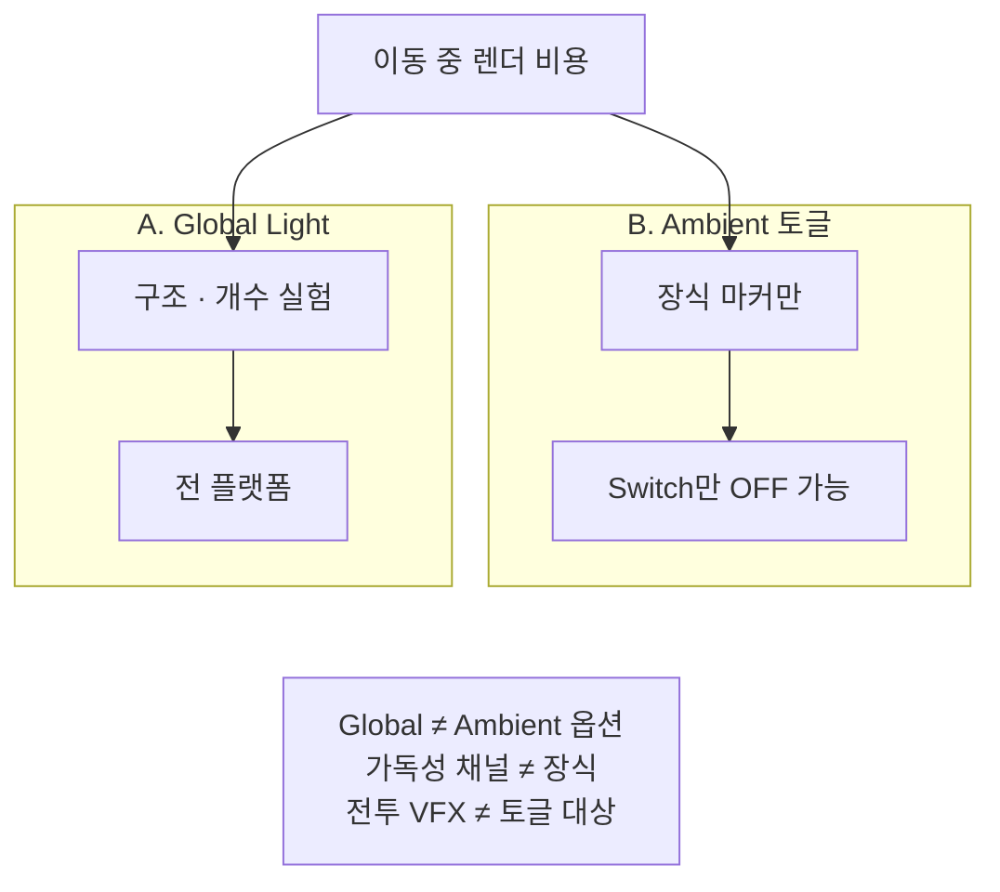

이동만 할 때 카메라에 따라 커지는 렌더 비용을, Global Light 구조와 Switch Ambient 토글 두 레버로 나눈 설계를 정리합니다.

[드래곤 이즈 데드]({{ "/projects/dragon-is-dead/" | relative_url }}) 스테이지 비주얼 최적화에서 적용한 내용입니다. **플레이어·QA 증상:** 전투·이벤트 없이 이동·점프·대시만 해도 프레임이 흔들리는 구간.

## 맥락

출시 축은 Steam(PC)이고, 이 트랙은 **Switch(저사양 콘솔)에서 이동 중 Render 2D Lighting·장식 비용**을 줄이기 위함입니다. Global Light **구조**는 전 플랫폼 공용이고, Ambient **옵션 토글**은 Switch만 적용합니다(PC·에디터는 항상 ON).

**Ambient** = 전투·판독에 필수 아닌 장식 비주얼(배경 파티클, 장식 Light2D, 배경 스프라이트). Global Light·타일맵·캐릭터·전투 VFX는 Ambient가 아닙니다.

**스테이지 조명 채널** = 가독성용 프리셋/채널. Ambient OFF로 Global까지 끄면 이 채널이 깨져 플레이 가독성이 무너지므로, Global은 옵션 축에서 제외합니다.

Profiler 기준은 전투·이벤트 없이 이동·점프·대시만 하고, 카메라가 배경·장식을 많이 담는 구간입니다.

## 문제

이벤트 없이 이동·점프·대시만 해도 프레임이 흔들릴 때가 있습니다. 그중 **카메라 이동에 따라 늘어나는 렌더링 비용**을 줄이는 것이 목표입니다.

| 증상 | 원인 후보 |
|------|-----------|
| 이동만 해도 GPU·`Render 2D Lighting`이 커짐 | Global Light2D 개수·구조, 장식 Light2D |
| 카메라가 배경을 쓸수록 Draw Call·파티클이 늘음 | 장식 파티클·배경 SpriteRenderer |
| 옵션으로 장식만 끄고 싶은데 Global까지 꺼짐 | Ambient 토글과 Global Light를 한 축으로 묶음 |

전투 VFX·타일맵·플레이어·NPC 스프라이트는 이 트랙 밖입니다. Ambient 마커를 붙이지 않습니다.

## 해결

레버를 둘로 나눕니다.

| | A. Global Light | B. Ambient Visual Toggle |
|---|---|---|
| **대상** | `Light2D.LightType.Global` | 마커가 붙은 장식 파티클·Light2D·SpriteRenderer |
| **수단** | 프리팹 구조 (개수 병합 등) | 비디오 옵션·런타임 enable |
| **플랫폼** | 전 플랫폼 (구조) | Switch만 적용 (그 외 항상 ON) |
| **Global** | 실험·유지 대상 | **태깅하지 않음** — 옵션으로 끄지 않음 |

**Global 구조 ≠ Ambient 토글**

- **Global Light**: 구조·개수 실험 — 전 플랫폼. Ambient 토글에 태깅하지 않음
- **Ambient 토글**: 장식 마커만 — Switch만 OFF. Global·전투 VFX·가독성 채널 제외

### A. Global Light

스테이지 프리팹에 Character / Ladder / Background 등 Global Light2D가 여러 개일 수 있습니다. 역할이 달라 한 개로 합치면 밝기·레이어 의도가 깨질 수 있어, 개수를 1로 병합해 실측했을 때 GPU 이득이 미미하면 **다중 Global을 유지**했습니다. Ladder처럼 스테이지 조명 채널 밖 라이트도 구조 실험 대상이지 Ambient 토글 대상이 아닙니다.

### B. Ambient Visual Toggle

닌텐도 Switch에서만 장식(ambient)을 옵션으로 끕니다. PC·에디터에서는 마커가 있어도 **항상 ON**입니다.

| 옵션 | 제어 대상 |
|------|-----------|
| Ambient Particle | 배경 파티클 그룹 (그룹 루트에만 마커) |
| Ambient Light | 비-Global 장식 Light2D |
| Ambient Sprite | 수동 태깅한 배경 SpriteRenderer |

흐름은 비디오 설정 → 변경 이벤트 → 마커·매니저 Apply입니다. 저사양(Switch) 기본은 장식 일부(예: 배경 파티클)를 끄는 쪽으로 둡니다.

### 원칙

1. **마커가 붙은 오브젝트만** 제어합니다.
2. **Switch가 아니면** 설정을 무시하고 항상 켭니다.
3. **`Global Light2D`는 태깅하지 않습니다** — 가독성·스테이지 조명 채널 유지, §A와 분리합니다.
4. 스프라이트 OFF 시 `SpriteRenderer`·`ParallaxEffect`·`Animator`(있을 때)의 `enabled`만 토글합니다. `SetActive`는 쓰지 않습니다.
5. 피격·전투·드롭 VFX, 타일맵·캐릭터·맵 오브젝트 등 게임플레이 스프라이트에는 마커를 붙이지 않습니다.

태깅은 에디터 메뉴로 파티클·라이트를 일괄하고, 스프라이트는 선택 오브젝트에만 수동으로 붙입니다.

## 기각·보류

**Global Light 3→1 병합으로 GPU 절감** — 실측 ΔGPU가 미미했습니다. 3 lights를 유지합니다.

**Ambient Light로 Global까지 OFF** — 플레이 가독성·스테이지 조명 채널이 깨집니다. 기각했습니다.

**Ambient를 PC에도 적용** — Switch 전용 부하 완화입니다. PC는 항상 ON입니다.

**스프라이트 OFF에 `SetActive`** — 계층·컴포넌트 부작용이 있습니다. `enabled` 토글을 씁니다.

**전투·타일맵·캐릭터에 Ambient 마커** — 게임플레이 시각과 옵션이 충돌합니다. 미부착합니다.

구 측정 세션에 Global Light2D 마커가 포함된 경우가 있습니다. 현재 정책(Global 제외)과 **수치를 직접 비교하지 않습니다**.

## 확인 포인트

- Switch(또는 Switch 런타임 proxy): Ambient Particle / Light / Sprite 토글이 마커 대상만 반영
- 비-Switch: 옵션을 바꿔도 화면이 변하지 않음
- Ambient Light 옵션 OFF여도 Global Light2D는 항상 ON
- Global·전투 VFX·타일맵·캐릭터에 Ambient 마커 없음
- 스프라이트 OFF 시 Parallax·Animator가 있으면 함께 disable

## 정리

Global은 **프리팹 구조**로, Ambient는 **Switch 전용 런타임 토글**로 다룹니다. 장식만 끄고 글로벌 조명·게임플레이 비주얼은 건드리지 않는 경계를 마커 정책으로 고정합니다.

**권장 읽기** — [StageSpawn preload로 지역 내 이동 hitch 제거]({{ "/notes/stage-spawn-area-preload/" | relative_url }}) · 이동 중 GPU(이 글). TMP 최초 사용 스파이크는 [스플래시·옵션으로 옮긴 TMP 폰트 워밍업]({{ "/notes/tmp-font-warmup/" | relative_url }})을 따릅니다.
