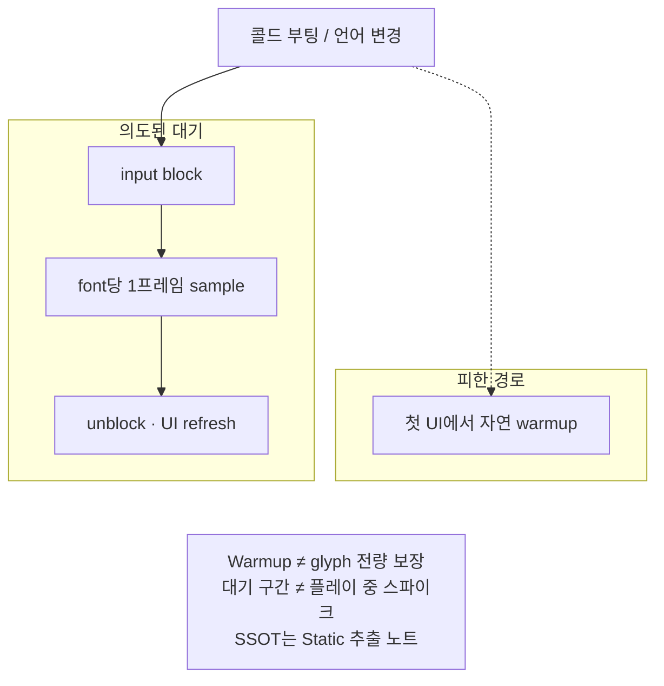

부팅·언어 전환 시 TMP 폰트·스프라이트 최초 사용 스파이크를 스플래시·옵션 대기 구간으로 옮기는 FontWarmup 설계를 정리합니다.

[Dragon is Dead]({{ "/projects/dragon-is-dead/" | relative_url }}) 로컬라이즈 작업에서 적용한 내용입니다. Static 문자셋(Dynamic atlas 회피)은 [TMP Static 아틀라스로 Dynamic hitch 피하기]({{ "/notes/tmp-static-font-atlas/" | relative_url }})를 따릅니다. 워밍업은 glyph 전량 보장의 대체재가 아닙니다.

## 맥락

Static은 «어떤 글자가 아틀라스에 있는가», Warmup은 «언제 처음 그리는가»를 담당합니다. FontWarmup 매니저로 **cancel/supersede·input block**을 한곳에서 묶어, 자연 첫 UI warmup이 플레이·입력과 겹치지 않게 합니다.

타임라인:

1. 콜드 부팅 → Splash에서 font type별 1프레임 warmup → Title
2. 옵션에서 언어 변경 → input block → warmup → UI refresh → unblock
3. 연속 변경 시 진행 중 작업 supersede → block이 풀림

| 타입 | 쓰임 |
|------|------|
| Title | 타이틀·큰 제목 |
| Content 계열 | 본문·일반 UI |
| Number | 숫자·수치 표시 등 |

실제로 쓰는 타입만 워밍업합니다. 미사용 타입까지 일괄 넣지 않습니다. 키보드(PC)·조이스틱·커런시 등 Sprite Asset도 언어 UI와 같이 처음 그릴 때 스파이크가 나므로, 같은 대기 구간으로 옮깁니다.

**공개 Demo 매핑.** [TMP Font Pipeline]({{ "/projects/tmp-font-pipeline/" | relative_url }})은 Title / Content / Number 대신 **Ui · Dialogue** `FontUsageRole`로 나눕니다. weight enum이 아니라 Static extract 버킷·Font Asset 역할입니다. Warmup sample도 역할별입니다 — Ui는 UI JSON(`Confirm` 등), Dialogue는 dialogue JSON(`dlg_intro` 등). glyph SSOT는 여전히 [Static 추출]({{ "/notes/tmp-static-font-atlas/" | relative_url }})입니다.

## 문제

Static atlas만으로는 «첫 사용 시 머티리얼·메쉬·스프라이트 준비» 비용이 사라지지 않습니다.

| 증상 | 원인 |
|------|------|
| 타이틀·첫 UI·언어 변경 직후 프레임 스파이크 | TMP Font Asset / material / mesh·관련 Sprite Asset을 처음 그릴 때 로드·초기화 비용이 몰림 |
| 플레이 중 입력과 겹침 | 옵션에서 언어를 바꾼 뒤 바로 조작하면 warmup과 gameplay가 같은 프레임에 경쟁 |
| 한 프레임에 전 font type 워밍업 | Title·Content·Number 등 다수 타입을 한꺼번에 강제하면 스플래시조차 멈춤 |

그 비용을 **의도된 대기 구간**(스플래시·언어 변경 input block)으로 옮기기 위해 전용 매니저를 둡니다.

## 해결

**Warmup = when**

첫 그리기 비용을 스플래시·언어 변경 대기 구간으로 옮깁니다. sample은 경로를 깨울 뿐이고, glyph 전량 보장은 Static 추출이 담당합니다.

| 항목 | 내용 |
|------|------|
| 트리거 | Splash 시작 / Title 미완료 시 fallback / 언어 변경 |
| 방식 | 화면 밖 TMP에 sample text → `ForceMeshUpdate` — **font 1개당 1프레임** |
| 부가 | 키보드(PC)·조이스틱·커런시 등 Sprite Asset preload |
| 완료 후 | 언어 변경 경로에서 input unblock + 언어 변경 이벤트 |
| 재요청 | 진행 중 warmup은 cancel(supersede); 이미 완료된 언어는 즉시 완료 콜백 |

워밍업 대상은 실제로 쓰는 타입(Title·Content 계열·Number 등)에 한정합니다. 미사용 타입까지 일괄 넣지 않습니다.

### Sample text

전 glyph가 아닙니다. 폰트·머티리얼 경로를 깨우는 짧은 샘플만 씁니다.

| 언어군 | 예시 |
|--------|------|
| CJK | `字体预热테스트漢字` |
| European | `Font Warmup AaBbCc012` |

Dragon은 언어군별 **공통** sample을 씁니다. 공개 Demo는 Ui·Dialogue atlas가 다르므로 **역할별** 짧은 문장(예: KO Ui `확인`, Dialogue `어서 오세요, 모험가.`)을 씁니다 — 전 glyph 보장이 아니라 해당 Static atlas 안의 글자만 참조합니다.

## 공개 구현

| 항목 | 내용 |
|------|------|
| 서비스 | `FontWarmupService` — 숨김 canvas, **font 1개당 1프레임**, supersede |
| 계약 | `IFontWarmupTarget` — `GetFontForWarmup`, **역할별** `GetSampleText` |
| 호출 | 부팅·언어 변경 시 `RequestWarmup`; input block은 게임/Demo 책임 |
| Demo | `DemoLanguageSwitcher` — block → warmup → label refresh → unblock |

상세는 [TMP Font Pipeline]({{ "/projects/tmp-font-pipeline/" | relative_url }}) · [GitHub README](https://github.com/monet5379/unity-tmp-font)를 따릅니다.

## 기각·보류

| 결정 | 사유 |
|------|------|
| 첫 UI에서 자연 warmup (명시적 manager 없음) | 플레이·입력과 스파이크가 겹침 — 기각 |
| 한 프레임에 전 font type 워밍업 | 스플래시 hitch — 프레임 분산 유지 |
| Warmup만으로 glyph completeness | sample은 일부만 커버 — [Static 추출]({{ "/notes/tmp-static-font-atlas/" | relative_url }})이 SSOT |
| 전 font type 일괄 warmup | 비용·미사용 타입 — 필요 시 목록 확장 (보류) |

## 확인 포인트

- 콜드 부팅 → Splash warmup → Title: 첫 UI에서 폰트 관련 장시간 hitch·tofu 없음
- Splash 완료 전 Title fallback이 겹쳐도 supersede/complete로 입력이 죽지 않음
- 옵션 언어 변경 → warmup 중 input block → 완료 후 UI refresh·조작 가능
- 언어를 빠르게 연속 변경해도 superseded로 block이 풀림
- Profiler상 warmup 비용이 스플래시·언어 변경 구간에만 유의미
- 워밍업 미완료·실패 시: 첫 UI hitch 또는 언어 변경 후 입력이 풀리지 않음으로 드러남

## 정리

Static은 «어떤 글자가 아틀라스에 있는가», Warmup은 «언제 처음 그리는가»를 담당합니다. 둘을 한 메커니즘으로 합치지 않고, 스파이크는 대기 구간으로·glyph 완결성은 데이터 추출로 나눕니다.

**권장 읽기** — [TMP Static 아틀라스로 Dynamic hitch 피하기]({{ "/notes/tmp-static-font-atlas/" | relative_url }}) → Warmup(이 글).
