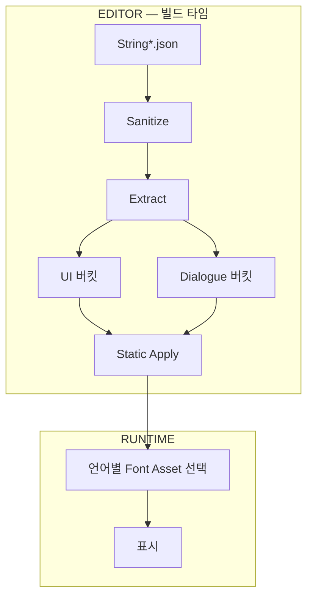

TMP Dynamic 폰트의 런타임 아틀라스 성장·프레임 히치를 피하기 위해, 문자열 JSON에서 언어별 고유 글자를 뽑아 Static 아틀라스에 넣는 파이프라인을 정리합니다.

TMP 폰트 시리즈 1편입니다. [드래곤 이즈 데드]({{ "/projects/dragon-is-dead/" | relative_url }}) 로컬라이즈 작업에서 적용한 내용입니다. **플레이어·QA 증상:** 첫 UI 표시·언어 전환 시 글자가 늦게 뜨거나 한 프레임 끊김.

## 이 글에서 쓰는 말

| 말 | 역할 |
|----|------|
| **Dynamic atlas** | 런타임에 글자를 추가하며 아틀라스가 커짐 (hitch·상한 불명) |
| **Static atlas** | 빌드 전에 글자 집합을 확정해 아틀라스에 넣음 |
| **String JSON** | [Excel→Json]({{ "/notes/excel-json-fixed-data/" | relative_url }}) 문자열 파이프라인 산출물 |
| **워밍업** | 언제 처음 그리는지 — [2편]({{ "/notes/tmp-font-warmup/" | relative_url }}) |

## 맥락

이 문서의 책임은 **어떤 글자가 아틀라스에 있는가**입니다. **언제 처음 그리는가**는 [스플래시·옵션으로 옮긴 TMP 폰트 워밍업]({{ "/notes/tmp-font-warmup/" | relative_url }})이 담당합니다.

CJK·다국어 출시에서 Dynamic atlas 성장이 첫 표시·언어 전환 hitch와 메모리 상한 불가를 만들어, 배포 기본을 Static으로 고정했습니다.

파이프라인은 한 줄로 다음과 같습니다.

`String*.json`(로컬라이즈 문자열) → 정제 · 언어 버킷별 unique codepoint → 생성 텍스트/테이블 → TMP Font Asset Character Table(Static) → 런타임은 언어에 맞는 Font Asset 선택

## 문제

TextMesh Pro의 Dynamic Font Asset은 처음 보는 glyph가 요청될 때 런타임 아틀라스를 키웁니다. 다국어·CJK에서는 다음이 반복됩니다.

| 증상 | 원인 |
|------|------|
| 첫 표시·언어 전환 시 프레임 스파이크 | 미등록 glyph 요청 시 아틀라스 확장·텍스처 재할당 |
| 메모리·텍스처 크기 예측 불가 | 플레이 중 본 문자열에 따라 atlas가 계속 커짐 |
| 누락·깨짐(tofu, □) | sample 워밍업만으로는 전 glyph를 보장할 수 없음 |

배포 기본은 Static으로 두고, 필요한 글자 집합은 에디터에서 문자열 데이터로부터 결정적으로 뽑는 쪽으로 바꿨습니다.

## 해결

**Extract → Static SSOT**

문자열 JSON에서 버킷별 글자를 뽑아 Static Character Table에 넣는 경로입니다. Warmup sample이나 Dynamic atlas가 glyph SSOT가 아닙니다.

### 에디터 추출

문자열 JSON(`String*.json`)을 읽어 언어별 고유 코드포인트를 모은 뒤, 생성 텍스트로 내보냅니다. 메뉴에서 한 번에 돌릴 수 있게 에디터 유틸로 묶었습니다.

### 언어 버킷

Korean · Simplified/Traditional Chinese · Japanese는 **언어별 개별 셋**으로 UI Font Asset을 만들고, English·French·German·Italian·Spanish는 글리프 겹침이 커서 **European 합집합** 하나로 묶었습니다. 대화 문자열만 **Dialogue 전용** 버킷으로 빼 UI atlas와 갈랐습니다.

UI·시스템 문자열과 대화를 나눈 이유는, 대화 전용 대량 CJK가 UI 폰트 아틀라스를 불필요하게 키우기 때문입니다. 유지보수 단위는 **언어/버킷별 Static Font Asset**입니다.

**드래곤 이즈 데드 배포 vs 공개 Demo.** 위 European **합집합**은 드래곤 이즈 데드 출시 기준입니다. 오픈소스 [TMP 폰트 파이프라인]({{ "/projects/tmp-font-pipeline/" | relative_url }}) Demo는 EN · FR · DE · IT · ES를 **언어별 버킷·Static asset**으로 분리합니다. UI·Dialogue 분리 원칙은 같고, 유럽어 쪼개기만 다릅니다.

### 정제

아틀라스에 넣지 않는 것:

- TMP 스타일·색·굵게/기울임 태그
- `<sprite…>` 태그
- `{0}` 등 format placeholder
- `[token]` 데이터 토큰
- 개행·탭·BOM·soft hyphen 등 제어·레이아웃 전용 코드포인트

예: `"<color=red>HP {0}</color> [ITEM]"` → 추출 대상은 실제 노출 글자(`H`, `P` 등). 태그·placeholder·토큰은 제외합니다.

### 런타임 경계

배포 아틀라스는 Static TMP Font Asset이고, Localized text UI는 현재 언어에 맞는 Font Asset만 고릅니다. [Font warmup]({{ "/notes/tmp-font-warmup/" | relative_url }})은 언어별 font·sprite preload이며 Dynamic atlas 대체재가 아닙니다.

워밍업은 전환 시 입력 블록·프리로드 경로를 안정화하는 역할이고, “이 sample이면 CJK 전 glyph가 보장된다”는 계약으로 쓰지 않습니다. glyph SSOT는 Static 추출입니다. 최초 사용 스파이크를 스플래시·옵션으로 옮기는 설계는 [스플래시·옵션으로 옮긴 TMP 폰트 워밍업]({{ "/notes/tmp-font-warmup/" | relative_url }})을 참고합니다.

## 기각·보류

**Dynamic을 런타임 기본으로 유지** — atlas 성장·히치·메모리 상한을 예측하기 어렵습니다. 기각했습니다.

**Warmup sample만으로 glyph 보장** — sample은 일부만 커버합니다. Static 추출이 SSOT입니다.

**Dialogue를 default 셋에 합치기** — UI atlas가 불필요하게 커집니다. 버킷 분리를 유지합니다.

## 문자열 갱신 후

String workbook / JSON이 바뀌면 Static 폰트도 같이 갱신합니다.

1. 고유 문자 추출 재실행
2. 생성 파일 diff로 의도치 않은 대량 증가·누락 확인
3. 해당 언어 TMP Font Asset Character Table에 반영
4. 아래 **확인 포인트**로 스모크

## 공개 구현

드래곤 이즈 데드에서 정리한 추출 → Static bake → 런타임 font 선택을 게임 없이 복사해 쓸 수 있게 [TMP 폰트 파이프라인]({{ "/projects/tmp-font-pipeline/" | relative_url }}) (`unity-tmp-font`)로 뺐습니다. Install·API·Demo 절차는 [GitHub README](https://github.com/monet5379/unity-tmp-font)가 정본입니다.

Editor Window **Extract**는 `String*.json` → `unique_chars_*.txt`(sanitize), **Apply** + `FontAtlasApplyProfile`은 Generated txt → Static SDF(2048 bake)입니다. `FontRoleCatalog`가 `LanguageId` + **Ui** / **Dialogue** → `TMP_FontAsset`을 잇고, `Assets/Demo` SampleScene은 Extract/Apply 놀이터입니다.

## 확인 포인트

- 주요 언어 UI·Dialogue: tofu·□ 없음, 런타임 Dynamic atlas 성장 없음
- 첫 표시·언어 전환: glyph 누락으로 인한 hitch 없음 (머티리얼·mesh warmup은 [스플래시·옵션으로 옮긴 TMP 폰트 워밍업]({{ "/notes/tmp-font-warmup/" | relative_url }}))
- Extract → Apply 후 Character Table이 생성 txt와 일치
- UI·Dialogue 버킷 분리 유지 — 대화 전용 CJK가 UI atlas를 불필요하게 키우지 않음
- 문자열 갱신 후 charset diff에 의도치 않은 폭증·누락 없음

## 정리

다국어 TMP에서 Dynamic은 “일단 돌아가게”는 쉽지만, 출시·라이브 기준으로는 히치와 메모리 상한이 문제입니다. 문자열 데이터를 문자셋의 SSOT로 두고 Static으로 고정하면, 폰트·로컬라이즈·워밍업 각각의 책임이 명확해집니다.
