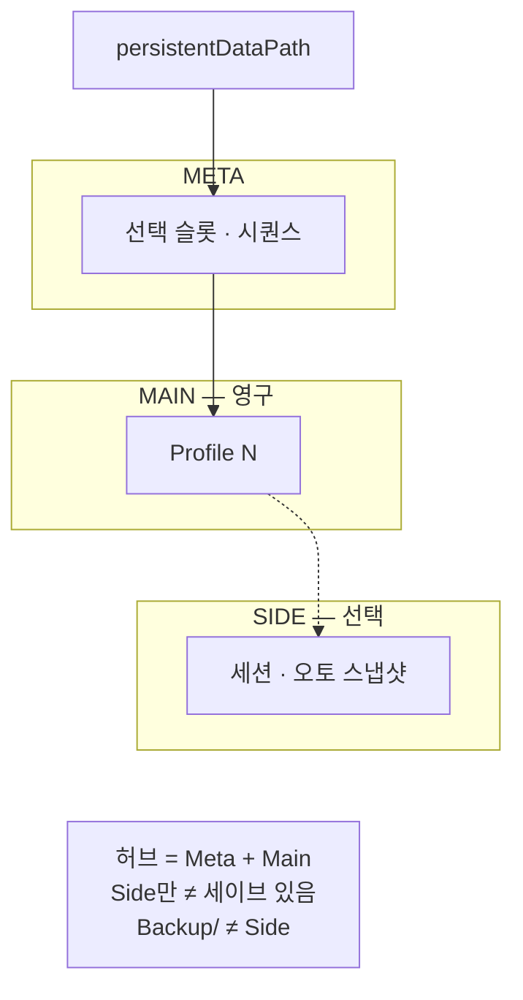

슬롯당 Main·선택적 Side와 공유 Meta로, 세이브 손상·복구·스키마 경계를 타이틀에서 분리한 Unity 케이스 스터디입니다.

블레이드 어썰트·드래곤 이즈 데드의 프로필·슬롯·백업 경험을 반영해, 게임이 없어도 Meta + Profile 레이아웃만으로 검증할 수 있는 최소 런타임을 목표로 합니다.

## 개요

- 형태: 개인 Unity 케이스 스터디 (세이브 레이아웃)
- 역할: 설계·구현·문서
- 초점: 슬롯당 Main 1, 선택적 Side, Meta, AtomicWrite, 슬롯 단위 백업·진단
- 배포: `Assets/SaveLayout` 폴더 복사 (UPM 아님) — Runtime / Editor 분리
- 연관: [블레이드 어썰트]({{ "/projects/blade-assault/" | relative_url }}) · [드래곤 이즈 데드]({{ "/projects/dragon-is-dead/" | relative_url }}) · [드래곤 이즈 데드 출시 세이브]({{ "/notes/dragon-save-shipped/" | relative_url }}) · [Main·Side·Meta]({{ "/notes/save-layout-boundaries/" | relative_url }}) · [Side 레인]({{ "/notes/save-layout-side-lane/" | relative_url }})

## 문제

출시한 클라이언트에서 세이브는 “잘 저장되면 그만”이 아닙니다.

- 저장 도중 종료·디스크 오류로 파일이 비거나 JSON이 깨집니다.
- 프로필을 한 파일에 묶으면 한 슬롯 손상이 다른 진행까지 위협합니다.
- 빈번한 저장이 I/O를 흔들고, 실패 시 메타데이터까지 어긋날 수 있습니다.
- 레이아웃·스키마 변경 시 구버전 파일을 읽지 못하거나 잘못된 기본값으로 덮일 수 있습니다.
- 런·세션처럼 짧은 진행을 Main과 같은 주기로 쓰면, 영구 진행까지 같이 흔들릴 수 있습니다.

타이틀 코드 안에 두면 전투·UI·밸런스 파이프라인과 섞여, 세이브만 재현·설명하기 어렵습니다. 계약·복구·진단에 초점을 둔 별도 프로젝트로 정리했습니다.

## 설계

한 문장으로: 프로필마다 Main을 두고, 필요하면 슬롯당 Side를 붙이며, Meta로 선택을 기록합니다.

**Main · Side · Meta**

- **Main**: 슬롯당 영구 진행 — 쿨다운·pending 저장
- **Side**: 짧은 진행·스냅샷 — `SaveSide` / `InvalidateSide` (Main과 분리)
- **Meta**: 선택 슬롯·시퀀스 — 세트와 함께 이동

| 축 | 선택 |
|----|------|
| 디스크 | Meta + Profile0~2 Main + 슬롯당 선택적 Side (Dev는 `_Dev`) |
| Main 저장 | 쿨다운 + 지연 저장 → 선택 프로필 Main → Meta |
| Side 저장 | 즉시 `SaveSide` / `InvalidateSide` / `ClearSide` — Main과 한 호출에 섞지 않음 |
| 로드 | Meta와 프로필 Main을 조립. Side는 `TryGetSide` |
| 실패 | 손상·빈 Main 또는 Side만 백업 후 null, 다른 슬롯 유지 |
| 관측 | F1·에디터 진단·시나리오 주입·수동 복구 |

설치·실패 시나리오·불변조건은 [GitHub README](https://github.com/monet5379/unity-save-layout)가 정본입니다.

## 이 프로젝트가 아닌 것

- 전투·스테이지 등 게임플레이 본편이 아닙니다.
- **`runs/` 트리**나 Side를 넘는 런 전용 제품 API가 아닙니다 — 세션·오토세이브는 Side 레시피 또는 타이틀 필드로 확장합니다.
- 레거시·타 포맷 세이브 **이관**이 아닙니다.
- Excel→Json·SO **고정 정의 Facade**가 아닙니다 (별도 OSS).
- Profile Rot·AES·Steam Cloud merge 전체 패리티가 아닙니다.

증명하려는 것은 동적 진행을 **슬롯 레이아웃**(Main·Side·Meta)으로 어떻게 안전하게 유지·복구·진화시키는가입니다.

## 계보

| 프로젝트 | 가져온 / 남긴 것 |
|----------|------------------|
| [블레이드 어썰트]({{ "/projects/blade-assault/" | relative_url }}) | 실서비스 이중 파일·암호화 경험 → 복구·시퀀스·레이아웃으로 재정리 |
| [드래곤 이즈 데드]({{ "/projects/dragon-is-dead/" | relative_url }}) | 타이틀 결합 프로필·슬롯·백업 → 계약 추출 |

드래곤 이즈 데드 프로젝트 페이지의 [세이브·데이터]({{ "/projects/dragon-is-dead/" | relative_url }}) 절과 같은 문제 의식을, 여기서는 레이아웃 단위로만 펼칩니다. Why는 [세이브 레이아웃 시리즈]({{ "/notes/dragon-save-shipped/" | relative_url }}) — [드래곤 이즈 데드 출시 세이브 슬롯·복구·마이그레이션 (1/3)]({{ "/notes/dragon-save-shipped/" | relative_url }}) · [Main·Side·Meta로 나눈 이유 (2/3)]({{ "/notes/save-layout-boundaries/" | relative_url }}) · [Side 레인 (3/3)]({{ "/notes/save-layout-side-lane/" | relative_url }}) — 에 둡니다.

## 스택

Unity, C#, Newtonsoft.Json

## 링크

### 외부

- [GitHub — unity-save-layout](https://github.com/monet5379/unity-save-layout)

### 내부

- [드래곤 이즈 데드 출시 세이브]({{ "/notes/dragon-save-shipped/" | relative_url }})
- [Main·Side·Meta로 나눈 이유]({{ "/notes/save-layout-boundaries/" | relative_url }})
- [슬롯 백업 대신 Side 레인을 둔 이유]({{ "/notes/save-layout-side-lane/" | relative_url }})
- [블레이드 어썰트]({{ "/projects/blade-assault/" | relative_url }})
- [드래곤 이즈 데드]({{ "/projects/dragon-is-dead/" | relative_url }})
- [홈 · 경력]({{ "/#경력" | relative_url }})
